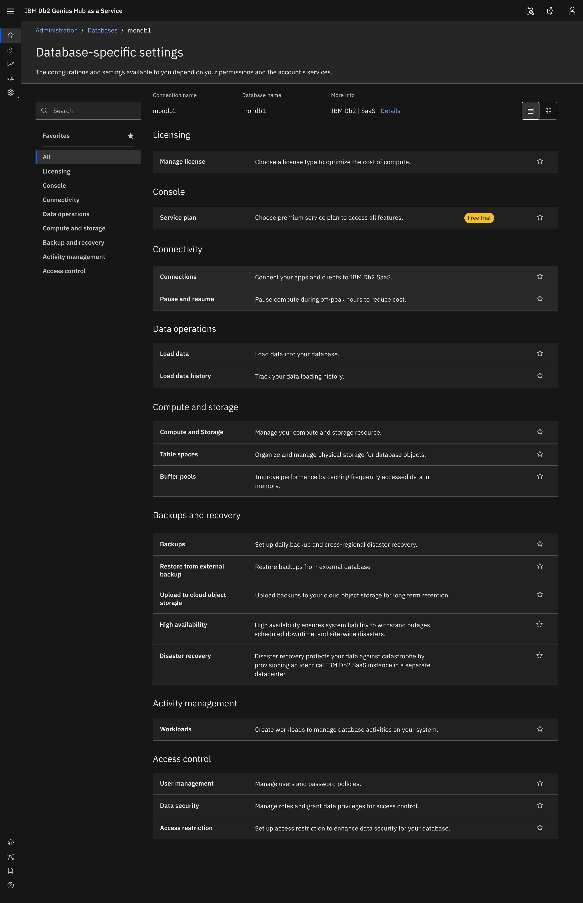
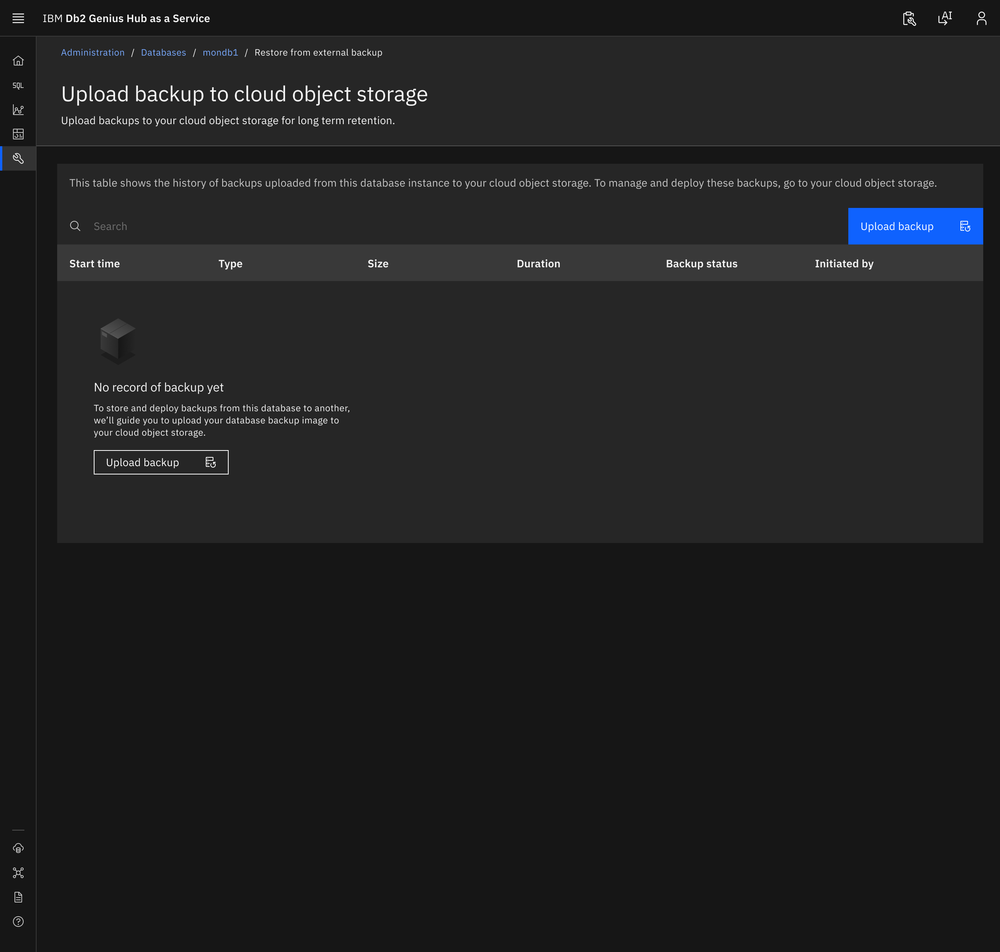
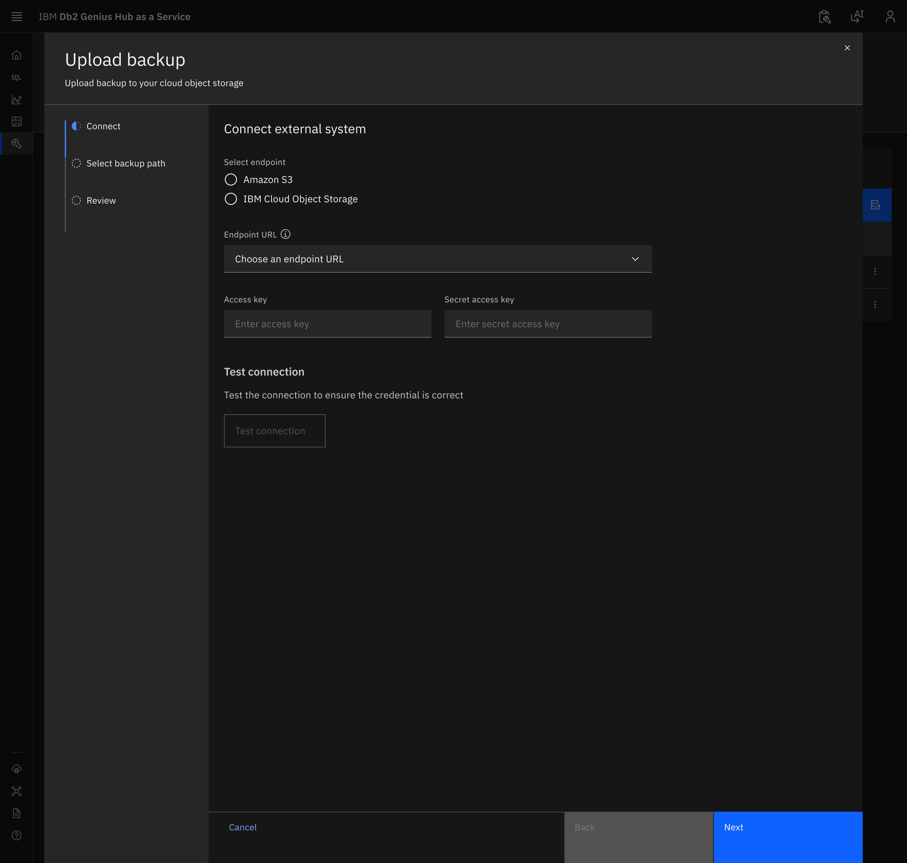
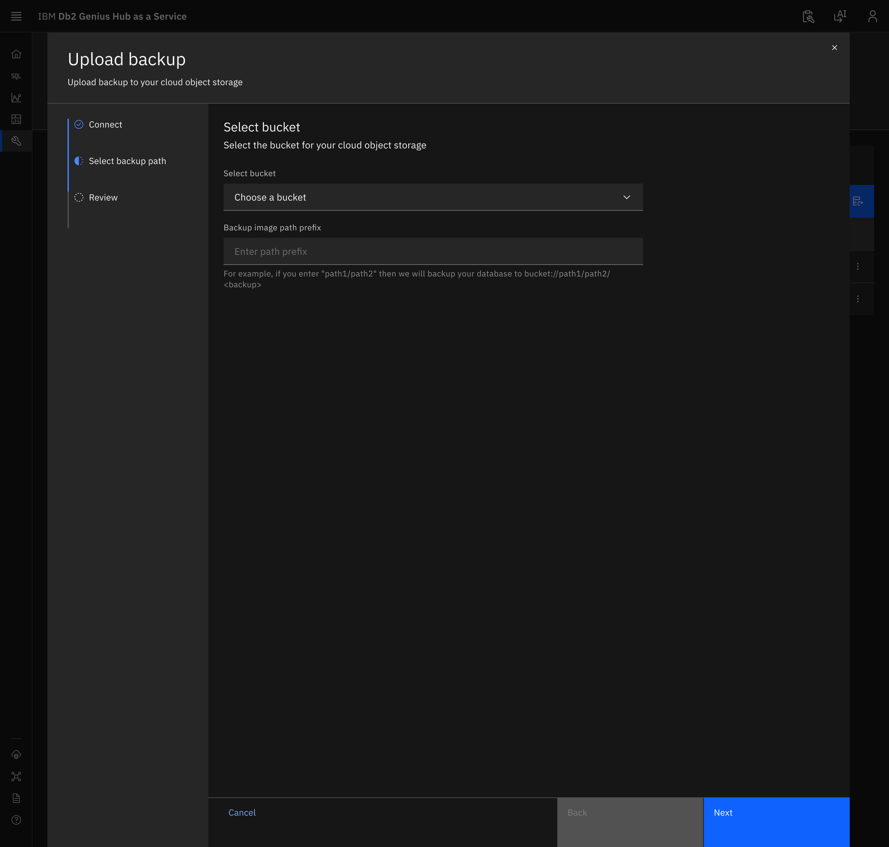
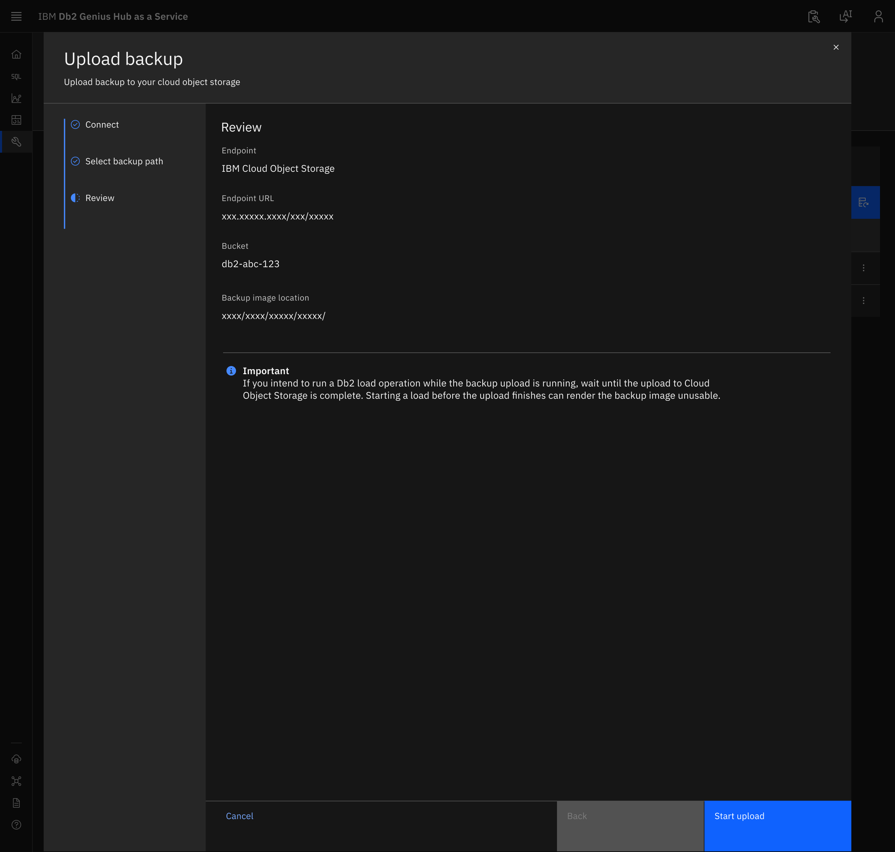
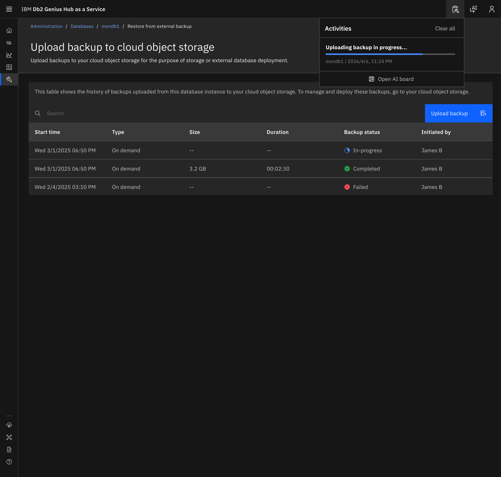
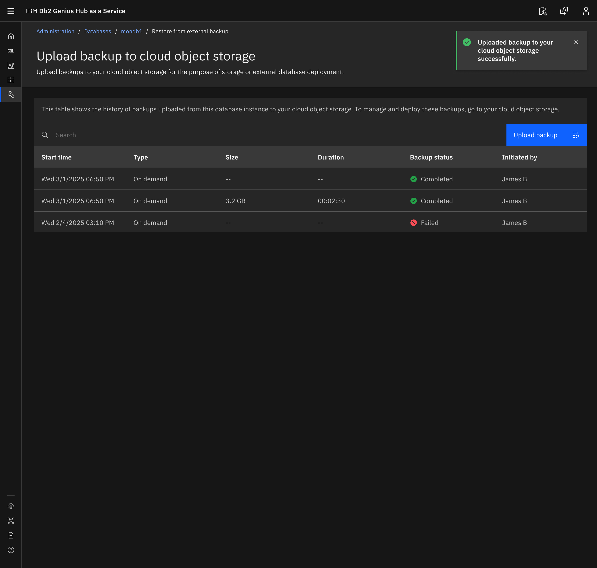

---
copyright:
  years: 2026
lastupdated: "2026-09-16"

keywords: upload backup, cloud object storage, performance plan, IBM Cloud Object Storage, Amazon S3

subcollection: Db2onCloud
---

{{site.data.keyword.attribute-definition-list}}

# Upload backup to cloud object storage
{: #upload-backup-cos}

You can upload a backup of your {{site.data.keyword.Db2_on_Cloud_long}} database to your own cloud object storage. This lets you transfer your database backup image from SaaS to an on-premises environment, for the purpose of storage or external database deployment.
{: shortdesc}

Supported endpoints are Amazon S3 and IBM Cloud Object Storage.

Do not run a Db2 load operation while the backup upload is running. If you intend to run a Db2 load operation while the backup upload is running, wait until the upload to Cloud Object Storage is complete. Starting a load before the upload finishes can render the backup image unusable.
{: important}

## Uploading a backup
{: #upload-backup-cos-steps}

1. Go to **Administration** > **Databases** and select your database. On the **Database-specific settings** page, under **Backups and recovery**, click **Upload to cloud object storage**.
{: caption="Upload to cloud object storage under Backups and recovery." caption-side="bottom"}

1. The **Upload backup to cloud object storage** page shows the history of backups uploaded from this database instance to your cloud object storage. To manage and deploy these backups, go to your cloud object storage. Click **Upload backup**.
{: caption="Upload backup to cloud object storage page with no uploaded backups." caption-side="bottom"}

1. On the **Connect** step, under **Connect external system**, enter the following:
    - **Select endpoint**: Select **Amazon S3** or **IBM Cloud Object Storage**.
    - **Endpoint URL**: Choose an endpoint URL.
    - **Access key**: Enter your access key.
    - **Secret access key**: Enter your secret access key.

    Click **Test connection** to ensure the credential is correct, then click **Next**.
{: caption="Connect to your cloud object storage." caption-side="bottom"}

1. On the **Select backup path** step, enter the following:
    - **Select bucket**: Choose the bucket for your cloud object storage.
    - **Backup image path prefix**: Enter a path prefix. For example, if you enter `path1/path2`, your database is backed up to `bucket://path1/path2/<backup>`.

    Click **Next**.
{: caption="Select the bucket and backup image path prefix." caption-side="bottom"}

1. On the **Review** step, confirm the **Endpoint**, **Endpoint URL**, **Bucket**, and **Backup image location**, then click **Start upload**.
{: caption="Review the upload details." caption-side="bottom"}

1. The **Activities** panel shows **Uploading backup in progress...** and the backup appears in the table with the status **In-progress**.
{: caption="Backup upload in progress." caption-side="bottom"}

1. When the upload finishes, the notification **Uploaded backup to your cloud object storage successfully.** is displayed and the backup status changes to **Completed**.
{: caption="Backup uploaded successfully." caption-side="bottom"}

## Backup history
{: #upload-backup-cos-history}

The table on the **Upload backup to cloud object storage** page shows the following for each upload:

| Column | Description |
|--------|-------------|
| Start time | When the upload started. |
| Type | The backup type, for example **On demand**. |
| Size | The size of the backup. |
| Duration | How long the upload took. |
| Backup status | **In-progress**, **Completed**, or **Failed**. |
| Initiated by | The user who started the upload. |
{: caption="Backup history columns" caption-side="bottom"}

## Restrictions
{: #upload-backup-cos-restrictions}

Do not run a Db2 load operation while a backup upload to cloud object storage is running. This restriction applies only to uploading a backup to cloud object storage. Restoring from an external backup, regular backups, and other operations are not affected.

Load copies generated by a Db2 load operation are not included in the uploaded backup. If a load runs during the upload, both the load and the backup complete successfully, but restoring or rolling forward that backup to end of backup on your on-premises instance will fail.
