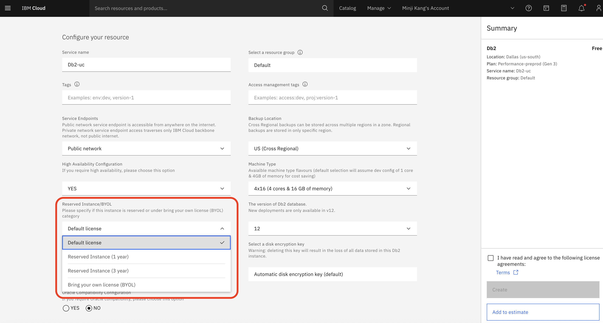
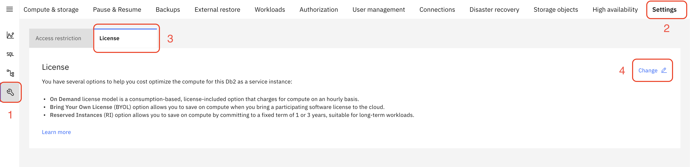
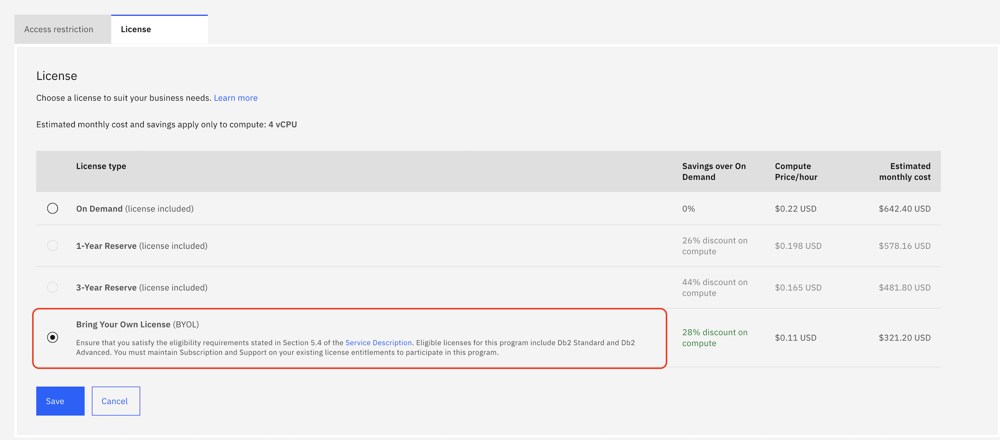
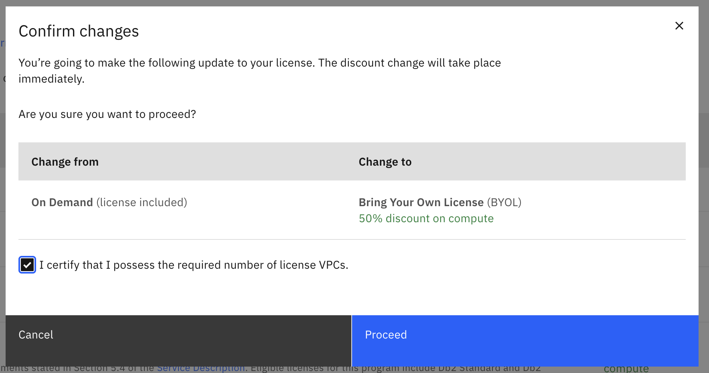
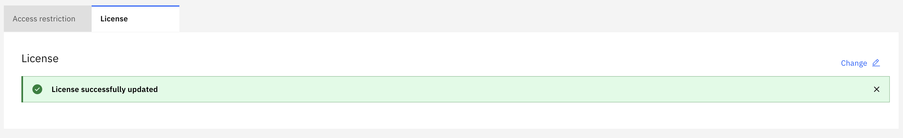

---
copyright:
  years: 2025, 2026
lastupdated: "2026-02-13"

keywords: byol, bring your own license, licensing, cost optimization

subcollection: Db2onCloud
---

{:external: target="_blank" .external}
{:shortdesc: .shortdesc}
{:codeblock: .codeblock}
{:screen: .screen}
{:tip: .tip}
{:important: .important}
{:note: .note}
{:deprecated: .deprecated}
{:pre: .pre}

# Bring Your Own License (BYOL)
{: #byol}

The Bring Your Own License (BYOL) option for Db2 on Cloud allows you to apply your existing eligible Db2 software licenses to your cloud instance, resulting in up to a **50% discount** on compute costs compared to the standard On Demand pricing model.
{: shortdesc}

## Prerequisites
{: #byol-prerequisites}

Before switching to the BYOL license model, ensure that you meet the following requirements:

- An active Db2 on Cloud instance on the **Performance** plan.
- Eligible Db2 software licenses (**Db2 Standard** or **Db2 Advanced**) with active Subscription and Support.
- Sufficient license VPCs (Virtual Processor Cores) to cover the compute allocation of your instance.
- Eligibility requirements as stated in **Section 5.4** of the [Db2 on Cloud Service Description](https://www.ibm.com/support/customer/csol/terms/?id=i126-7519&lc=en){: external} must be satisfied.

## Selecting BYOL during provisioning
{: #byol-provisioning}

You can select the BYOL license type when provisioning a new Db2 on Cloud instance.

During the provisioning process, locate the **Reserved Instance/BYOL** dropdown. By default, the license is set to **Default license**. Select **Bring your own license (BYOL)** from the dropdown, then continue with the rest of the provisioning steps.

{: caption="Select Bring your own license (BYOL) from the Reserved Instance/BYOL dropdown during provisioning" caption-side="bottom"}

## Configuring BYOL in the UI
{: #byol-configuration}

You can also change your license type on an existing Db2 on Cloud instance through the console.

### Step 1: Navigate to the license settings
{: #byol-step1}

From your Db2 on Cloud instance dashboard:

1. Click the **Settings** icon in the left sidebar (wrench icon), or select **Settings** from the top navigation bar.
1. Select the **License** sub-tab.
1. Click the **Change** button on the right side to modify your license type.

{: caption="Navigate to Settings > License and click Change" caption-side="bottom"}

### Step 2: Select the BYOL license type
{: #byol-step2}

On the License selection page, select the **Bring Your Own License (BYOL)** radio button, then click **Save**.

The BYOL option provides the highest discount at 50% off compute costs. Ensure you meet the eligibility requirements stated in Section 5.4 of the Service Description before proceeding. Eligible licenses include Db2 Standard and Db2 Advanced, and you must maintain active Subscription and Support on your existing license entitlements.
{: important}

{: caption="Select the Bring Your Own License (BYOL) option" caption-side="bottom"}

### Step 3: Confirm the license change
{: #byol-step3}

A confirmation dialog appears showing the details of your license change:

1. Verify the **Change from** and **Change to** columns reflect the correct transition.
1. Check the certification box: *"I certify that I possess the required number of license VPCs."*
1. Click **Proceed** to apply the change.

The discount takes effect immediately.

{: caption="Confirm the license change to BYOL" caption-side="bottom"}

### Step 4: Verify successful update
{: #byol-step4}

After clicking Proceed, you are returned to the License settings page. A green success banner confirms that the license has been successfully updated. The new BYOL pricing is now active on your instance.

{: caption="License successfully updated confirmation" caption-side="bottom"}

## Important notes
{: #byol-notes}

- **Immediate effect**: The discount change takes place immediately upon confirmation. Your next billing cycle reflects the new BYOL pricing.
- **License compliance**: You are responsible for ensuring that you hold the required number of license VPCs for the compute resources allocated to your instance. IBM may audit compliance.
- **Reversibility**: You can switch back to On Demand or another license type at any time by following the same steps and selecting a different option.
- **No service disruption**: Changing the license type does not affect your database instance availability. There is no downtime associated with this change.
- **Subscription and Support**: You must maintain active Subscription and Support on your existing Db2 license entitlements to remain eligible for the BYOL program.
