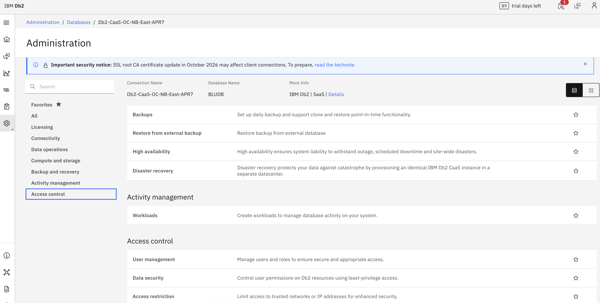
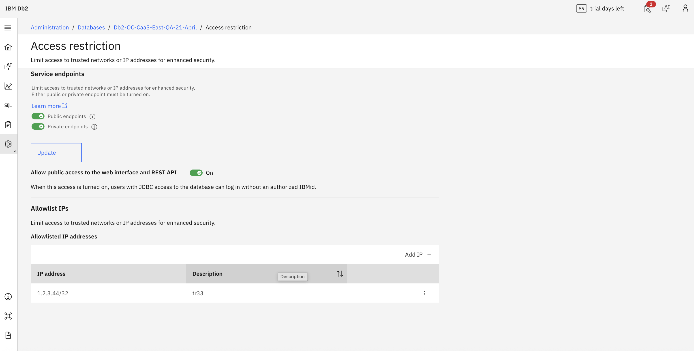
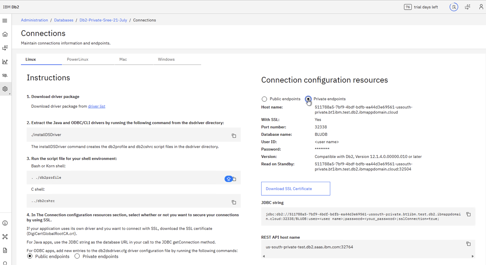

---

copyright:
  years: 2026
lastupdated: "2026-07-24"

keywords:

subcollection: db2-saas

---

{:external: target="_blank" .external}
{:shortdesc: .shortdesc}
{:codeblock: .codeblock}
{:screen: .screen}
{:tip: .tip}
{:important: .important}
{:note: .note}
{:deprecated: .deprecated}
{:pre: .pre}

# Endpoints
{: #gh_endpts}

This section explains how to configure endpoints in the new Genius Hub–enabled console. Follow these instructions if you see the updated UI. If you are still using the **legacy console**, refer to the [Endpoints](https://cloud.ibm.com/docs/db2-saas?topic=db2-saas-endpts) section for the correct steps.
{: important}

## Performance plans
{: #gh_performance}

The Performance plans offer the choice of Public, Private, or both Public and Private endpoints.

- Public network service endpoint is accessible from anywhere on the internet.
- Private network service endpoint access traverses only the {{site.data.keyword.cloud_notm}} backbone network, not the public internet.

The steps differ depending on whether you are using the legacy console or the new Genius Hub–enabled console.
{: note}

If you are still using the legacy console, refer to the [Changing endpoints](https://cloud.ibm.com/docs/db2-saas?topic=db2-saas-endpts#ep_perf_chg_epts) section for the correct steps.
{: important}

### Changing endpoints
{: #gh_perf_chg_epts}

To change endpoints, complete the following steps:

1. Select your Db2 service from {{site.data.keyword.cloud_notm}}  
2. From the **Manage** tab, click **Open Console**.  
3. Select **Administration** from the left side menu.  
4. Go to **Databases** and select your database.  
5. Select **Access Control** from the left menu.  
6. Select the **Access restrictions** option from the **Access Control** section.  
7. Under Service endpoints, select Public endpoints, or Private endpoints, or both.  
8. Click **Update**. The change occurs immediately.  

{: caption="Service endpoints configuration for Performance plans" caption-side="bottom"}

{: caption="Access restriction" caption-side="bottom"}

The Connections page displays endpoint details based on your selection of Public endpoints or Private endpoints. The Host name field shows the database endpoint, and the REST API host name is the console hostname used to access the Db2 Console REST APIs.
{: note}

For private endpoints, to access the console APIs and database over a private network, you must create a Virtual Private Endpoint (VPE) gateway for VPC in your account and configure it to use the endpoint shown on the **Connections** page. You can provision the gateway from the [IBM Cloud Endpoint Gateway provisioning page](https://cloud.ibm.com/infrastructure/provision/endpointGateway).
{: note}

{: caption="Connection information & configuration" caption-side="bottom"}
