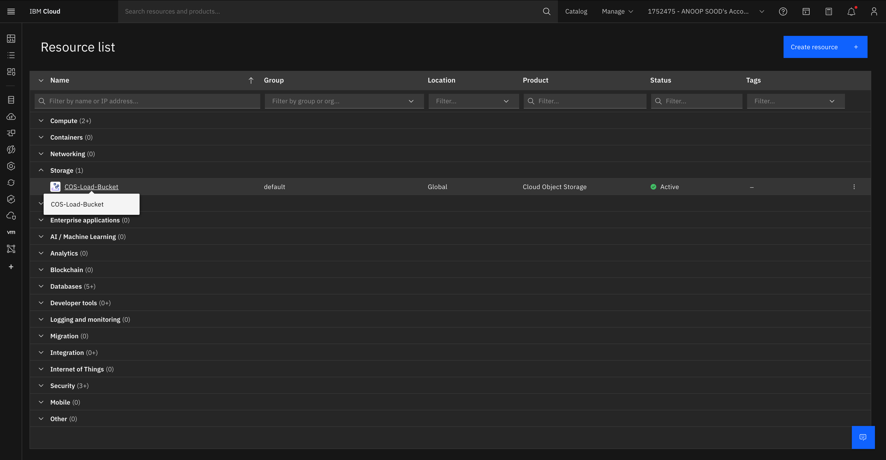
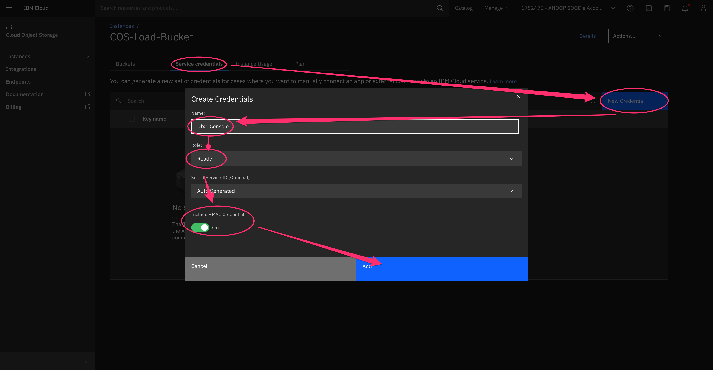
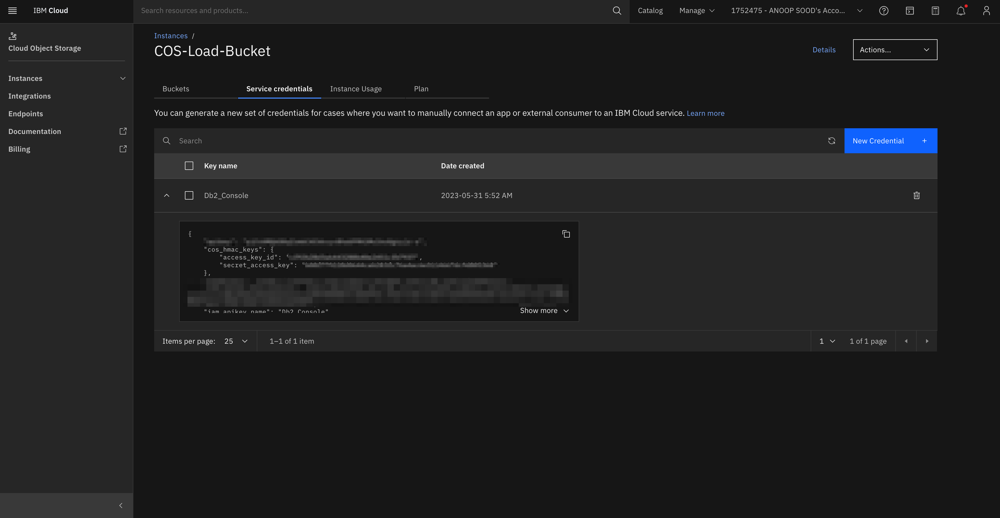
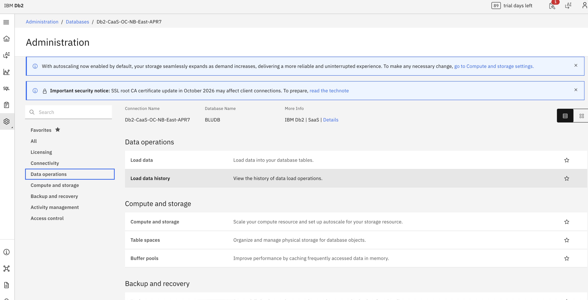
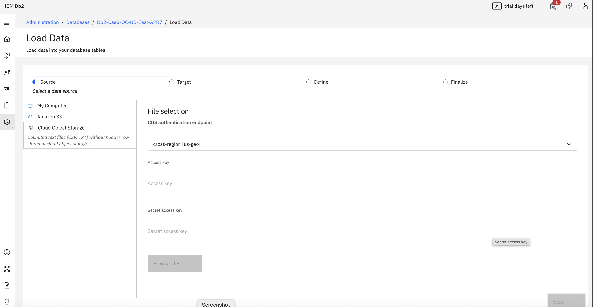

---

copyright:
  years: 2014, 2023
lastupdated: "2026-07-24"

keywords:

subcollection: db2-saas

---


{:external: target="_blank" .external}
{:shortdesc: .shortdesc}
{:codeblock: .codeblock}
{:screen: .screen}
{:tip: .tip}
{:important: .important}
{:note: .note}
{:deprecated: .deprecated}
{:pre: .pre}


# Loading data from IBM Cloud Object Storage
{: #gh_loading}

This section explains how to load data from IBM Cloud Object Storage in Db2 SaaS in the new Genius Hub–enabled console. Follow these instructions if you see the updated UI. If you are still using the **legacy console**, refer to the [Loading data](https://cloud.ibm.com/docs/db2-saas?topic=db2-saas-loading) section for the correct steps.
{: important}

## Using Console
{: #using-gh-console}

You can load data from IBM Cloud Object Storage (COS) into {{site.data.keyword.Db2_on_Cloud_long}} by using the Console.

BLUUSERS cannot load data from the console.
{:important}

### Create the necessary credentials on the COS bucket to allow Console to access the data
{: #gh_bucket}

1. Access the COS Bucket on the IBMCloud Dashboard by clicking on the name

{: caption="Resource List" caption-side="bottom"}

### Create Credentials on the COS bucket so Db2 Console can access the data.

1. Select **Service Credentials**  
2. Click on **New Credentials**  
3. Enter **Name** for the Service Credential  
4. Select the appropriate **Role**  
5. Ensure **Include HMAC Credential** is enabled  

{: caption="Create Service Credentials" caption-side="bottom"}

### Get the `Access key` and `Secret access key` from the Credentials

1. Expand the Credential
2. Note down the `access_key_id` and `secret_access_key`


{: caption="Get Access Keys" caption-side="bottom"}

The steps for opening the db2 console to the load data page in the UI differ depending on whether you are using the legacy console or the new Genius Hub–enabled console.
{: note}

If you are still using the legacy console, refer to the [Loading data](https://cloud.ibm.com/docs/db2-saas?topic=db2-saas-loading#open-the-db2-console-to-the-load-data-page) section for the correct steps.
{: important}

### Open the Db2 Console to the load data page


1. Click on **Administration** > **Databases** > **select your database** > click on **Data operations** in the left menu  
2. Click on **Load Data** in the main content  
3. Click on **Cloud Object Storage**  
4. Pick the **COS Authentication Endpoint** that matches your bucket  
5. Enter the **Access key ID** from above for **Access key**  
6. Enter the **Secret access key** from above for **Secret access key**  
7. Click on **Browse Files** to select the file you want to load from  


 {: caption="Create Service Credentials" caption-side="bottom"}


 {: caption="Create Service Credentials" caption-side="bottom"}


## External Tables
{: #gh_external}

You can load data from IBM Cloud Object Storage (COS) into {{site.data.keyword.Db2_on_Cloud_long}} by using the built-in External Tables functionality.


Here's an example SQL statement that inserts COS data into a {{site.data.keyword.dashdbshort_notm}} table by using External Tables:

```
INSERT INTO <table-name> SELECT * FROM EXTERNAL '<mys3file.txt>' USING
  (CCSID 1208 s3('s3-api.us-geo.objectstorage.softlayer.net',
  '<S3-access-key-ID>',
  '<S3-secret-access-key>',
  '<my_bucket>'
     )
  )
```
