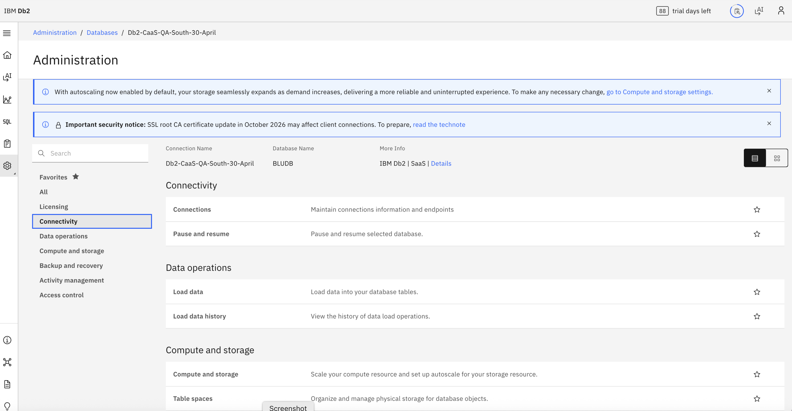
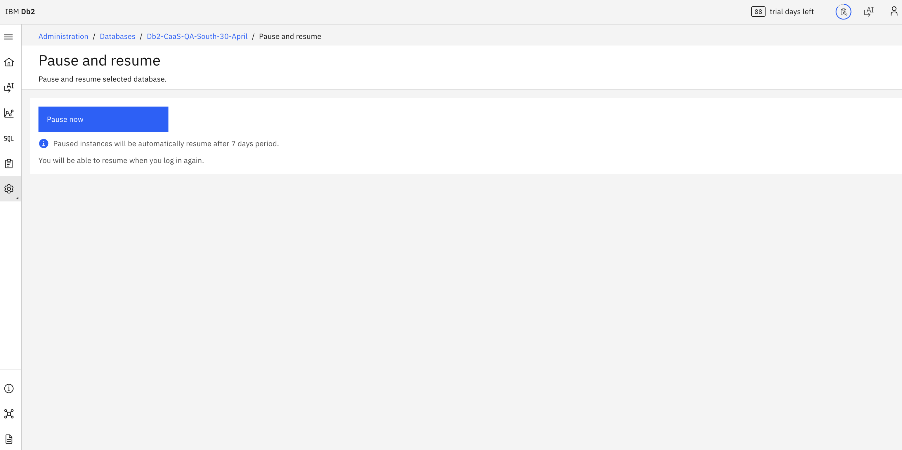
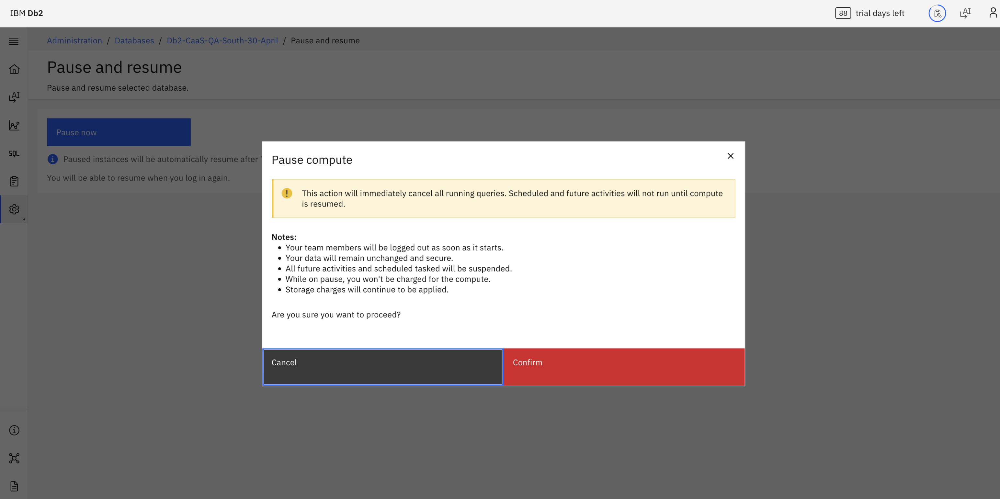
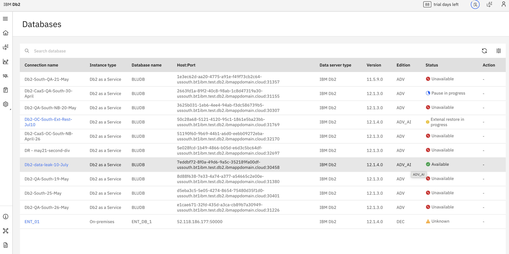
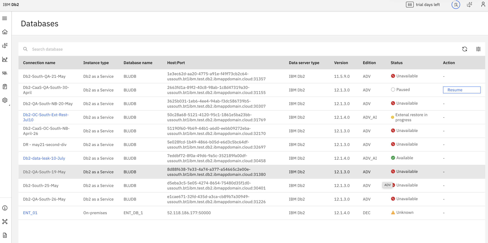
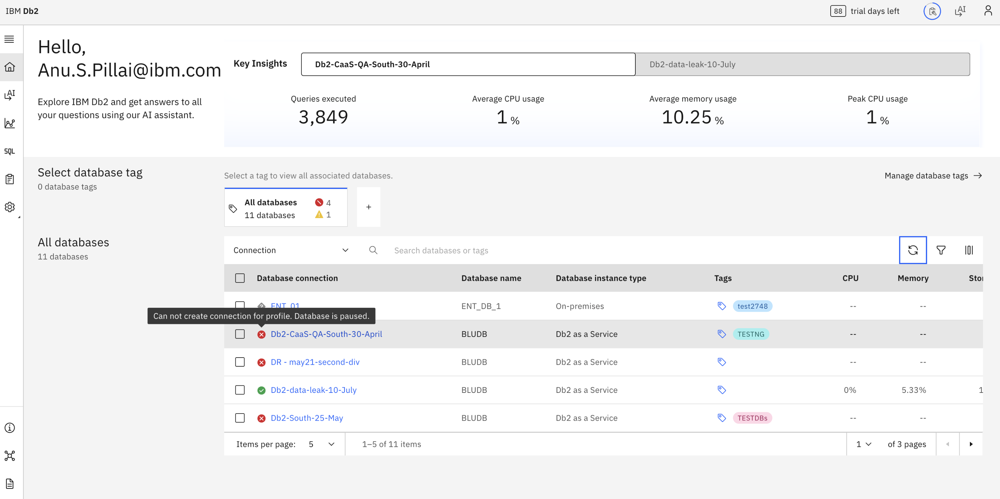
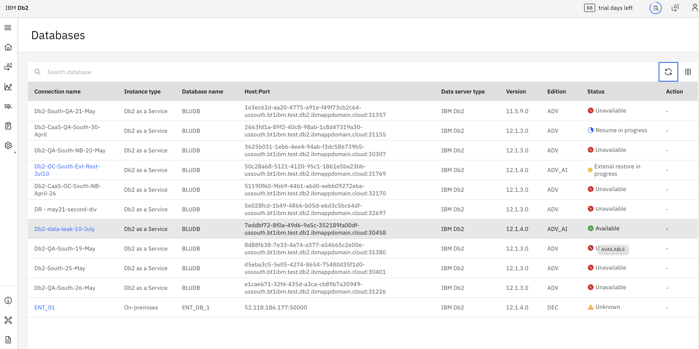
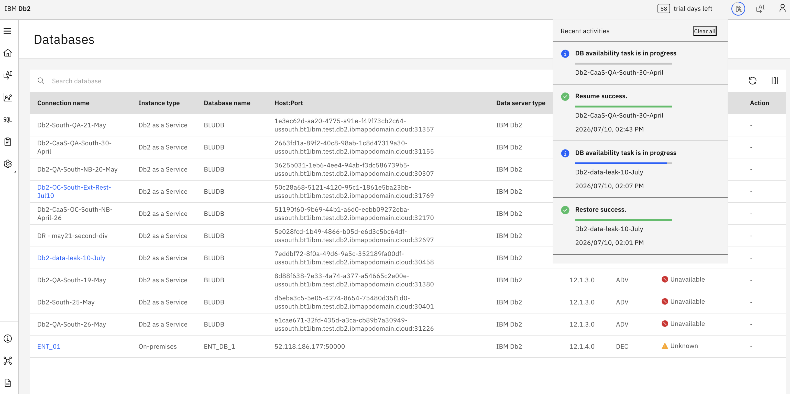

---
copyright:
  years: 2025, 2026
lastupdated: "2026-02-18"

keywords: pause, resume, pause compute, resume compute, cost savings

subcollection: Db2onCloud
---

{:external: target="_blank" .external}
{:shortdesc: .shortdesc}
{:codeblock: .codeblock}
{:screen: .screen}
{:tip: .tip}
{:important: .important}
{:note: .note}
{:deprecated: .deprecated}
{:pre: .pre}

# Pause and Resume
{: #gh_pause-resume}

This section explains how to pasue and resume compute resources of your instance in the new Genius Hub–enabled console. Follow these instructions if you see the updated UI. If you are still using the **legacy console**, refer to the [Pause and Resume](https://cloud.ibm.com/docs/db2-saas?topic=db2-saas-pause-resume) section for the correct steps.
{: important}

You can pause and resume the compute resources of your Db2 on Cloud instance at any time. While paused, you are not charged for compute, but storage charges continue to apply.
{: shortdesc}

## Pausing your instance
{: #gh_pause}

### Step 1: Navigate to Pause & Resume
{: #gh_pause-step1}

From your Db2 on Cloud instance dashboard:

1. Select **Administration** from the left side nav.
2. Go to **Databases** and click on your database.
3. Click on **Connectivity** in left menu
4. Click on **Pause & Resume** under Connectivity section.

{: caption="Navigate to Connectivity to find Pause & Resume" caption-side="bottom"}

{: caption="Navigate to Pause & Resume and click Pause now" caption-side="bottom"}

### Step 2: Confirm the pause
{: #gh_pause-step2}

A confirmation dialog appears with details about what happens when you pause compute. Review the following before proceeding:

- All current queries will be cancelled and no future or scheduled activities will run until compute is resumed.
- Your team members will be logged out as soon as the pause starts.
- Your data will remain unchanged and secure.
- All future activities and scheduled tasks will be suspended.
- While on pause, you won't be charged for the compute.
- Storage charges will continue to be applied.

If you want to check your current in-flight executions before pausing, go to **Monitoring > Statement > In-flight executions**.
{: tip}

Click **Confirm** to pause the instance.

{: caption="Pause compute resource confirmation dialog" caption-side="bottom"}

After you click Confirm, the screen will display the instance with a Paused – In Progress status. This status indicates that the pause operation has started and will remain visible until the instance is fully paused.

{: caption="Instance with a Paused – In Progress status" caption-side="bottom"}

### Step 3: Instance is paused
{: #gh_pause-step3}

After confirming, the instance enters a paused state. The dashboard displays a **Database Paused** screen with a **Resume now** button.

The instance can remain paused for up to 7 days. After 7 days, the instance automatically resumes. Once resumed, you may choose to pause the instance again through the console.
{: important}

{: caption="Database Paused screen" caption-side="bottom"}

{: caption="Homescreen with Paused Instance" caption-side="bottom"}

## Resuming your instance
{: #gh_resume}

### Step 1: Click Resume now
{: #gh_resume-step1}

From the **Database Paused** screen, click the **Resume now** button. The instance begins preparing to resume. This may take up to a few hours depending on the database size.

{: caption="Resume in Progress" caption-side="bottom"}

### Step 2: Verify successful resume
{: #gh_resume-step2}

Once the resume completes, you are returned to the instance dashboard. A **Resume success!** notification confirms that the instance is back online.

{: caption="Resume success notification" caption-side="bottom"}

## Important notes
{: #pause-resume-notes}

- **Compute charges stop**: While paused, you are not charged for compute resources. However, instances on a Reserved Instance (1-Year or 3-Year) term will continue to be billed at the regular rate, even while paused.
- **Storage charges continue**: Storage charges continue to be applied while the instance is paused.
- **Connections terminated**: All active connections and queries are cancelled when the pause starts. Team members are logged out immediately.
- **Scheduled tasks suspended**: All future activities and scheduled tasks are suspended during the pause and resume when the instance is brought back online.
- **Resume time**: Resuming may take up to a few hours depending on the database size.
- **Disaster recovery**: Pause and Resume is not supported on instances with a disaster recovery (DR) configuration.
- **Maintenance updates**: If a maintenance update is required while your instance is paused, the system will temporarily resume the instance to perform the update. Compute charges will apply during the update. The instance will be paused again once the update is complete.
