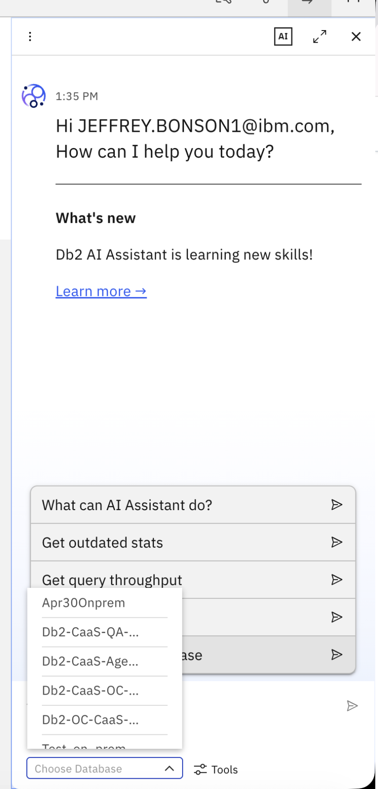
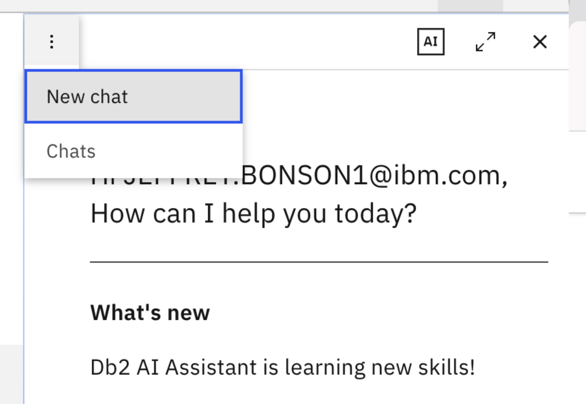
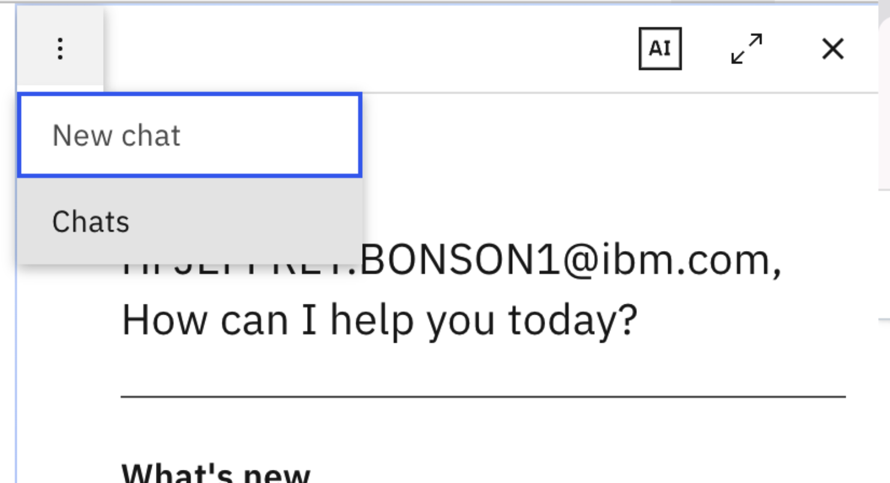
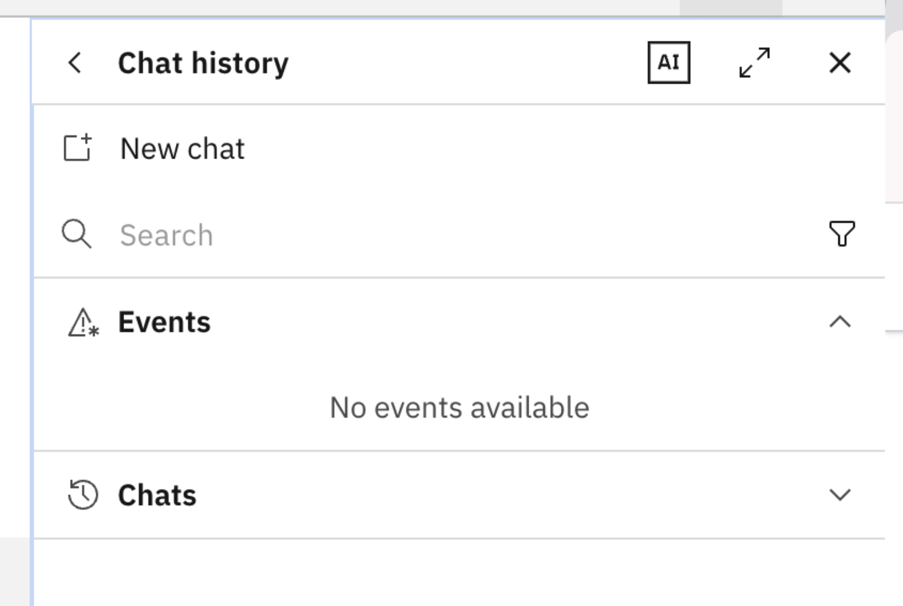
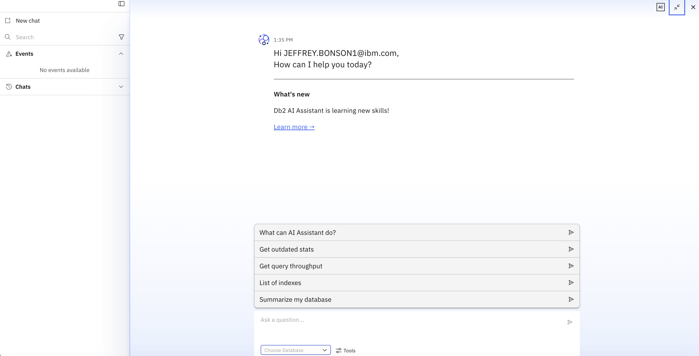

---
copyright:
  years: 2026
lastupdated: "2026-07-24"

keywords: CaaS, Genius Hub–enabled Consol, Agentic AI for CaaS

subcollection: db2-saas
---

{:external: target="_blank" .external}
{:shortdesc: .shortdesc}
{:codeblock: .codeblock}
{:screen: .screen}
{:tip: .tip}
{:important: .important}
{:note: .note}
{:deprecated: .deprecated}
{:pre: .pre}

# Agentic AI for CaaS
{: #agentic_ai_caas}

Agentic AI for CaaS is an intelligent assistant that enables users to interact with their databases using natural language. It simplifies database management, performance analysis, troubleshooting, and data queryingn reducing the need for deep technical expertise.

With multiple operational modes, the assistant supports everything from quick system insights to advanced root cause analysis and SQL generation.

## Key Concepts
{: #gh_key_concepts}

- **Database Context (Mandatory)**: You must select a database before asking any question. All queries are executed within this context.
- **Chat Context**: Each chat session is tied to a single database. To switch databases, start a new chat.

- **Chats vs Events**
  - Chats: History of user questions
  - Events: Automatically generated anomaly and diagnostic reports

### Starting a Chat
{: #gh_start_chat}

1. When you open the chatbot, you must first select a database.
   
   {: caption="Choosing a database" caption-side="bottom"}

2. Once a database is selected, you can only ask questions related to that database.

3. To change the database, start a New chat.

  {: caption="Starting a new chat" caption-side="bottom"}

### Viewing Previous Activity
{: #gh_view_activity}

1. Click on Chats to see your history.

  {: caption="Previous chat history" caption-side="bottom"}

2. This section has two parts:
  - **Chats:** shows the questions you typed/asked.
  - **Events:** shows auto anomaly reports generated automatically.

 {: caption="Chats and Events" caption-side="bottom"}

### Screen Options
You can toggle between half screen and full screen modes.

 {: caption="half screen and full screen modes" caption-side="bottom"}

## Modes of Operation
{: #modes_operation}

### 1. Assistant Mode (Default)

Provides quick operational insights and system-level information.

**Use it for:**

- Resource monitoring (CPU, memory)  
- Configuration queries  
- Basic diagnostics  

**Examples:**

- “Show memory summary”  
- “What is CPU utilization?”  
- “What is the sort heap value of my DB config?”  

### 2. Text-to-SQL Mode

Converts natural language into executable SQL queries.

**Use it for:**

- Data exploration without writing SQL  
- Business reporting queries  

**Examples:**

- “Total runs scored in each World Cup”  
- “Which player scored the most runs in 2011?”  

### 3. Deep Research Mode

Performs advanced diagnostics and multi-step reasoning.

**Use it for:**

- Root cause analysis  
- Performance troubleshooting  
- Complex database health checks  

**Examples:**

- “Why is my query running slow?”  
- “Show all waiting locks”  
- “Perform a database health check”  

## Example Questions

#### 1.DB2 Concept Validation
- What is IBM DB2 and how is it different from MySQL or Oracle?  
- Explain DB2 architecture (instance, database, tablespace, buffer pool).  

#### 2. SQL + DB2 Behavior
- How does DB2 handle NULL values in GROUP BY?  
- Write a query using OLAP functions (ROW_NUMBER, RANK).  

#### 3. Performance & Optimization
- What is RUNSTATS and why is it important?  
- Explain EXPLAIN PLAN in DB2.  

#### 4. Transaction & Concurrency
- What are DB2 isolation levels (UR, CS, RS, RR)?  
- How does DB2 handle deadlocks?  

## Best Practices
{: #gh_bp}

- Use **Assistant Mode** for quick insights  
- Use **Deep Research Mode** for complex issues  
- Provide clear and specific questions  
- Start a new chat when switching databases

## Quick Troubleshooting
{: #agentic_ai_trbl}

| Issue                   | Resolution                                                    |
|-------------------------|--------------------------------------------------------------|
| Unable to ask questions | Ensure database is selected                                  |
| Incorrect results       | Verify schema and context                                    |
| Slow responses          | Use appropriate mode (avoid Deep Research for simple queries) |
| Missing data insights   | Check database connectivity                                  |

## Summary
{: #agentic_ai_summary}

Agentic AI for CaaS transforms how users interact with databases by combining conversational AI with advanced diagnostics and automation. It enables faster decision-making, reduces manual effort, and empowers both technical and non-technical users to extract value from data efficiently.
