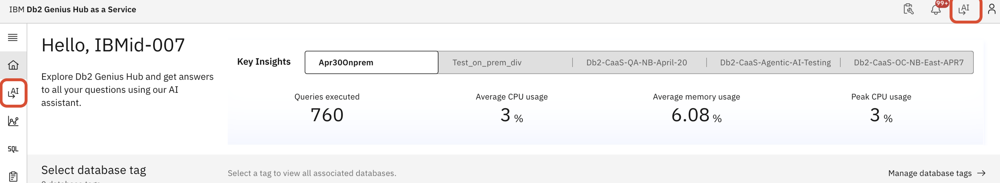
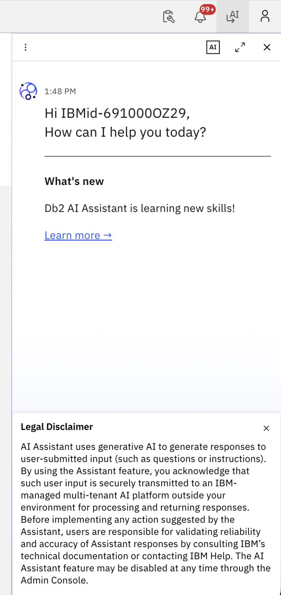
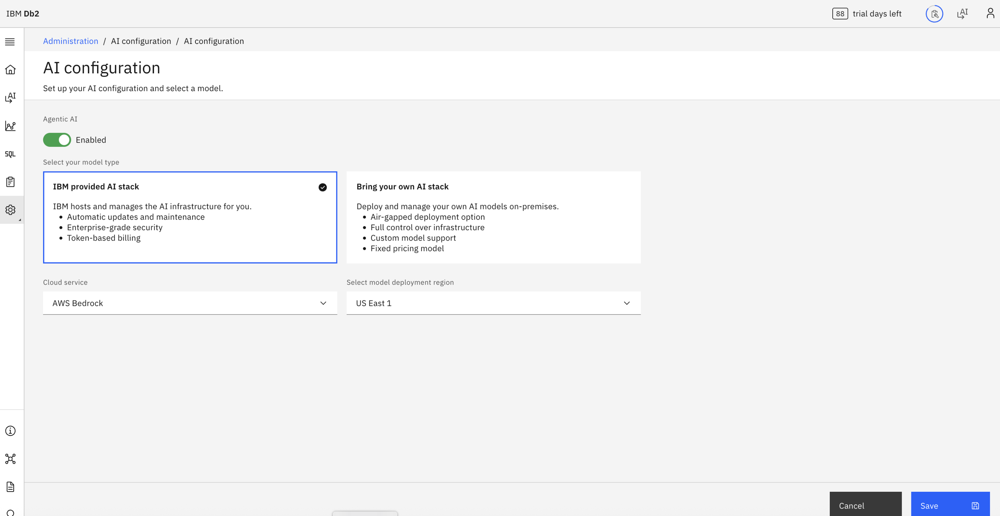
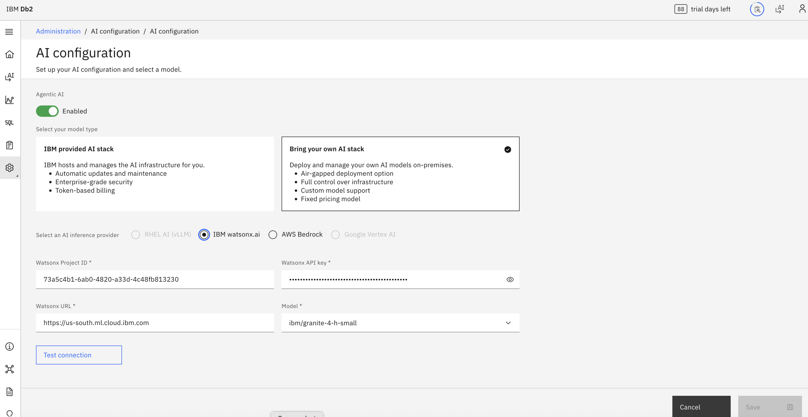
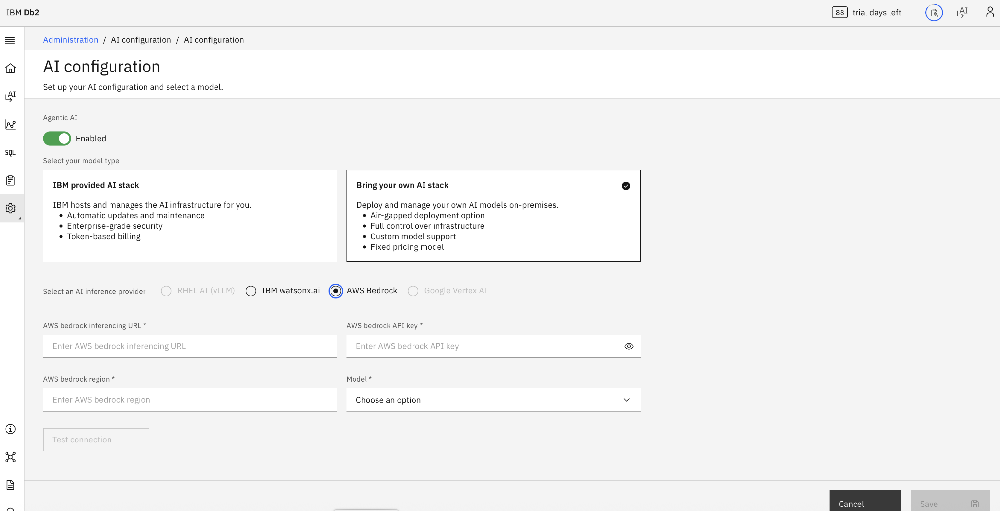

---
copyright:
  years: 2026
lastupdated: "2026-07-24"

keywords: CaaS, Genius Hub–enabled Consol, AI Configuration for CaaS

subcollection: db2-saas
---

{:external: target="_blank" .external}
{:shortdesc: .shortdesc}
{:codeblock: .codeblock}
{:screen: .screen}
{:tip: .tip}
{:important: .important}
{:note: .note}
{:deprecated: .deprecated}
{:pre: .pre}

# AI Configuration for CaaS
{: #ai_config_caas}

The AI Configuration feature allows you to enable and access the Agentic AI chatbot within CaaS. Depending on whether the feature is enabled or disabled, clicking the AI option will either open the chatbot or take you to the configuration page.

## Accessing the Chatbot
{: #access_chatbot}

You can access the AI chatbot from two locations in the interface:

- Header
- Side navigation panel

When Agentic AI is enabled, clicking the AI button from either location will open the chatbot.

{: caption="Accessing the chatbot" caption-side="bottom"}

### Behavior When AI is Disabled
If Agentic AI is disabled and you are an admin user, clicking the AI button will redirect you to the AI Configuration page.

## Enabling Agentic AI
{: #en_agentic_ai}

On the AI Configuration page:

1. Locate the toggle button (disabled by default).
2. Click the toggle to enable it.
3. Once enabled, configuration options will appear.

{: caption="Enabling the agentic AI" caption-side="bottom"}

## Configuring AI Options
{: #configure_ai}

After enabling the toggle, you will see the available configuration options.

#### Default Option
IBM Provided AI Stack (selected by default)

You can keep this default selection or choose another option if needed.

{: caption="Example Autoscaling panel" caption-side="bottom"}

#### Bring Your Own AI Stack
If you choose to use your own AI stack, the following options are available:

- IBM watsonx.ai

{: caption="IBM watsonx.ai" caption-side="bottom"}

- AWS Bedrock

{: caption="AWS Bedrock" caption-side="bottom"}

#### Saving the Configuration
After selecting the desired option:

1. Click Save
2. Once saved, you will be redirected back to the previously visited page

### End-to-End Flow Summary
{: #ai_end_summary}

1. Click AI button from header or sidenav
2. If enabled → chatbot opens
3. If disabled (admin) → redirected to configuration
4. Enable toggle
5. Select AI stack (default or BYO)
6. Click Save
7. System returns to previous page
8. Chatbot is now accessible

### Summary
{: #ai_config_summary}

The AI Configuration feature controls whether the Agentic AI chatbot is available and which AI stack it uses. Once enabled and saved, users can directly access the chatbot from the main interface without additional setup.
