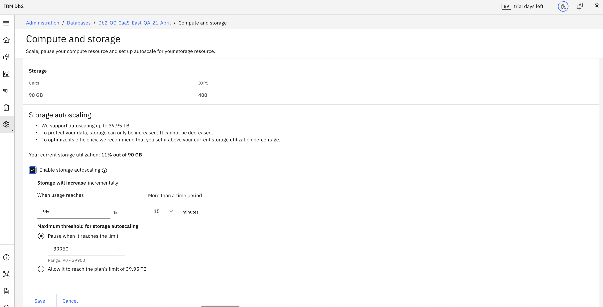
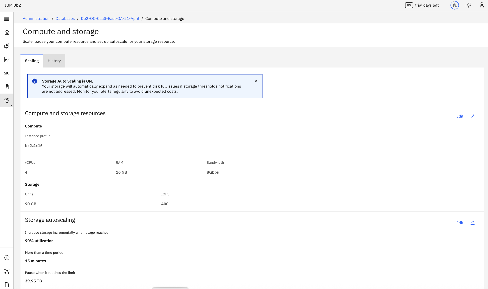

---

copyright:
  years: 2026
lastupdated: "2026-07-24"

keywords:

subcollection: db2-saas

---

{:external: target="_blank" .external}
{:shortdesc: .shortdesc}
{:codeblock: .codeblock}
{:screen: .screen}
{:tip: .tip}
{:important: .important}
{:note: .note}
{:deprecated: .deprecated}
{:pre: .pre}

# Auto-scaling
{: #gh_auto_scaling}

This section explains how to configure autoscaling in Db2 SaaS using the new Genius Hub–enabled console. Follow these instructions if you see the updated UI. If you are still using the legacy console, refer to the [Autoscaling](https://cloud.ibm.com/docs/db2-saas?topic=db2-saas-auto-scaling) section for the correct steps.
{: important}

When you enable autoscaling, the storage on your {{site.data.keyword.Db2_on_Cloud_long}}  instance will automatically be scaled up if your storage use exceeds the threshold you specify. For example, you can choose to scale up your storage by 20GB if more than 90% of your storage is in use for a period of 15 minutes.

To monitor your storage usage, use the IBM Cloud® Monitoring integration, which provides metrics for disk space.

## General Autoscaling Parameters

- When to scale, based on usage over time.
- A hard limit on scaling, your deployment stops autoscaling at the limit.

## Performance Plan
{: #gh_scaling_perfomance}

Autoscaling is enabled by default in the Performance plan
{: note}

## Autoscaling Considerations
{: #gh_autoscaling_consdr}

- **Storage cannot be scaled down.**
- Each increment is 10% of your storage size. The minimum increase is 20GB.
- Storage can be auto-scaled up to a limit of 39.95 TB.
- You must have the IAM Operator, Editor or Administrator authority in order to use this feature.
- If you rarely increase storage on your deployment, you might want to manually scale your deployment rather than enabling the auto-scaling feature.
- Scaling is an online operation.
- Some scaling operations can be more long running than others. Significantly increasing the storage size can take longer than increasing it by a small amount because additional underlying hardware resources must be provisioned.
- IOPS value will be maintained during auto scale in most cases. However, if the current IOPS is less than the minimum IOPS required for the new storage, it will be automatically increased to the minimum value required.

## Configuring Autoscaling in the UI
{: #gh_confg_scaling}

The **Autoscaling** panel is available from your deployment’s console page:

1. Go to the **Administration** tab.  
2. Select your database.  
3. From the left menu, choose **Compute & storage**.  
4. In the **Compute & storage** section, locate the **Autoscaling** panel.  
   
### To enable autoscaling
1. Click **Edit**
2. Check **Enable storage autoscaling**
3. Enter your desired parameter values.
4. Be sure to click **Save** for your configuration to be saved and your changes to take effect.

### To disable autoscaling
1. Click **Edit**
2. Uncheck **Enable storage autoscaling**.
3. Click **Save Changes** to save the configuration.
