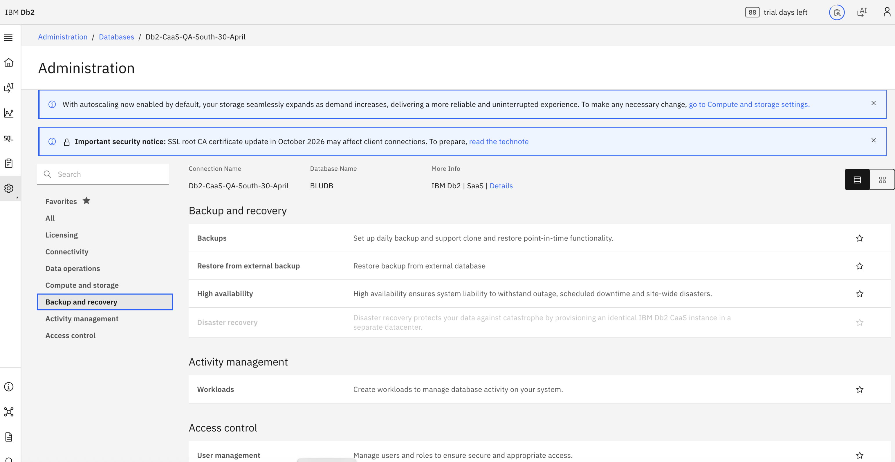
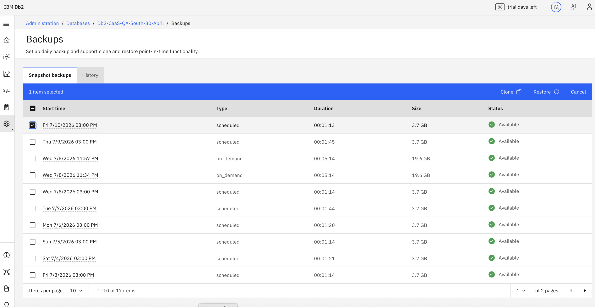
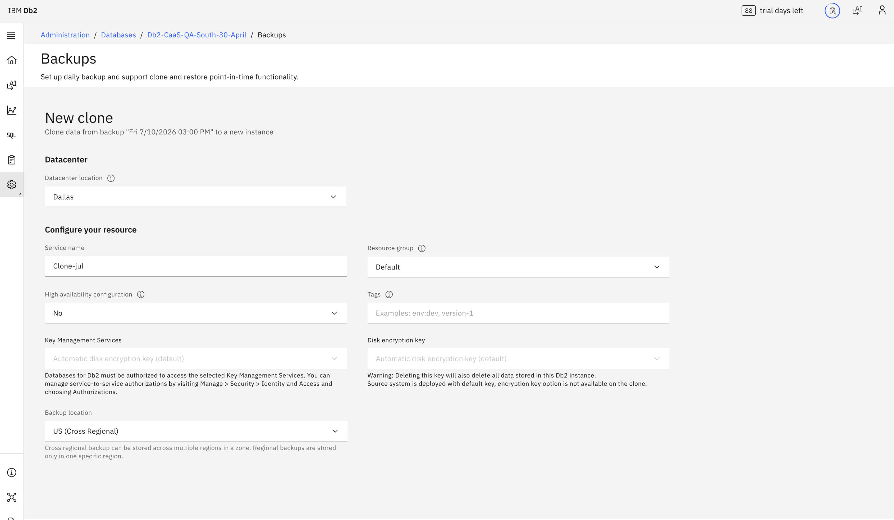
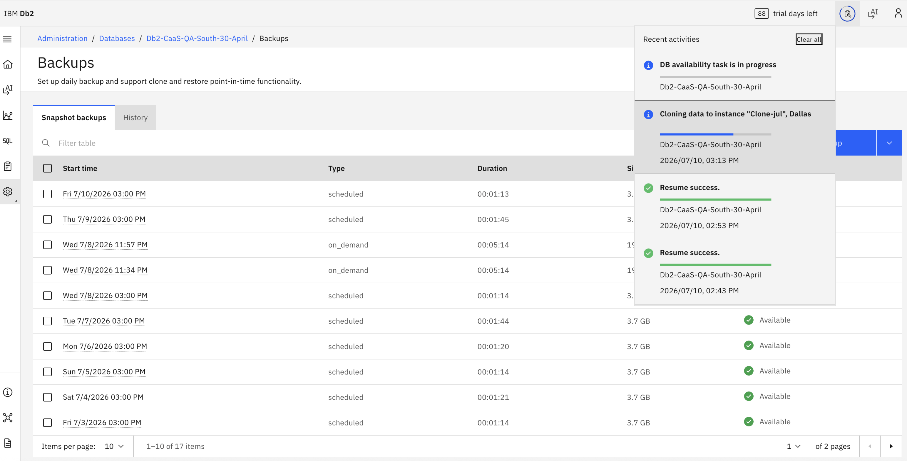
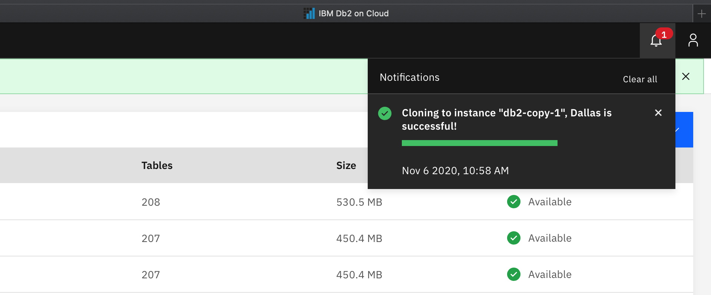
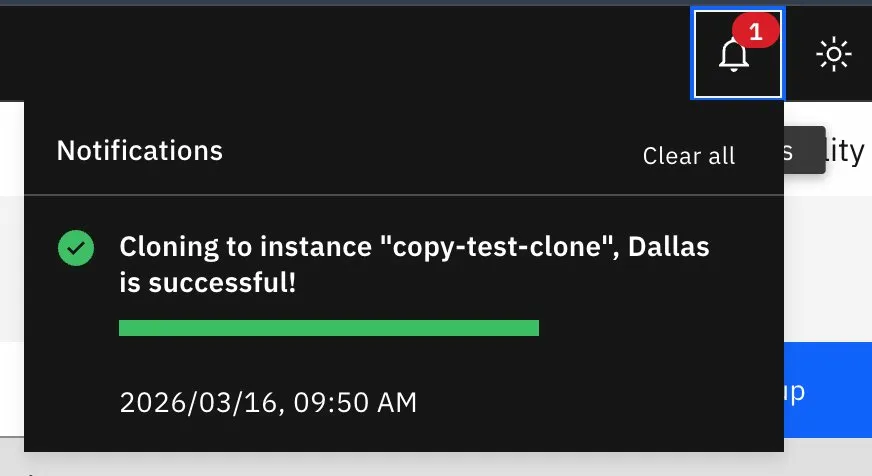

---

copyright:
  years: 2014, 2025
  
lastupdated: "2026-07-24"

keywords:

subcollection: db2-saas

---

{:external: target="_blank" .external}
{:shortdesc: .shortdesc}
{:codeblock: .codeblock}
{:screen: .screen}
{:tip: .tip}
{:important: .important}
{:note: .note}
{:deprecated: .deprecated}
{:pre: .pre}

# Copy Database
{: #gh_cp_db}

This section explains how to use copy database feature in the new Genius Hub–enabled console. Follow these instructions if you see the updated UI. If you are still using the **legacy console**, refer to the [Copy database](https://cloud.ibm.com/docs/db2-saas?topic=db2-saas-cp_db) section for the correct steps.
{: important}

The {{site.data.keyword.Db2_on_Cloud_long}} Copy Database feature gives you the ability to copy your existing database to a new instance or easily change plans and instance types.

The {{site.data.keyword.Db2_on_Cloud_long}} Copy Database feature gives you the ability to copy your existing database to a new instance.
{: shortdesc}

The following are helpful use cases for creating a copy of a database:

- Run analytics or reports.
- Make a fresh copy of your production database each morning to use for development purposes.
- Make a *template* database for an app, and make a copy of that template as your apps need it.
- Move from a single node instance to a HA instance or vice versa.
- Move between Standard or Enterprise Plans.

Because the copy instance creates a new instance and restores your existing backup, it’s important to keep the following in mind:

- The new instance will have the same amount of resources as the instance it was copied from.
- Create a full backup of the data you want restored onto the copy. Any data written after the backup will not be moved across.
- When creating the copy, an outage will be required to point your apps to the new hostname and port.

## Copying a Performance plan instance
{: #gh_cp_performance}
 

### Prerequisites
{: #gh_cp_perf_prereqs}

To copy your Performance plan database to a new instance, a backup of the current database must exist.

### Select a backup
{: #gh_cp_perf_bkup}

- Select **Administration** from the left side nav.  
- Go to **Databases** and click on your database.  
- Select **Backup and recovery** option from the left menu.  
- Click on **Backups**.  
- Under the **Snapshot backups** tab, select the checkbox next to the backup you want to copy.  
- Click **Clone**.  

{: caption="Select a backup to copy to a new instance" caption-side="bottom"}

{: caption="Select a backup and click Clone" caption-side="bottom"}

### Creating the copy instance
{: #gh_cp_perf_create_inst}

On the **New clone** page, enter information for the new copy instance:

1. Select the data center location for the new copy instance under **Datacenter location**.
2. Enter a name under **Service name**.
3. Select the resource group of the new instance under **Resource group**.
4. If you'd like a highly available instance, select **Yes** for **High availability configuration**. Verify that the other options are correct.
5. Select a KMS instance to use for the new copy instance under **KMS instance**. If not selected, a default Key Protect instance and key will be used.
6. Select the backup location for the new copy instance under **Backup Location**. If the selected data center location does not support **Backup Location**, the backup location cannot be changed.
7. Select a **Pricing plan**.

8. If you'd like a highly available instance, select **Yes** for **High availability configuration**.
9. Optionally, add tags for the new instance under **Tags**.
10. Select a Key Management Services instance under **Key Management Services**. If not selected, automatic disk encryption key is used by default.
11. Select a disk encryption key under **Disk encryption key**. If not selected, automatic disk encryption key is used by default.
12. Select the backup location for the new copy instance under **Backup location**. Cross regional backup can be stored across multiple regions in a zone. Regional backups are stored only in one specific region.
13. Click **Clone**.

{: caption="Enter information for the new clone instance" caption-side="bottom"}

### Progress
{: #gh_cp_prog}

The **Notifications** icon of the console shows the progress of the copy process.

{: caption="Copy progress" caption-side="bottom"}

### Copy completion
{: #gh_cp_fin}

After successful completion of the copy process, the **Notifications** icon of the console displays a success message.

- The **Notifications** icon of the console shows the progress of the copy process.
   

{: caption="Copy successfully completed" caption-side="bottom"}

- After successful completion, the **Notifications** icon displays a success message. Your new copy instance is now available.
   
{: caption="Clone successfully completed" caption-side="bottom"}
