---
copyright:
  years: 2026
lastupdated: "2026-07-24"

keywords: Geo-replicated disaster recovery, DR, disaster recovery

subcollection: db2-saas
---

{:external: target="_blank" .external}
{:shortdesc: .shortdesc}
{:codeblock: .codeblock}
{:screen: .screen}
{:tip: .tip}
{:important: .important}
{:note: .note}
{:deprecated: .deprecated}
{:pre: .pre}

# Geo-replicated disaster recovery (DR)
{: #gh_dr}

This section explains how to configure disaster recovery in Db2 SaaS in the new Genius Hub–enabled console. Follow these instructions if you see the updated UI. If you are still using the **legacy console**, refer to the [DR](https://cloud.ibm.com/docs/db2-saas?topic=db2-saas-dr_gen) section for the correct steps.
{: important}

IBM® Console® as a Service uses Db2 HADR technology to provide on-demand Disaster Recovery (DR) capabilities. You can add a DR node in an offsite data center of your choice and use it as a recovery site if the primary data server becomes unavailable because of external events such as a natural disaster.

In the event of an outage at the primary site, you can manually fail over to the geo-replicated DR node. When the primary site becomes available again, you can fail back to it.

## Important considerations
{: #gh_ic}

- Administrative functionality is not available on the DR node. Run all administrative tasks on the primary instance while it is **Active**.
- Users must have access to the appropriate Resource Group in the IBM Cloud account to configure Disaster Recovery.
- DR nodes are available only for Enterprise and Standard HADR plans. DR nodes are not supported for single-node plans or in EU-Cloud environments.
- Failover to the DR site is not automatic. You must manually initiate the failover.

## High Availability and Disaster Recovery
{: #gh_dr_ha}

The IBM Db2 as a Service High Availability (HA) plan uses Db2 HADR SYNC and ASYNC nodes to provide availability and reliability within the same region. Failover to HA nodes is handled automatically by IBM through Automatic Client Reroute (ACR). HA deployments operate within a single MZR or SZR region.

Geo-Replicated Disaster Recovery extends availability beyond a single region by allowing you to deploy a DR node in a different region. This configuration provides access to your data if the primary region experiences an outage.

For example:

- Primary instance: Dallas
- DR node: London

## Enterprise and Standard HADR plans
{: #gh_dr_se}

DR nodes are now available for Enterprise and Standard HADR plans only. DR nodes are currently not supported in single node plans or in EU-Cloud.

### Creating a DR node
{: #gh_creating_drnode}

1. Go to **Settings > Databases**. Select the required database and Open the **Disaster Recovery** tab.
   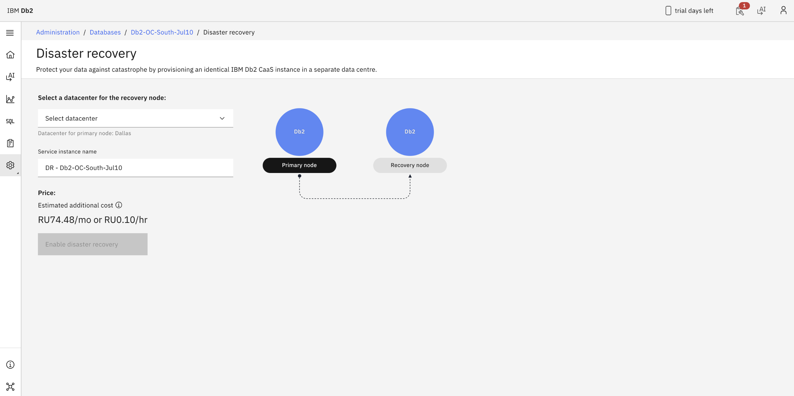
2. Select a data center for the DR node.
3. Click **Enable Disaster Recovery**.
   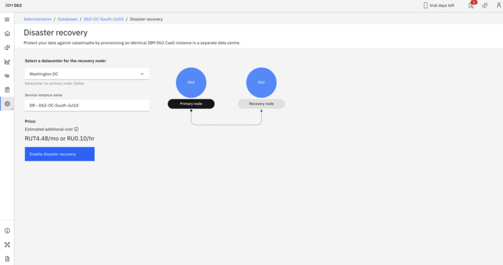
   Click **Enable Disaster Recovery**.
4. After deployment starts, the new DR node appears on the **Disaster Recovery** page along with a deployment notification.
   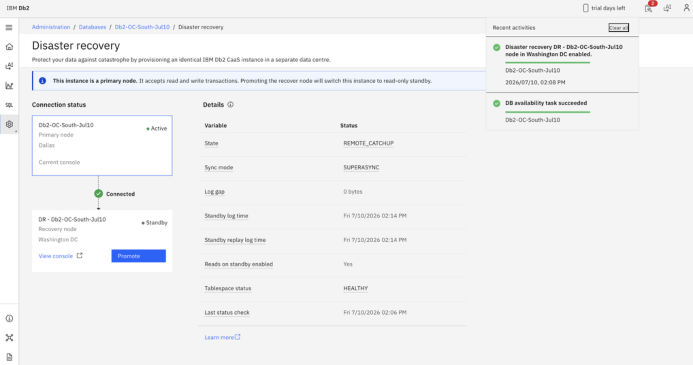
5. DR enablement can take up to 30 minutes, depending on the size of the database.
   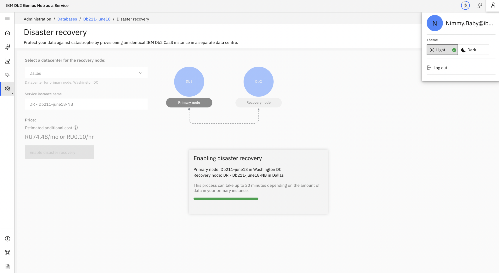

#### After DR enablement completes
{: #gh_enabledr}

You can access the DR Console by:

- Clicking **View Console**, or
- Clicking **Promote**

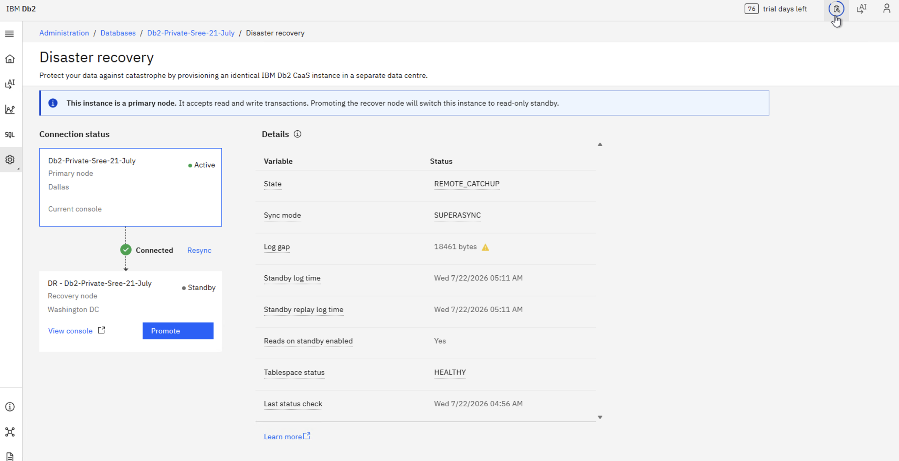

### Deleting a DR node
{: #gh_deletedr}

Deleting a DR service instance removes only the DR node. The HA instance remains intact.

After the DR node is deleted, you can deploy a new DR node in any supported location from the HA environment.

The DR node must be in a **Standby** state before it can be deleted. If the DR node is not in Standby, initiate a failback to the primary site before deleting it.
{: important}

To delete a DR node:

1. Open the IBM Cloud **Resource List**.
2. Locate the DR service instance.
3. Delete the DR service instance.

Both failover and failback operations are initiated from the DR Console.
{: important}

### Forcing a failover to the DR site
{: #gh_drforcing}

1. Open the recovery site web console from the IBM Cloud dashboard.
   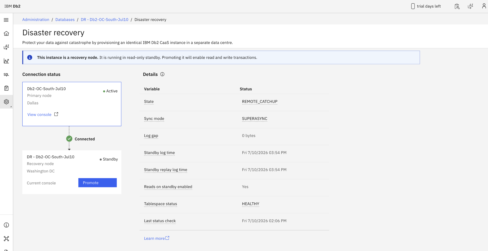
2. On the **Disaster Recovery** page, click **Promote**.
   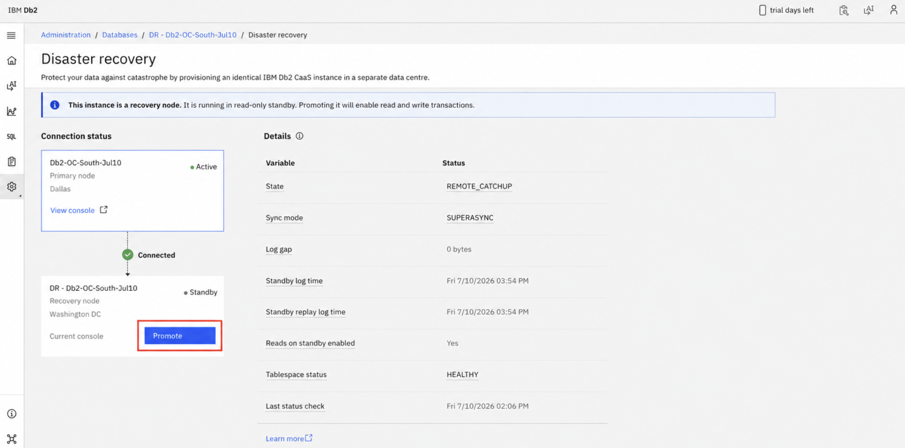
3. Click **Promote** again to confirm the takeover.
   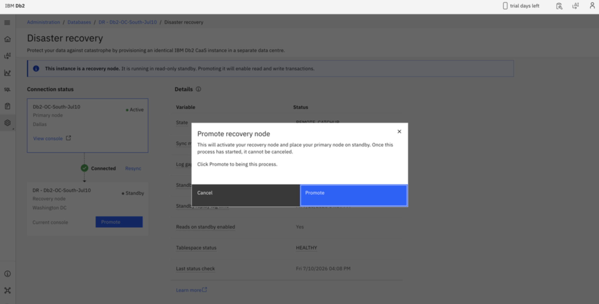
4. The takeover process can take up to 30 minutes, depending on the size of the database.
   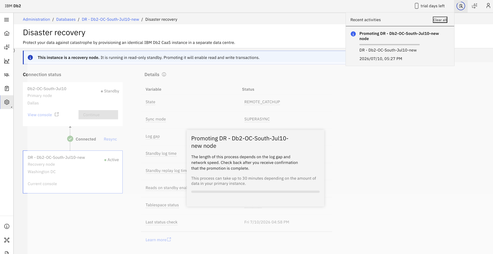
5. When the takeover completes:
   - The **Promote** button moves to the original primary node, which becomes the standby node.
   - A notification indicates that the takeover was successful.
   - The recovery site becomes **Active**.
   
   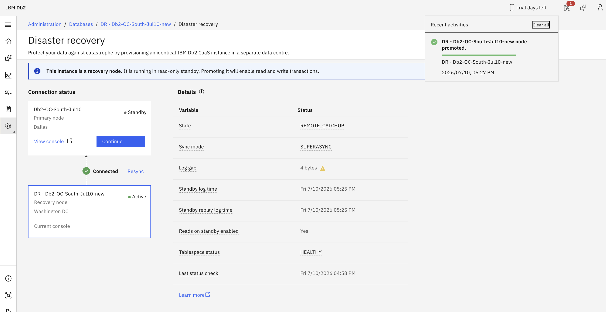

After the DR database is promoted to primary, the HA database becomes unavailable. The CaaS Console remains available unless it is also affected by the disaster.
{: note}

### Forcing a failback to the primary site
{: #gh_drfailback}

1. Open the primary site web console from the IBM Cloud dashboard.
   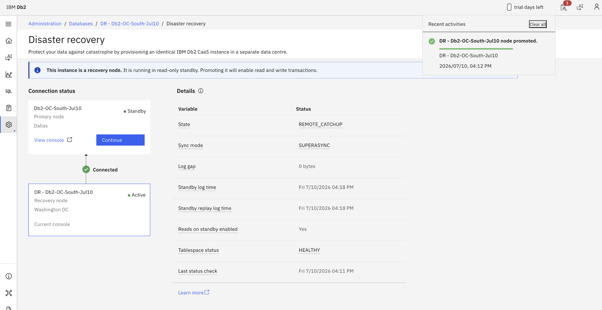
2. On the **Disaster Recovery** page, click **Promote**.
3. When the confirmation page appears, click **Promote** again to initiate the takeover.
   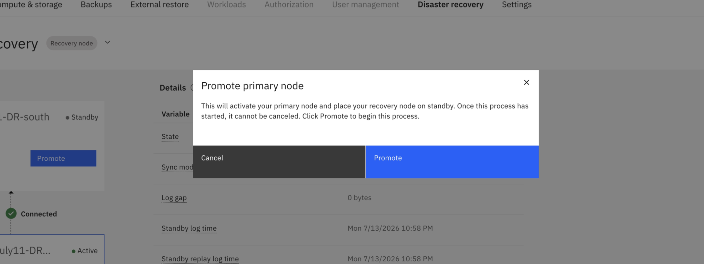
4. When the takeover completes:
   - The **Promote** button moves to the recovery node, which becomes the standby node.
   - A notification indicates that the takeover was successful.
   - The primary site becomes **Active**.
   
     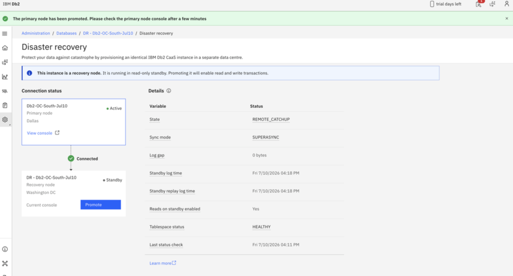

## Limitations
{: #gh_drlimitations}

The following information is not available or synchronized on the DR node:

1. Saved SQL scripts and SQL Editor history
2. Scaling history
3. Backup and restore settings
4. Load history
