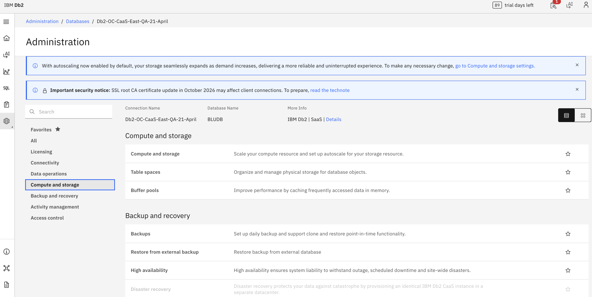
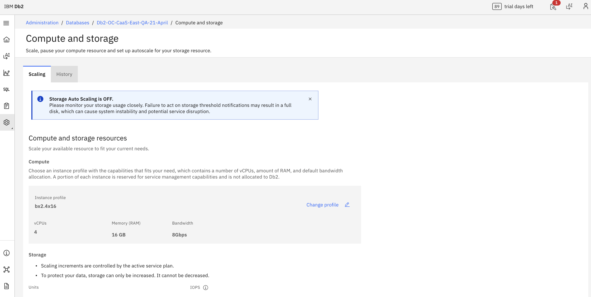

---

copyright:
  years: 2026
lastupdated: "2026-07-24"

keywords:

subcollection: db2-saas

---

{:external: target="_blank" .external}
{:shortdesc: .shortdesc}
{:codeblock: .codeblock}
{:screen: .screen}
{:tip: .tip}
{:important: .important}
{:note: .note}
{:deprecated: .deprecated}
{:pre: .pre}

# Flexible scaling
{: #gh_flex_scale}

This section explains how to configure flexible scaling in Db2 SaaS using the new Genius Hub–enabled console. Follow these instructions if you see the updated UI. If you are still using the legacy console, refer to the [Flexible Scaling](https://cloud.ibm.com/docs/db2-saas?topic=db2-saas-scale) section for the correct steps.
{: important}

{{site.data.keyword.Db2_on_Cloud_long}}  provides you with the ability to independently scale up compute cores and storage.
{: shortdesc}

As the number of cores is increased, memory is also increased.  The updating of resources can result in an outage that can last up to 20 minutes.
{: important}

Storage cannot be scaled down once it has been increased.
{: important}

## Perfomance Plan
{: #fs_perfomance_plan}

Each {{site.data.keyword.Db2_on_Cloud_long}} Performance Plan instance deploys with 50 GB of disk space and 400 IOPS by default. Storage can be scaled up to a maximum of 39,950 GB in increments of 20 GB starting at 50 GB, while IOPS can be scaled up to a maximum of 192,000 in increments of 100.

The following table shows the available IOPS ranges based on storage capacity.
{: shortdesc}

| Total Size (GB) |          | Total IOPS |          |
|-----------------|----------|------------|----------|
| min             | max      | min        | max      |
| 50              | 150      | 400        | 4,000    |
| 170             | 310      | 400        | 8,000    |
| 330             | 390      | 400        | 16,000   |
| 410             | 1,990    | 400        | 24,000   |
| 2,010           | 3,990    | 400        | 40,000   |
| 4,010           | 7,990    | 800        | 80,000   |
| 8,010           | 31,990   | 2,000      | 160,000  |
| 32,010          | 39,950   | 2,000      | 192,000  |
{: caption="Storage/IOPS scaling ranges" caption-side="top"}

## Scaling Storage from the Console

To scale storage from within the console, complete the following steps:

1. Select **Administration** from the left side menu.
2. Go to *Databases* and click on your database.
3. Select the **Compute & storage** from the left menu.
4. Click on **Compute & storage** section on the main window
5. Select **Edit** under the Compute & storage resources.
6. Select the desired **Units** for storage and IOPS to make changes.
7. Click **Save**.
8. Select **Confirm** if you are satisfied with the changes.

{: caption="Perfomance Plan memory and storage" caption-side="bottom"}

{: caption="Perfomance Plan memory and storage" caption-side="bottom"}

> **Note:** In this documentation, we refer to storage capacity using the unit **GB (Gigabytes)** to align with industry standard terminology. However, the actual provisioning and billing of storage are based on **GiB (Gibibytes)**.

### GB vs GiB

- **GB (Gigabyte)** is a decimal unit, where
  **1 GB = 1,000,000,000 bytes**
- **GiB (Gibibyte)** is a binary unit, where
  **1 GiB = 1,073,741,824 bytes**
