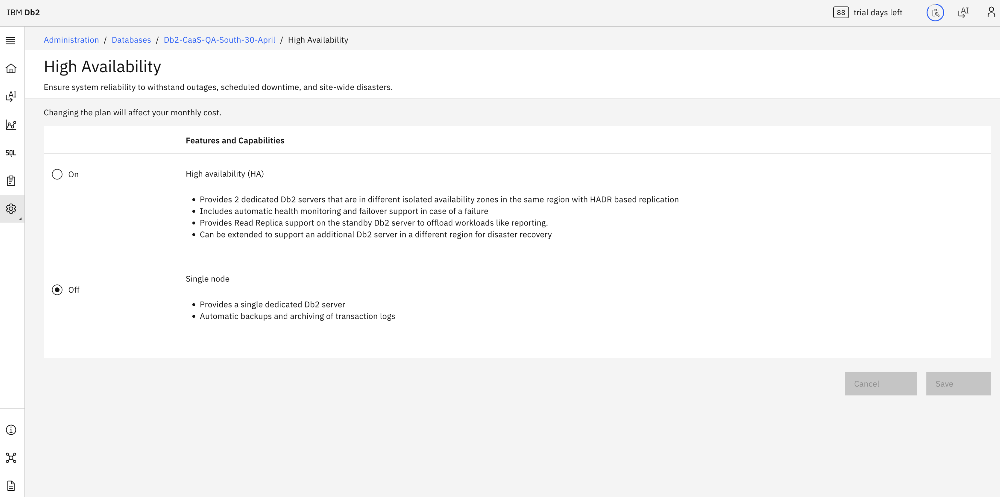

---

copyright:
  years: 2014, 2026
lastupdated: "2026-07-24"

keywords: HADR, high availability disaster recovery, performance

subcollection: db2-saas

---

{:external: target="_blank" .external}
{:shortdesc: .shortdesc}
{:codeblock: .codeblock}
{:screen: .screen}
{:tip: .tip}
{:important: .important}
{:note: .note}
{:deprecated: .deprecated}
{:pre: .pre}

# HADR Conversion
{: #gh_hadr_conv}

This section explains how to configure HADR conversion in the new Genius Hub–enabled console. Follow these instructions if you see the updated UI. If you are still using the **legacy console**, refer to the [HADR Conversion](https://cloud.ibm.com/docs/db2-saas?topic=db2-saas-hadr-conversion) section for the correct steps.
{: important}

With {{site.data.keyword.Db2_on_Cloud_long}} Performance plans, administrators can change their high availability configuration. Administrator's can convert their {{site.data.keyword.Db2_on_Cloud_short}} instance from high availability, to a single node instance and vice versa.

## Considerations
{: #gh_considerations}

- Downtime during any maintenance will increase as rolling updates/maintenance cannot be performed if going from a high available instance to single node instance.
- If you are configuring from high availability to single, note that there will be bit of downtime at the end of the configuration to restart the orchestrator to recognize the availability configuration has changed.
- When scaling from a single-node setup to a high-availability configuration, expect a brief connection interruption as the orchestrator restarts to integrate the newly added pod.
- Deployments which have a Disaster Recovery configured can not switch to single node without unconfiguring the diasaster recovery settings.

## Configuring Availability in the UI

The High Availability panel is on the Adminstration tab > Databases > Select your database > Backup and recovery > High Availability in console page.

You can choose the desired availability and click **Save**.

