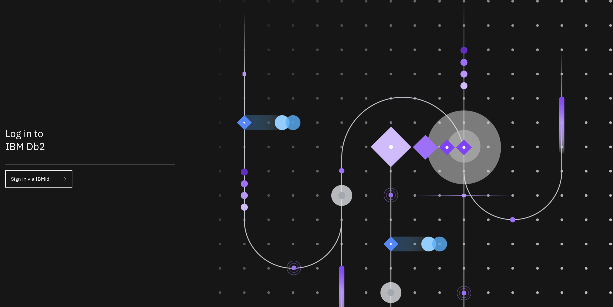
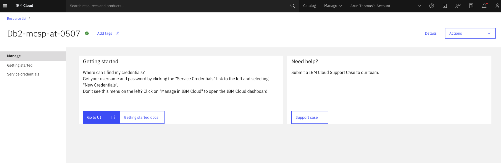
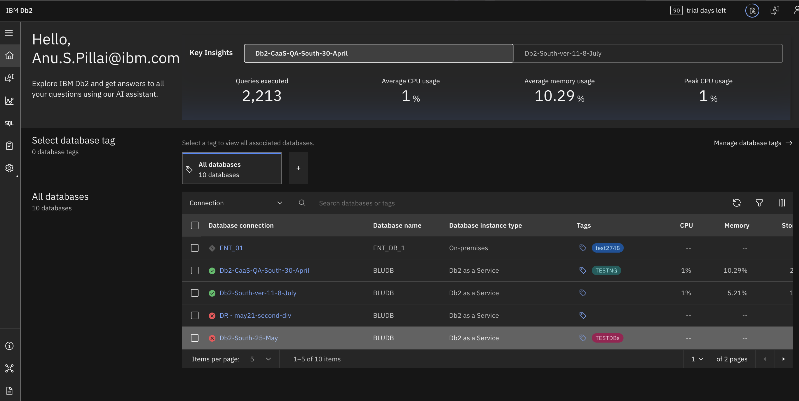
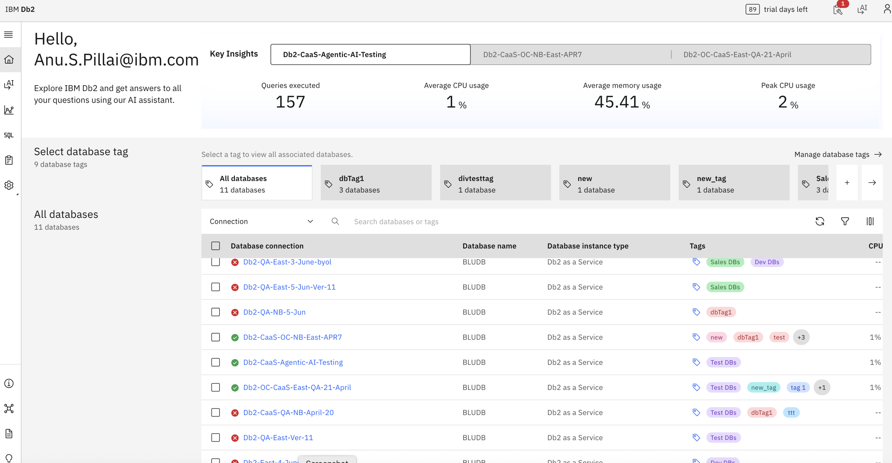
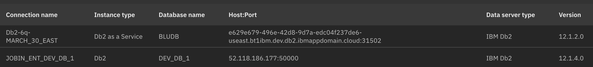
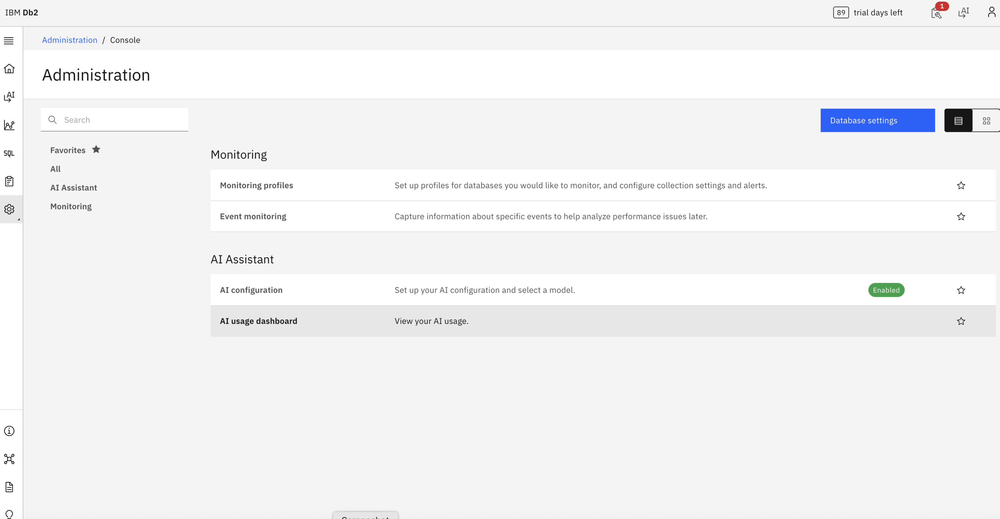
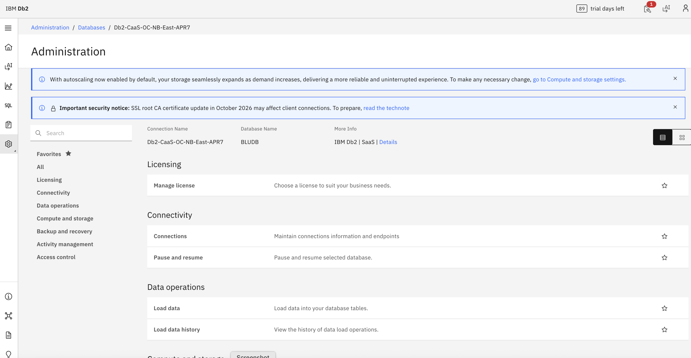

---
copyright:
  years: 2026
lastupdated: "2026-07-24"

keywords: CaaS, Genius Hub–enabled Consol, CaaS login, login to CaaS

subcollection: db2-saas
---

{:external: target="_blank" .external}
{:shortdesc: .shortdesc}
{:codeblock: .codeblock}
{:screen: .screen}
{:tip: .tip}
{:important: .important}
{:note: .note}
{:deprecated: .deprecated}
{:pre: .pre}

# Logging into CaaS
{: #caas_login}

This section explains how to log in to the new Genius Hub–enabled console (CaaS). Follow these instructions if you see the updated UI. If you are still using the legacy console, refer to [Getting started with IBM Db2 SaaS](https://cloud.ibm.com/docs/db2-saas?topic=db2-saas-getting-started) for details on logging in to Db2 SaaS.  
{: important}

You can access the new Genius Hub enabled console (CaaS) in different ways depending on your user type.

## IAM users
{: #caas_im}

- Sign in with your IAM ID on the CaaS login page.  

- You can also go to the **Cloud catalog**, select a resource, and click **GOTOUI**.  

- After signing in, you are redirected to the CaaS home page.  

## IAM administrators
{: #caas_iamadmin}

IAM administrators can log in using the same process as IAM users (via the login page or catalog).After logging in, administrators can manage databases and user access.

## Console Roles in CaaS
CaaS defines three console roles:

- **Console Administrator** – The IBM Cloud account owner is assigned this role by default. Console Administrators can manage databases, user access, and assign console roles to other members.  
- **Console Manager** – A role with elevated permissions to manage certain console functions, delegated by the Administrator.  
- **Console User** – All other members of the IBM Cloud account are Console Users by default, with limited access.

To manage console roles:
- A Console Administrator can go to the **Launchpad user management page** (db2.ibm.com).  
- From there, they can add or update console roles for other users.

## Database users (JDBC admin, JDBC user)
{: #caas_dbusers}

The standard CaaS login URL does not work for database users. Database users require a **direct login URL**, which must be provided by an IAM administrator.

**Steps for IAM administrator to obtain the direct URL:**

1. Go to **Administration → Databases**.  
2. Select the required database.  
3. Open **User Management**.  
4. Copy the URL displayed.  
5. Share this URL with the database user for direct login.  
{: shortdesc}

## Viewing and Accessing Databases in Db2 CaaS
{: #caas_db}

Follow these steps to view and access databases in Db2 CaaS.

### Step 1: View database details
After logging in to Db2 CaaS, the home page displays a list of databases with detailed information.  

You can configure the view to include:

- Database connection  
- Database name  
- Database instance type  
- Tags and alerts  
- CPU, memory, storage, and log space  
- Response time (ms)  
- Statements (total), rows read (/min), statements (/min)  
- Concurrent connections and lock waits (/min)  
- Top time spent  
- Server type and version  
- Host:Port  
- Total CPUs  

### Step 2: Identify the database type

Check the **Instance Type** to determine the database type:

- **Db2 as a Service** (cloud database)  
- **Db2** (on‑premises database)  

### Step 3: Access cloud databases

1. Select **Databases** under the **Administration** icon on the left‑hand side.  
2. A list of available databases is displayed.  
3. Click a database with status **Available** and instance type **Db2 as a Service**.  
4. The cloud console menu opens.  

### Step 4: Access on‑premises databases

1. Select **Console** under the **Administration** icon on the left‑hand side.  
   - Alternatively, click a database with status **Available** and instance type **Db2**.  
2. The on‑premises menu opens.  

