---
copyright:
  years: 2026
lastupdated: "2026-09-15"

keywords: CaaS, Genius Hub–enabled Consol, CaaS login, login to CaaS

subcollection: db2-saas
---

{:external: target="_blank" .external}
{:shortdesc: .shortdesc}
{:codeblock: .codeblock}
{:screen: .screen}
{:tip: .tip}
{:important: .important}
{:note: .note}
{:deprecated: .deprecated}
{:pre: .pre}

# Logging into CaaS
{: #caas_login}

This section explains how to log in to the new Genius Hub–enabled console (CaaS). Follow these instructions if you see the updated UI. If you are still using the legacy console, refer to [Getting started with IBM Db2 SaaS](https://cloud.ibm.com/docs/db2-saas?topic=db2-saas-getting-started) for details on logging in to Db2 SaaS.  
{: important}

You can access the new Genius Hub enabled console (CaaS) in different ways depending on your user type.

## IAM users
{: #caas_im}

- Sign in with your IAM ID on the CaaS login page.  

- You can also go to the **Cloud catalog**, select a resource, and click **GOTOUI**.  

- After signing in, you are redirected to the CaaS home page.  

## IAM administrators
{: #caas_iamadmin}

IAM administrators can log in using the same process as IAM users (via the login page or catalog).After logging in, administrators can manage databases and user access.

## Console Roles in CaaS
CaaS defines three console roles:

- **Console Administrator** – The IBM Cloud account owner is assigned this role by default. Console Administrators can manage databases, user access, and assign console roles to other members.  
- **Console Manager** – A role with elevated permissions to manage certain console functions, delegated by the Administrator.  
- **Console User** – All other members of the IBM Cloud account are Console Users by default, with limited access.

To manage console roles:
- A Console Administrator can go to the **Launchpad user management page** (db2.ibm.com).  
- From there, they can add or update console roles for other users.

## Database users (JDBC admin, JDBC user)
{: #caas_dbusers}

The standard CaaS login URL does not work for database users. Database users require a **direct login URL**, which must be provided by an IAM administrator.

**Steps for IAM administrator to obtain the direct URL:**

1. Go to **Administration → Databases**.  
2. Select the required database.  
3. Open **User Management**.  
4. Copy the URL displayed.  
5. Share this URL with the database user for direct login.

**Steps to reset password from the login page:**
Once a password policy is expired , all jdbc users tagged to the expired policy have to reset their password from the login page.
1. When you attempt to login after password expiry, you will be redirected to the **Password Reset** page.
2. Enter the new password.
3. After successful reset, click **OK**.

You must enter the old password and confirm your new password before proceeding ahead.
{: important}

The new password can't be same as the old password and must pass all on-screen validations.
{: note}

## Viewing and Accessing Databases in Db2 CaaS
{: #caas_db}

Follow these steps to view and access databases in Db2 CaaS.

### Step 1: View database details
After logging in to Db2 CaaS, the home page displays a list of databases with detailed information.  

You can configure the view to include:

- Database connection  
- Database name  
- Database instance type  
- Tags and alerts  
- CPU, memory, storage, and log space  
- Response time (ms)  
- Statements (total), rows read (/min), statements (/min)  
- Concurrent connections and lock waits (/min)  
- Top time spent  
- Server type and version  
- Host:Port  
- Total CPUs  

### Step 2: Identify the database type

Check the **Instance Type** to determine the database type:

- **Db2 as a Service** (cloud database)  
- **Db2** (on‑premises database)  

### Step 3: Access cloud databases

1. Select **Databases** under the **Administration** icon on the left‑hand side.  
2. A list of available databases is displayed.  
3. Click a database with status **Available** and instance type **Db2 as a Service**.  
4. The cloud console menu opens.  

### Step 4: Access on‑premises databases

1. Select **Console** under the **Administration** icon on the left‑hand side.  
   - Alternatively, click a database with status **Available** and instance type **Db2**.  
2. The on‑premises menu opens.  

## Console User Management Through Launchpad 

The IBM Db2 on Cloud console provides reporting and administration features. Access to these features should be restricted to users responsible for managing the console.

Db2 Launchpad provides IBM Cloud account owners and Global Console Administrators with a centralized interface for managing console access roles for IBM ID users.

Administrators can assign, modify, or remove console roles for users in the IBM Cloud accounts they are authorized to manage.

### Understanding Console Access

Db2 on Cloud supports two sign-in approaches:
- Database credentials: A database user signs in directly to an individual Db2 database by using a database user ID and password.
- IBM ID: An IBM ID user signs in through IBM Cloud and can access the Db2 service instances and databases permitted by IBM Cloud Identity and Access Management (IAM).

Global console roles apply only to the IBM ID sign-in experience. They control access to console-level features and are independent of IBM Cloud IAM permissions and Db2 database authorities.

The following access controls work together:
- IBM Cloud IAM determines which Db2 service instances and databases are visible to an IBM ID user.
- Global console roles determine which console-level features the user can access.
- Db2 database authorities, roles, and privileges determine which operations the user can perform within a database.

Assigning a Global Console Administrator role does not grant access to an IBM Cloud account, expand access to Db2 resources, or grant additional database privileges. A global console role applies to the Db2 on Cloud console across the region for the selected IBM Cloud account. It does not extend the user's access beyond the resources already available through IBM Cloud IAM.
{: important}

### Global Console Roles

Db2 Launchpad provides the following global console roles:

1. **Global Console Administrator**

The Global Console Administrator role provides access to console administration features. A Global Console Administrator can:
- Manage IBM ID console users and their roles.
- Access **Reports**.
- Access **Administration** > **Console**, including:
    - AI configuration
    - AI usage dashboard
    - AI analytics
    - Monitoring profile
    - Event monitoring

IBM Cloud account owners and users with Administrator or Manager access to a Db2 on Cloud service instance are automatically assigned the Global Console Administrator role.

Automatically assigned administrators are displayed under Db2 SaaS console Users. These assignments are derived from IBM Cloud IAM and cannot be overridden by a lower explicit role. If an automatically assigned administrator is manually deleted from the list, the assignment is restored during the daily synchronization. If multiple role sources apply to a user, the highest role takes precedence.

2. **Global Console Manager**

The Global Console Manager role provides non-administrative console access. It does not provide access to Reports, **Administration** > **Console**, or **Console User Management**.

3. **Global Console User**

The Global Console User role provides basic access to the console. It does not grant access to Reports, **Administration** > **Console**, or console user management.

By default, each IBM ID user with access to an IBM Cloud account receives the Global Console User role. Users with only this default role do not appear under **Db2 SaaS Console** users. 

However, they can sign in to the console if they have the required IBM Cloud IAM permissions.

Console roles do not control database operations. A user’s ability to query data or perform database administration is determined by the authorities, roles, and privileges assigned within the database.

### Pre-requisites 

Before managing console users, ensure that the following requirements are met:
- The administrator has a registered IBM ID.
- The administrator is the IBM Cloud account owner or an existing **Global Console Administrator**.
- The administrator can sign in to IBM Cloud through Db2 Launchpad.
- The target user has a registered IBM ID.
- The target user has been granted access to the relevant IBM Cloud account through IBM Cloud IAM.

The administrator does not need access to a Db2 on Cloud service instance in the selected account to manage explicit console role assignments for that account.

Adding an IBM ID under Db2 SaaS console Users does not grant access to the corresponding IBM Cloud account. Grant the user the required IBM Cloud IAM access before the user signs in to the Db2 on Cloud console. Otherwise, an error indicating that the user has not been added to the IBM Cloud account is displayed when the user attempts to sign in to the console. The error is shown during console sign-in, not while the administrator creates the role assignment in Db2 Launchpad.
{: important}

### Open User Management from Db2 Launchpad

1.	Open [Db2 Launchpad](https://db2.ibm.com/).
2.	Under Db2 SaaS instances, select **Connect to IBM Cloud**.
3.	Sign in to IBM Cloud with an IBM ID.

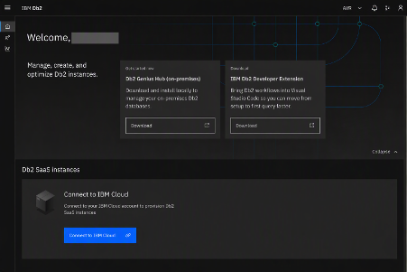

4.	From the Db2 Launchpad side navigation, select **User Management**.

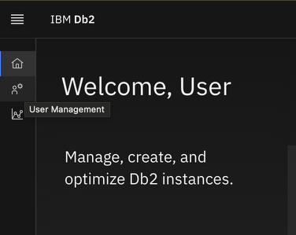

5.	On the **User Management** page, locate **Db2 SaaS Console Users**.
The list shows explicit and automatically assigned global console roles for IBM IDs across the IBM Cloud accounts that the administrator can manage.

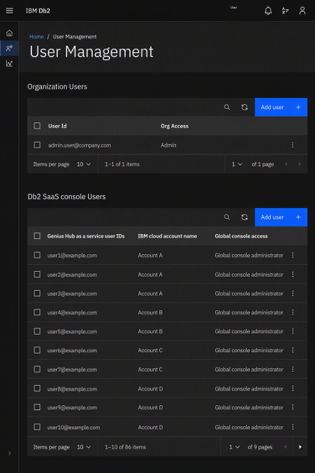

### Add a Console User

To assign an explicit global console role to an IBM ID user:
1.	In Db2 SaaS console Users, select **Add User**.

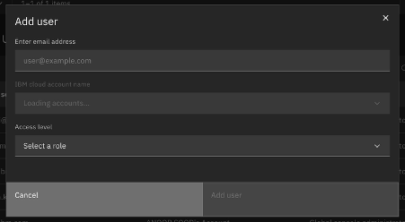

2.	In **Enter Email Address**, enter the email address associated with the user's registered IBM ID. Email matching is not case-sensitive.
3.	From IBM cloud account name, select the account to which the role applies. Each entry identifies the account by its account name and account ID.
4.	From Access level, select one of the following roles:
    - Globle console administrator
    - Global console manager
    - Global console user
5.	Select **Add User**.

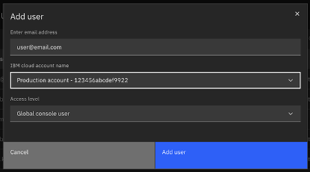

Db2 Launchpad displays a confirmation notification, sends an invitation to the specified email address, and immediately shows the assigned role in the user list.

Administrators can manage users across multiple IBM Cloud accounts from a single Db2 Launchpad session, provided they are authorized to administer each account.

### Change a User's Role

To change an existing explicit role assignment:
1.	Locate the user under Db2 SaaS console Users.
2.	Open the overflow menu at the end of the user's row.
3.	Select **Edit Role**.

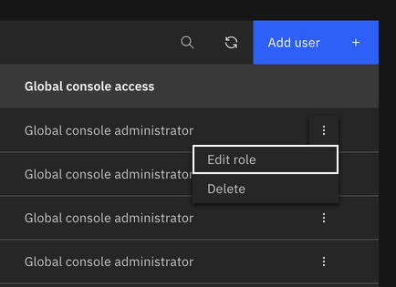

4.	Select the new global console role from **Acess Level**.
5.	Select **Save**.

The IBM Cloud account name and email address are read-only in the Edit role dialog. Only the access level can be changed. 

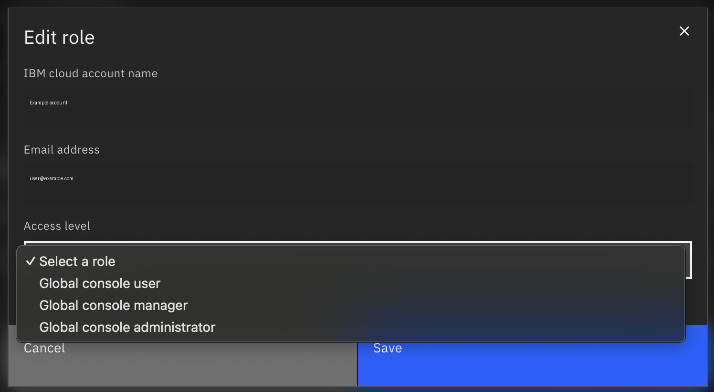

After the update completes, Db2 Launchpad displays a confirmation notification.

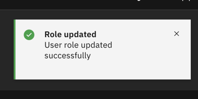

Changing a user’s role does not affect the current console session. To apply the updated role, the user must sign out of the Db2 on Cloud console and sign in again. Signing out of Db2 Launchpad or IBM Cloud is not required. The updated role takes effect immediately after the user signs in.
{: note}

### Verify Global Console Administrator Access

After assigning the Global Console Administrator role:
1.	Ask the affected user to sign out of the **Db2 on Cloud** onsole.
2.	Ask the user to sign back in with the same IBM ID.
3.	Verify that Reports is visible in the navigation menu.
4.	Expand **Administration** and verify that the console is available.

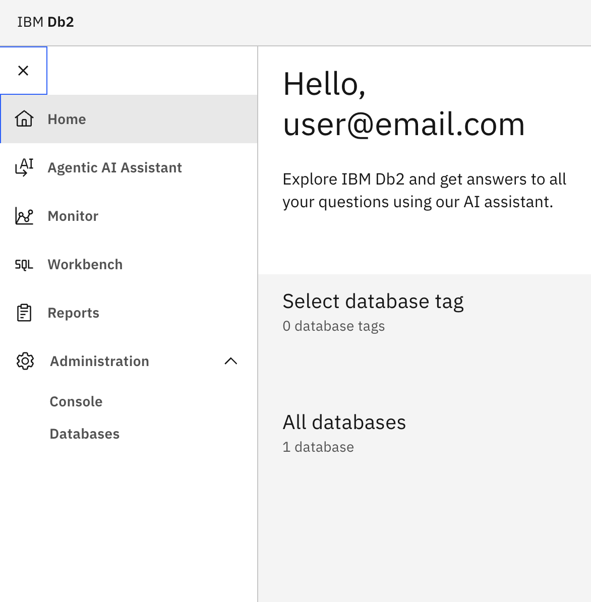

The presence of Reports and **Administration** > **Console** confirms that the Global Console Administrator role is active.

### Remove An Explicit Role Assignment

To remove a user's explicit global console role assignment:
1.	Locate the user under **Db2 SaaS Console Users**.
2.	Open the overflow menu at the end of the user's row.
3.	Select **Delete**.
4.	Review the confirmation dialog, and then select **Delete**.

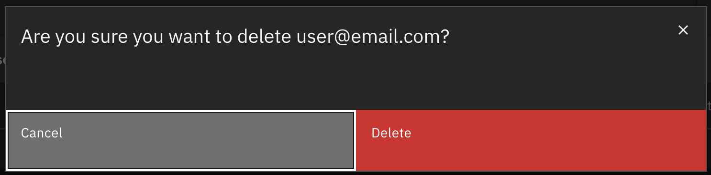

After the operation completes, Db2 Launchpad displays a confirmation notification.

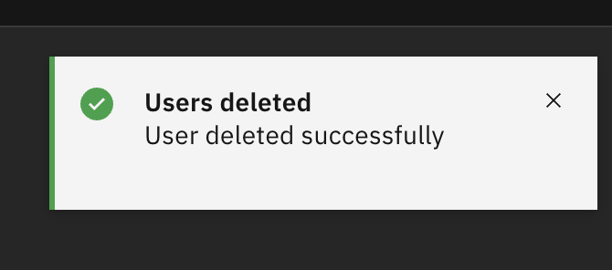

Deleting a user in the Db2 SaaS console removes only any explicitly assigned global console role. It does not remove the user’s IBM ID from the associated IBM Cloud account, nor does it automatically block console access. If the user still has the necessary IBM Cloud IAM permissions, they continue to inherit the default Global Console User role. Because this role is assigned by default, it does not appear in the Db2 SaaS console’s Users list.
{: important}

Signing out is mandatory before a deleted assignment takes effect. An active Db2 on Cloud console session continues using the previous access level until the user signs out and signs in again.

Removing a displayed Global Console Administrator assignment does not permanently revoke the role when that role is inherited automatically from IBM Cloud account permissions or Db2 on Cloud instance access. The daily synchronisation restores the automatically assigned role while the qualifying IBM Cloud IAM access remains in place.

### Key Considerations

Consider the following points when managing console users:
- Only the IBM Cloud account owner or an existing Global Console Administrator can manage console users and roles.
- The user must have a registered IBM ID.
- Before the user signs in to the Db2 on Cloud console, grant them access to the relevant IBM Cloud account through IBM Cloud IAM.
- Adding a user in Db2 Launchpad assigns a console role but does not grant IBM Cloud IAM access.
- Global console roles are separate from IBM Cloud IAM roles and Db2 database privileges.
- IBM Cloud IAM controls which Db2 service instances and databases the user can view.
- Db2 authorities, roles, and privileges control the operations the user can perform within a database.
- If a user receives role assignments from multiple sources, the highest applicable role takes precedence.
- Add, edit, and delete operations take effect immediately, but active console sessions are not updated automatically.
- After a role is changed or deleted, the user must sign out of the Db2 on Cloud console and sign in again.
