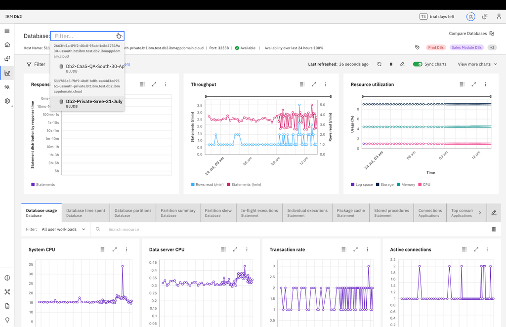
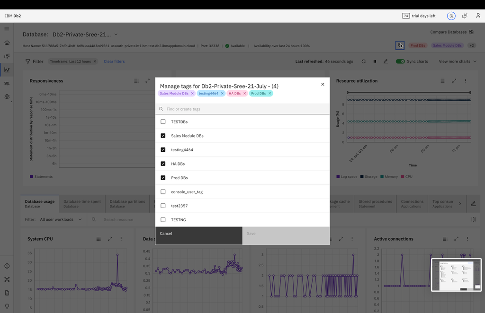
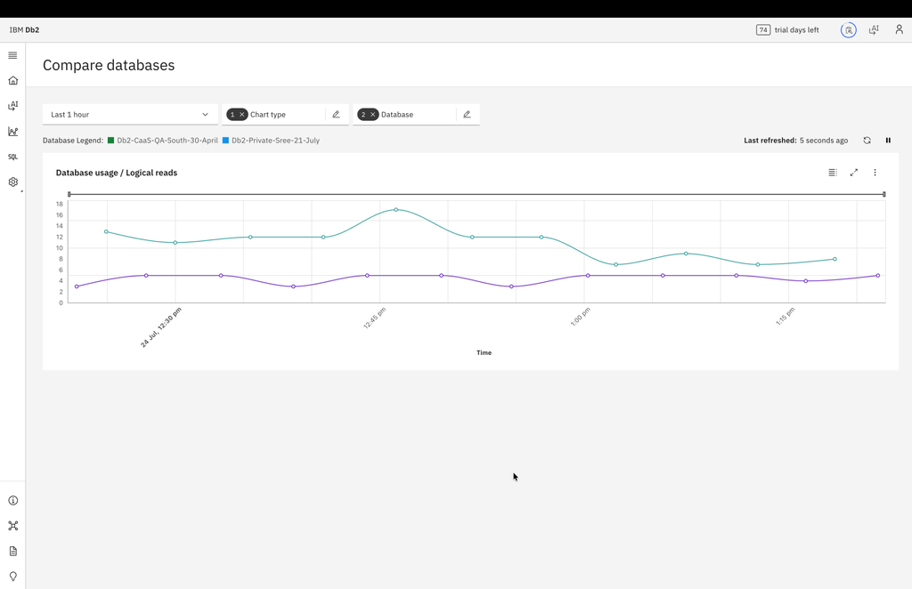
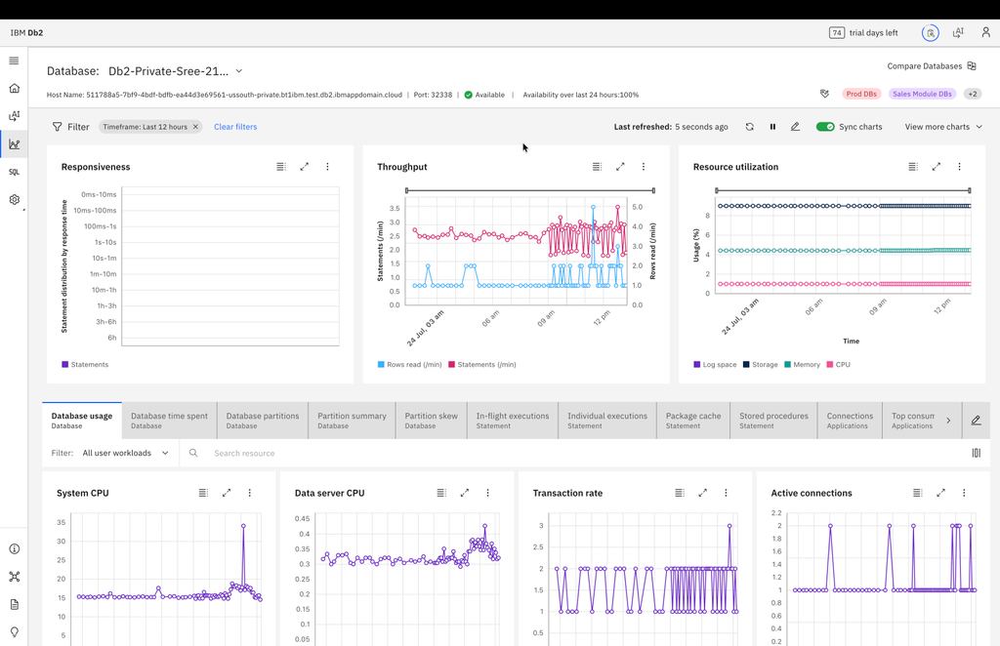
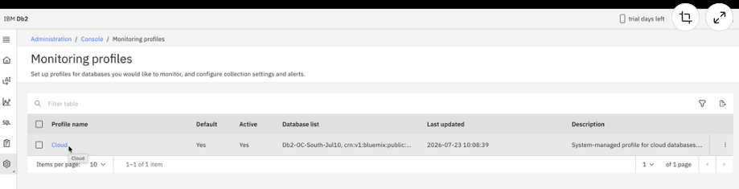

---
copyright:
  years: 2026
lastupdated: "2026-09-03"

keywords: CaaS, Genius Hub–enabled Consol, Monitoring in CaaS

subcollection: db2-saas
---

{:external: target="_blank" .external}
{:shortdesc: .shortdesc}
{:codeblock: .codeblock}
{:screen: .screen}
{:tip: .tip}
{:important: .important}
{:note: .note}
{:deprecated: .deprecated}
{:pre: .pre}

# Monitoring in CaaS
{: #caas_monitoring}

The Monitoring module in IBM CaaS provides a centralized view of database health, performance, and resource utilization. It enables database administrators and users to monitor real-time activity, analyze performance trends, and identify potential issues across database workloads and system resources.

The Monitoring page combines high-level performance summaries with detailed operational metrics, helping users quickly assess the current state of a database and investigate performance, availability, or resource-related concerns.

# Monitoring
The Monitoring module in IBM CaaS provides a centralized view of database health, performance, and resource utilization. It enables database administrators and users to monitor real-time activity, analyze performance trends, and identify potential issues across database workloads and system resources.

The Monitoring page combines high-level performance summaries with detailed operational metrics, helping users quickly assess the current state of a database and investigate performance, availability, or resource-related concerns.

## Database Selection
The database selection dropdown allows users to choose a database and view monitoring data specific to the selected database.

## Tags
Tags help organize and categorize databases. Users can add or remove tags from the selected database for easier identification and filtering.

## Overview
The Monitoring page provides visibility into key aspects of database operation, including:
- Database responsiveness and workload activity
- Throughput and transaction trends
- CPU, memory, storage, and log utilization
- SQL statement execution and package cache activity
- Locking and contention events
- Application and connection behaviour
- Workload management statistics
- Storage and tablespace performance
Users can select a database and view monitoring data across multiple categories using configurable charts and metric tabs.

## Summary Dashboard
At the top of the Monitoring page, summary charts provide an overview of database performance and activity.

### Responsiveness
Displays the distribution of statement execution times, helping identify slow-running workloads and performance bottlenecks.

## Throughput
Shows database activity trends such as statements processed, transactions executed, and rows accessed over time.

## Resource Utilization
Provides visibility into resource consumption, including CPU, memory, storage, and log space usage. These charts help users quickly identify unusual activity and determine where further investigation may be required.

## Contention
Displays locking and concurrency activity, helping identify lock waits and contention that may impact database performance.

## Time Spent
Shows how database request processing time is distributed across SQL execution, I/O operations, lock waits, and other activities.

## Response Time
Provides visibility into database response time trends, helping identify latency issues and changes in database responsiveness over time.

## Compare Database
The Compare Database feature enables users to compare performance and resource metrics across multiple databases.
Users can:
- Select one or more databases for comparison
- Choose specific monitoring charts and metrics
- Adjust the timeline or monitoring period
- Compare trends side-by-side across databases
- Identify differences in workload behaviour, resource consumption, and performance patterns

This feature is useful for capacity planning, performance benchmarking, troubleshooting, and evaluating the impact of configuration or workload changes across environments.

## Monitoring Categories
Detailed monitoring information is organized into categories that focus on specific areas of database activity.

## Database Monitoring
Provides visibility into overall database activity, usage patterns, partition behaviour, and workload distribution.

## Statement Monitoring
Displays SQL execution information, including running statements, package cache activity, and stored procedure execution details.

## Locking Monitoring
Helps identify lock contention and waiting conditions by providing information about blockers, waiters, locked objects, and locking events.

## Application Monitoring
Provides insights into application activity, connections, utilities, units of work, and event monitor data.

## Throughput Monitoring
Shows connection activity and operating-system-level processing metrics that affect database throughput.

## Memory Monitoring
Displays memory utilization at both the instance and database levels, helping identify memory pressure and allocation trends.

## I/O Monitoring
Provides information about buffer pool activity, prefetch operations, and logging performance.

## Storage Monitoring
Helps monitor storage utilization, table performance, tablespace performance, and capacity trends.

## Workload Management Monitoring
Provides visibility into workload management activity, service classes, and workload-level resource consumption.

## Customization and Analysis
The Monitoring page includes tools that help users focus on the information most relevant to their environment.
Users can:
- Filter monitoring data
- Select different time ranges
- Refresh or pause monitoring views
- Synchronize charts for easier analysis
- Add additional charts
- Customize visible monitoring tabs

These capabilities allow users to tailor the monitoring experience to specific operational and troubleshooting requirements.

## Typical Use Cases

Use the Monitoring module to:
- Monitor overall database health and performance
- Investigate slow-running workloads
- Analyze resource consumption trends
- Identify locking and contention issues
- Monitor application and connection activity
- Review storage and memory utilization
- Compare performance across multiple databases
- Support troubleshooting and capacity planning activities

## Notes
- Available monitoring data depends on database activity and configuration.
- Some monitoring views may display limited information if no related activity is occurring.
- Monitoring metrics are updated periodically based on the selected timeframe.
- Compare Database provides comparative analysis across databases using selected charts and timelines.
- The Monitoring module is intended to provide both high-level visibility and detailed operational insights from a single interface.

# CaaS Monitoring Profile
The Monitoring Profiles feature defines how monitoring is applied to databases managed through the service. A monitoring profile acts as a monitoring policy that controls how performance and operational data is collected and retained for associated databases.
For cloud databases, IBM CaaS automatically assigns instances to a system-managed Cloud monitoring profile, ensuring that monitoring starts without any manual configuration.

## Overview
When a cloud database instance is added to IBM CaaS:
- The instance is automatically associated with the Cloud monitoring profile
- Monitoring begins using predefined collection settings
- The database becomes available in monitoring views and dashboards
- The profile remains active and continues to manage monitoring for all associated databases

The Cloud monitoring profile is managed by the platform and cannot be modified by users.

## Accessing Monitoring Profiles
To view monitoring profiles:
1. Go to Administration.
2. Open Console.
3. Select Monitoring Profiles.

The Monitoring Profiles page displays all available monitoring profiles in the environment.

## Monitoring Profiles List
The Monitoring Profiles page provides a summary of each profile, including:
- Profile Name - Name of the monitoring profile
- Default - Indicates whether the profile is the default profile
- Active - Shows whether the profile is currently active
- Database List - Databases associated with the profile
- Last Updated - Date and time of the latest update
- Description - Brief description of the profile

In cloud environments, the Cloud profile is displayed as the default and active monitoring profile.

## Cloud Monitoring Profile
The Cloud monitoring profile is automatically applied to cloud databases onboarded into IBM CaaS. When a cloud instance is added:
- The instance is automatically added to the Cloud profile.
- Monitoring starts using predefined settings.
- The database appears in the profile's associated database list.
- No manual profile assignment is required.

This automatic onboarding ensures consistent monitoring coverage across all cloud databases.

## System-Managed Profile
The Cloud monitoring profile is a read-only, system-managed profile.

**Users can:**
- View profile information
- View associated databases
- Review monitoring settings

**Users cannot:**
- Modify profile settings
- Change collection parameters
- Update retention policies
- Delete the profile

This ensures a consistent monitoring configuration across the environment.

## Profile Details
Selecting a monitoring profile opens the profile details page, which includes:
- Status – Current profile status
- Profile Name – Name of the profile
- Databases – Number of associated databases
- Description – Profile description and management information

The database count helps identify how many databases are currently monitored by the profile.

## Monitoring Settings
The Monitoring Settings section displays the monitoring configuration applied to databases associated with the profile.

## Collection Settings
Collection settings determine how monitoring data is gathered. 
Typical settings include:
- Data collection interval
- Number of SQL statements captured from package cache
- SQL statement normalization
- Lock wait monitoring threshold
- Table data read threshold
- Storage metrics collection
- Storage collection schedule
- Table performance data collection
- Object scope included in monitoring

These settings control the type and frequency of monitoring data collected from databases.

## Persistence Settings
Persistence settings define how monitoring data is stored and retained. 
Typical settings include:
- Monitoring data persistence
- Monitor data retention period
- Package cache persistence
- Package cache retention period

These settings ensure monitoring data remains available for historical analysis and troubleshooting.

## Database Association
The profile displays all databases currently associated with it. As new cloud databases are onboarded into IBM CaaS, they are automatically added to the Cloud monitoring profile.
This ensures:
- Consistent monitoring coverage
- Automatic onboarding of new databases
- Easy verification of monitored databases

## Key Features
- Automatic Onboarding – Cloud databases are automatically added to the monitoring profile.
- Immediate Monitoring – Monitoring starts as soon as a database is onboarded.
- System-Managed Configuration – Monitoring settings are maintained by the platform.
- Consistent Monitoring Policy – All cloud databases use the same monitoring configuration.

## When to Use This Page
Use the Monitoring Profiles page to:
- Verify that a database is being monitored
- Confirm that the Cloud profile is active
- View databases associated with the profile
- Review monitoring collection and retention settings
- Understand how monitoring is configured for cloud databases

## Notes
- The Cloud monitoring profile is intended for cloud databases managed through IBM CaaS.
- Database association is performed automatically during onboarding.
- The profile is read-only and cannot be modified.
- Monitoring begins automatically after a database is associated with the profile.
- The profile remains active and available for viewing at all times.

# CaaS - Event Monitoring Profile
The Event Monitoring feature in IBM CaaS enables you to capture and analyze database events. 
Event Monitoring provides a centralized interface for configuring event monitors, viewing data collection settings, and reviewing monitoring-related storage usage.

## Overview
Event monitors collect detailed information about specific database events and store it for later analysis. This information can be used to investigate database behaviour, identify performance bottlenecks, and support troubleshooting activities.

Using the Event Monitoring module, you can:
- Configure event monitors for supported event types
- Enable or disable event collection
- View collection and retention settings
- Review monitoring tablespace usage
- Scale monitoring storage when required
- View event monitor objects associated with a database

## Accessing Event Monitoring
To access Event Monitoring:
1. Go to Administration.
2. Select Console.
3. Click Event Monitoring.

The landing page displays monitored databases along with summary information and access to event monitor configuration.

## Event Monitor Configuration
Each monitored database can have one or more event monitors configured. Event monitor settings control how event data is collected, stored, and retained. Common configuration options include:
- Status – Enable or disable event collection
- Collection Interval – Frequency at which event data is gathered
- Data Retention – Duration for retaining collected data
- Threshold Settings – Event-specific collection thresholds
- Administrative Task Scheduler – Optional scheduled collection support

## Supported Event Monitor Types

### Activity
Captures database activity information that can be used to analyse workload behaviour and query execution patterns.

### Locking
Captures lock-related events, including lock waits and contention. This monitor helps identify blocking applications and concurrency issues.

### Utility
Captures information related to database utility operations, such as maintenance and administrative activities.

### Statistics
Collects database statistics that can be used to analyse performance trends and operational behaviour over time.

### Configuration (Config)
Captures configuration-related events, helping track changes that may affect database behaviour or performance.

### DDL
Captures Data Definition Language (DDL) events, including schema and database object changes.

### Registry Variables (Regvar)
Captures events related to database registry variables and associated changes.

## Monitoring Storage Management
Event monitoring data is stored in a dedicated monitoring tablespace. The Event Monitoring page provides visibility into:
- Current tablespace size
- Storage utilisation
- Usage thresholds
- Overall tablespace health

When additional capacity is required, the tablespace can be scaled directly from the Event Monitoring interface.

## Event Monitor Objects
The module also displays the event monitor objects created for a database. This allows administrators to verify the monitors currently configured and ensure that the required monitoring components are available.

## Typical Use Cases

Use Event Monitoring to:
- Investigate locking and wait-related issues
- Analyse database activity and workload patterns
- Monitor utility execution and maintenance operations
- Track configuration and schema changes
- Collect diagnostic information for troubleshooting
- Maintain historical event data for operational analysis

These informations can be viewed under tabs for respective event monitoring , in the monitoring page.

## Key Features
- Centralized event monitor management
- Support for multiple event monitor types
- Configurable collection and retention settings
- Monitoring tablespace visibility and scaling
- Event monitor object management
- Database-level monitoring configuration

## Notes
- Event Monitoring is intended for targeted diagnostics and performance analysis
- Storage usage increases as event data is collected and retained
- Monitoring requirements vary by event type and workload
- Tablespace utilisation should be reviewed periodically when event monitoring is enabled
- Only enable the event monitors required for your analysis or troubleshooting activities
