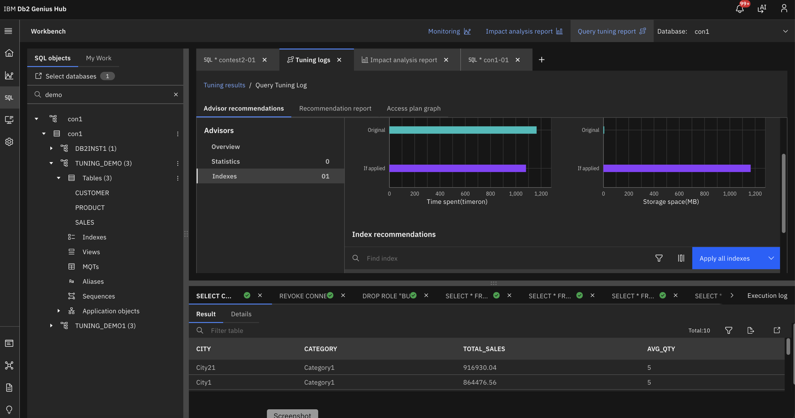

---
copyright:
  years: 2026
lastupdated: "2026-07-24"

keywords: CaaS, Genius Hub–enabled Consol, Query Tuning

subcollection: db2-saas
---

{:external: target="_blank" .external}
{:shortdesc: .shortdesc}
{:codeblock: .codeblock}
{:screen: .screen}
{:tip: .tip}
{:important: .important}
{:note: .note}
{:deprecated: .deprecated}
{:pre: .pre}

# Tuning Queries in CaaS
{: #gh_tuningquery}

You can tune your SQL queries in CaaS to optimize efficiency and improve performance.

Query tuning helps identify optimization opportunities and generate recommendations for better execution.

To tune a query in CaaS, follow these steps:

1. **Select the query** and click the **Tune the statements** icon.  
2. The **Select tuning activities to run** dialog appears.  
3. Fill in the required fields in the dialog.  
4. Choose **EXPLAIN** and other tuning options.  
5. Select the **Notifications** check box and enter email addresses to receive updates.  
6. Click **OK** to run the tuning task.  
7.  The **Tuning logs** page displays. From here you can:  
   
    - Click the **Refresh** icon to check progress and fetch up-to-date results.  
    - Select the query from the table, then click **View result** to see recommendations.

The new Genius Hub‑enabled CaaS console introduces enhanced query tuning. This feature provides reports with recommendations to optimize your queries efficiently.

{: caption="Tuning Query in CaaS" caption-side="bottom"}
