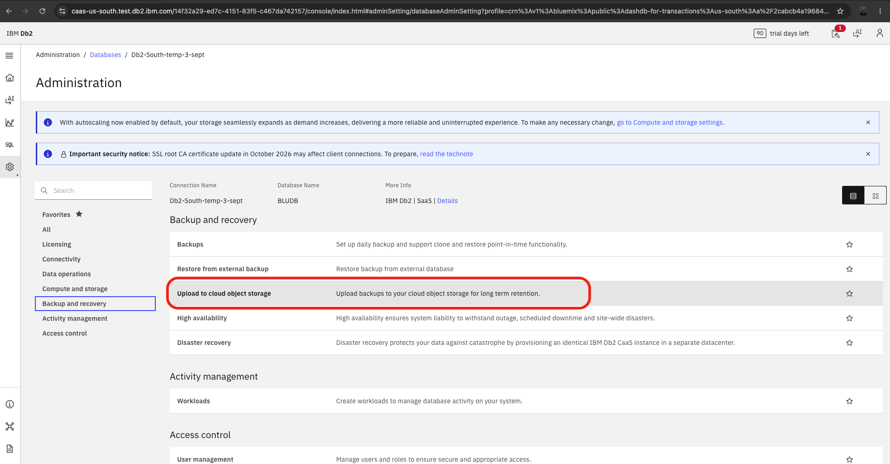
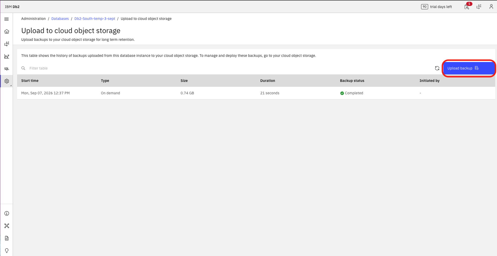
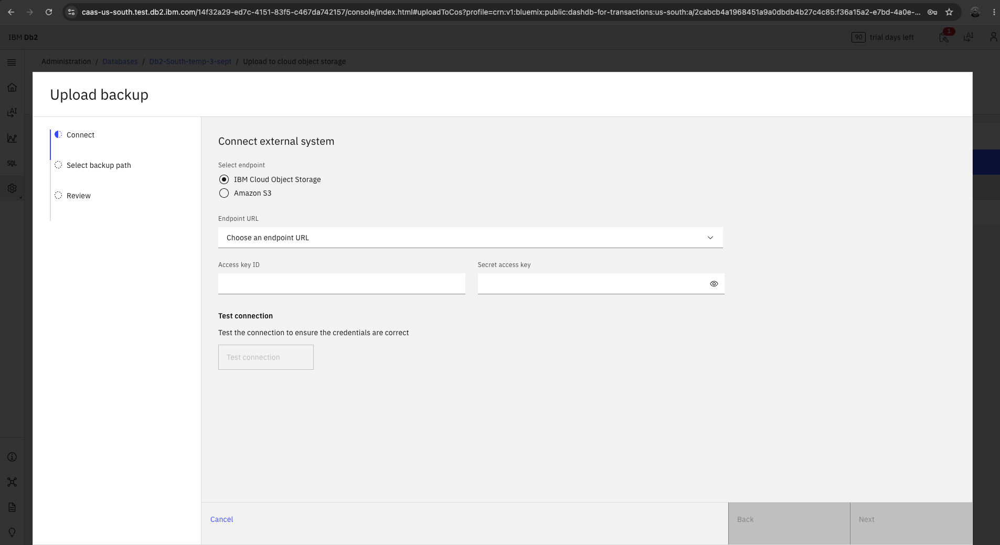
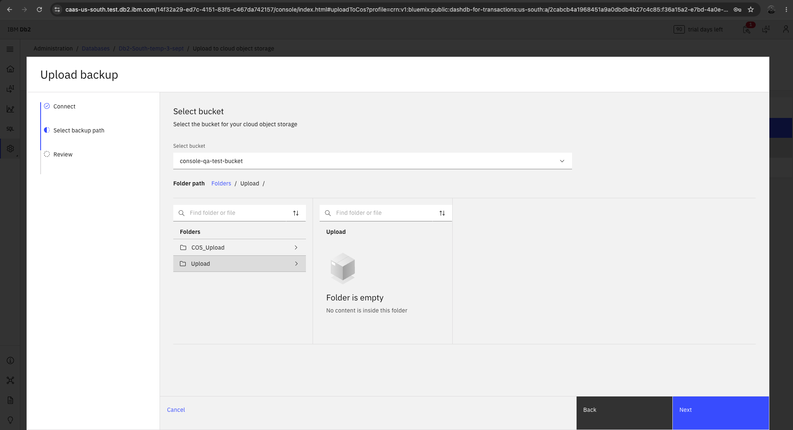
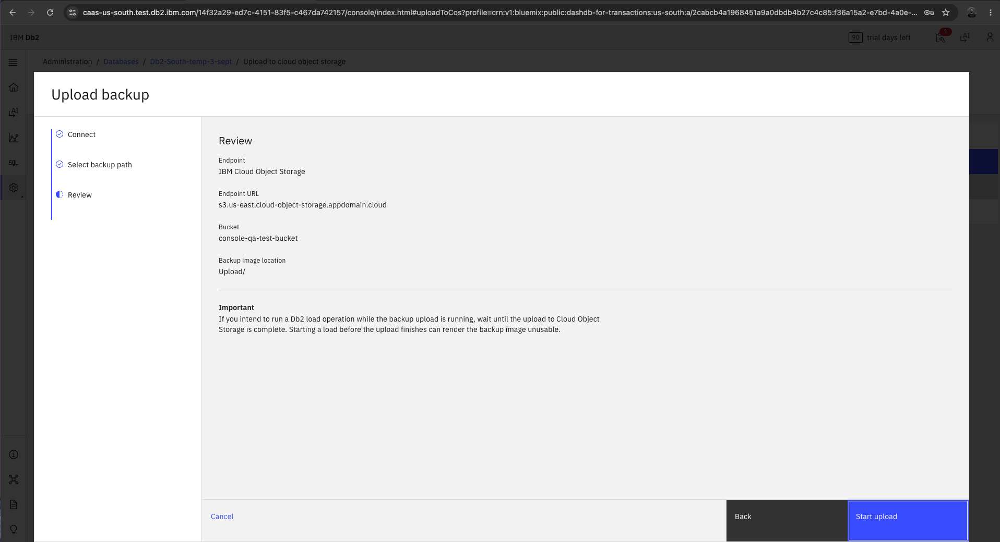
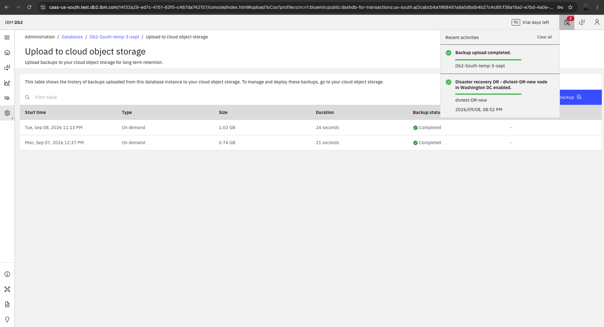

---

copyright:
  years: 2014, 2026
lastupdated: "2026-09-08"

keywords:

subcollection: db2-saas

---

{:external: target="_blank" .external}
{:shortdesc: .shortdesc}
{:codeblock: .codeblock}
{:screen: .screen}
{:tip: .tip}
{:important: .important}
{:note: .note}
{:deprecated: .deprecated}
{:pre: .pre}

# Uploading backups to cloud object storage
{: #gh_upload_cos}

This section explains how to upload database backups to cloud object storage in Db2 SaaS in the new Genius Hub–enabled console. Follow these instructions if you see the updated UI.
{: important}

## Before you begin
{: #gh_upload_prereq}

You can upload backups to either an IBM Cloud Object Storage (COS) bucket or an Amazon S3 bucket. You need an existing bucket and a set of access keys for it.

For IBM Cloud Object Storage, create a service credential on the bucket with **Include HMAC Credential** enabled, then note the `access_key_id` and `secret_access_key`. For the full steps, see [Create the necessary credentials on the COS bucket](https://cloud.ibm.com/docs/db2-saas?topic=db2-saas-gh_loading#gh_bucket).

For Amazon S3, use the access key ID and secret access key for an AWS identity that has access to the bucket. For the steps to create them, see the [AWS documentation](https://docs.aws.amazon.com/IAM/latest/UserGuide/id_credentials_access-keys.html){: external}.

## Open the upload to cloud object storage page
{: #gh_upload_open}

1. Click **Administration** > **Databases** > **select your database**
2. Click **Backup and recovery** in the left menu
3. Click **Upload to cloud object storage** in the main content

{: caption="Backup and recovery settings" caption-side="bottom"}

## Viewing the upload history
{: #gh_upload_history}

The **Upload to cloud object storage** page shows the history of backups that were uploaded from this database instance to your cloud object storage. To manage or deploy the uploaded backups, go to your cloud object storage.

{: caption="Upload to cloud object storage" caption-side="bottom"}

## Uploading a backup
{: #gh_upload_backup}

Click **Upload backup** to open the upload wizard. The wizard has three steps: **Connect**, **Select backup path**, and **Review**.

### Step 1: Connect to the external system
{: #gh_upload_connect}

1. Under **Select endpoint**, select **IBM Cloud Object Storage** or **Amazon S3**
2. Select the **Endpoint URL** that matches your bucket
3. Enter the **Access key ID** from your service credential
4. Enter the **Secret access key** from your service credential. Click the eye icon to show or hide the value
5. Click **Test connection** to confirm that the credentials are correct
6. Click **Next**

Click **Cancel** at any point to close the wizard without uploading.
{: note}

{: caption="Connect external system" caption-side="bottom"}

### Step 2: Select the backup path
{: #gh_upload_path}

1. Select the bucket for your cloud object storage from the **Select bucket** list
2. In the **Folders** panel, click a folder to open it. The panel on the right shows the contents of the selected folder
3. Use **Find folder or file** to search within a panel, or the sort icon to change the sort order
4. Use the **Folder path** breadcrumb to navigate back to a higher level
5. Click **Next**

{: caption="Select bucket" caption-side="bottom"}

### Step 3: Review and start the upload
{: #gh_upload_review}

1. Review the **Endpoint**, **Endpoint URL**, **Bucket**, and **Backup image location** details. Click **Back** to change any of them
2. Click **Start upload**

{: caption="Review" caption-side="bottom"}

Do not run a load operation while a backup upload is in progress. If you intend to run a Db2 load operation while the backup upload is running, wait until the upload to Cloud Object Storage is complete. Starting a load before the upload finishes can render the backup image unusable.
{: important}

The upload appears in the table on the **Upload to cloud object storage** page. When it finishes, the **Backup status** changes to **Completed**, and a **Backup upload completed** message appears in the **Recent activities** notification panel.

{: caption="Backup upload completed" caption-side="bottom"}
