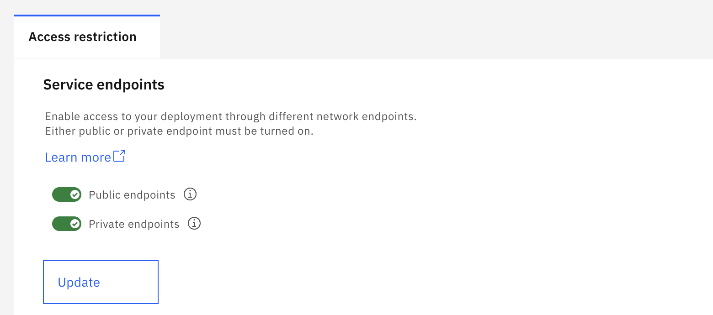
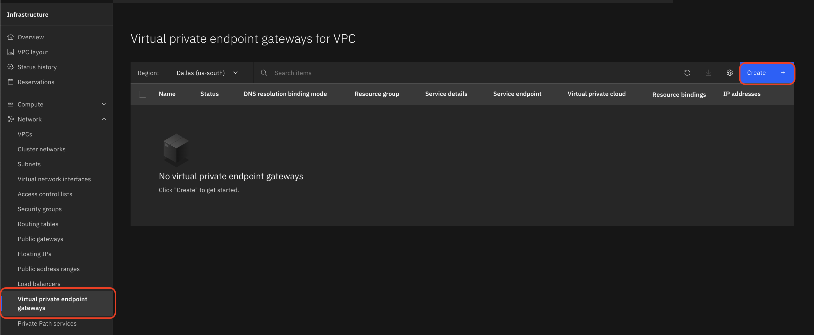
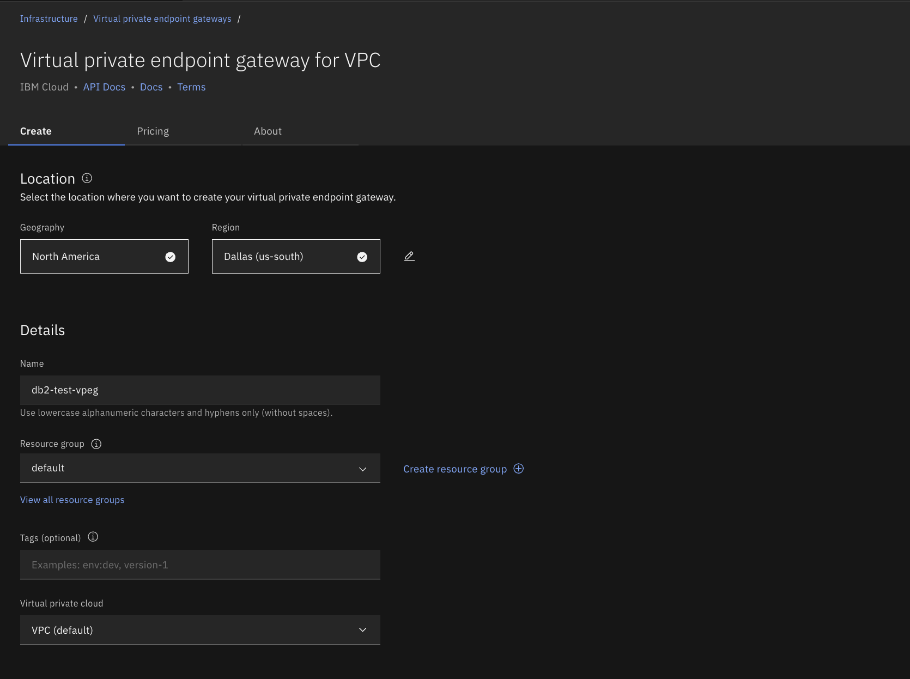
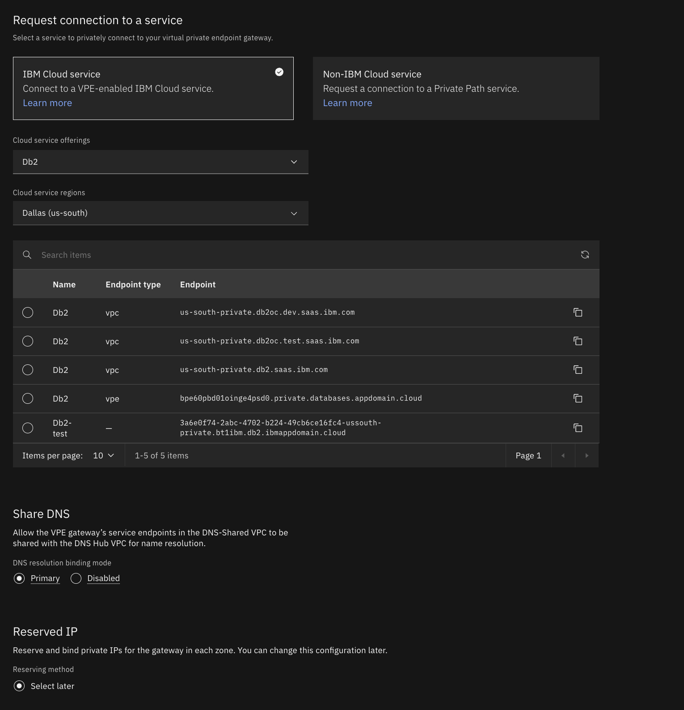
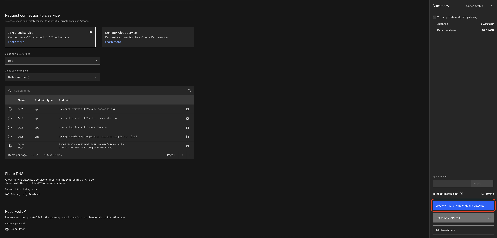

---

copyright:
  years: 2014, 2026
lastupdated: "2026-02-24"

keywords: virtual private endpoint, VPE, VPEG, private connectivity, VPC

subcollection: db2-saas

---

{:external: target="_blank" .external}
{:shortdesc: .shortdesc}
{:codeblock: .codeblock}
{:screen: .screen}
{:tip: .tip}
{:important: .important}
{:note: .note}
{:deprecated: .deprecated}
{:pre: .pre}

# Virtual private endpoint gateways
{: #vpeg}

{{site.data.keyword.cloud}} Virtual Private Endpoint (VPE) gateways provide private connectivity to {{site.data.keyword.Db2_on_Cloud_long}} from your VPC network. Traffic between your VPC and the Db2 service traverses the {{site.data.keyword.cloud_notm}} private backbone network and does not pass through the public internet.
{: shortdesc}

## Before you begin
{: #vpeg_prereqs}

Before creating a virtual private endpoint gateway for your Db2 instance, ensure that you have the following:

- A {{site.data.keyword.cloud_notm}} account with the required IAM permissions for VPC Infrastructure Services.
- An existing Virtual Private Cloud (VPC) in the same region as your Db2 instance.
- At least one subnet in your VPC for binding a reserved IP address.
- A provisioned Db2 Performance plan instance with at least **private endpoints** enabled.

To verify that private endpoints are enabled on your Db2 instance:
1. Open the Db2 console.
2. Select **Administration** from the left side menu.
3. Select the **Access restriction** tab.
4. Ensure that **Private endpoints** is toggled on.

{: caption="Ensure at least private endpoints are enabled on your Db2 instance" caption-side="bottom"}

VPE gateway connectivity is supported for Db2 instances on the **Performance plan** only.
{: important}

## Creating a virtual private endpoint gateway
{: #vpeg_create}

To create a virtual private endpoint gateway for your Db2 instance, complete the following steps:

### Step 1: Navigate to Virtual private endpoint gateways
{: #vpeg_step1}

1. Log in to the [{{site.data.keyword.cloud_notm}} console](https://cloud.ibm.com){: external}.
2. Click the **Navigation Menu** icon.
3. Click **Infrastructure** > **Network** > **Virtual private endpoint gateways**.

The Virtual private endpoint gateways for VPC page is displayed. From here, you can view any existing endpoint gateways or create a new one.

{: caption="Virtual private endpoint gateways for VPC" caption-side="bottom"}

### Step 2: Create a new endpoint gateway
{: #vpeg_step2}

1. Click **Create**.
2. Under **Location**, select the **Geography** and **Region** that matches your Db2 instance. For example, if your Db2 instance is in Dallas, select **North America** and **Dallas (us-south)**.
3. Under **Details**, configure the following:
   - **Name**: Enter a unique name for your endpoint gateway using lowercase alphanumeric characters and hyphens only (for example, `db2-test-vpeg`).
   - **Resource group**: Select the resource group for the endpoint gateway.
   - **Tags** (optional): Add tags to help organize and identify your resources.
   - **Virtual private cloud**: Select the VPC where you want to create the endpoint gateway.

The region of the endpoint gateway must match the region of your Db2 instance.
{: important}

{: caption="Setting the location and details for a virtual private endpoint gateway" caption-side="bottom"}

### Step 3: Configure security groups and select your Db2 service
{: #vpeg_step3}

1. Under **Security groups**, select at least one security group to control traffic at the networking level. You can select up to five security groups.
2. Under **Request connection to a service**, select **IBM Cloud service**.
3. From the **Cloud service offerings** dropdown, select **Db2**.
4. From the **Cloud service regions** dropdown, select the region where your Db2 instance is deployed (for example, **Dallas (us-south)**).
5. From the list of available endpoints, select your Db2 instance.

{: caption="Configuring security groups and selecting the Db2 service instance" caption-side="bottom"}

### Step 4: Configure DNS and reserved IP settings
{: #vpeg_step4}

1. Under **Share DNS**, select the DNS resolution binding mode. The default is **Primary**.
2. Under **Reserved IP**, choose a reserving method. You can reserve and bind a private IP from a subnet now or select **Select later** to configure this after creation.
3. Review the **Summary** panel on the right for estimated costs.
4. Click **Create virtual private endpoint gateway**.

{: caption="Final configuration and creation of the virtual private endpoint gateway" caption-side="bottom"}

After creation, the status of your endpoint gateway changes from **Updating** to **Stable** once the gateway is ready.

## After creating the endpoint gateway
{: #vpeg_after}

After the endpoint gateway status is **Stable**, you can connect to your Db2 instance using the private endpoint. The private endpoint hostname for your instance is available from the **Connections** tab in the Db2 console under **Administration**.

If you selected **Select later** for the reserved IP during creation, you can bind a reserved IP address at any time from the endpoint gateway details page.
{: tip}
