---

copyright:
  years: 2014, 2025
lastupdated: "2026-03-16"

keywords:

subcollection: db2-saas

---

{:external: target="_blank" .external}
{:shortdesc: .shortdesc}
{:codeblock: .codeblock}
{:screen: .screen}
{:tip: .tip}
{:important: .important}
{:note: .note}
{:deprecated: .deprecated}
{:pre: .pre}

# Copy Database
{: #cp_db}

The {{site.data.keyword.Db2_on_Cloud_long}} Copy Database feature gives you the ability to copy your existing database to a new instance.
{: shortdesc}

The following are helpful use cases for creating a copy of a database:
- Run analytics or reports.
- Make a fresh copy of your production database each morning to use for development purposes.
- Make a *template* database for an app, and make a copy of that template as your apps need it.

Because the copy creates a new instance and restores your existing backup, it's important to keep the following in mind:
- The new instance will have the same amount of resources as the instance it was copied from.
- Create a full backup of the data you want restored onto the copy. Any data written after the backup will not be moved across.
- When creating the copy, an outage will be required to point your apps to the new hostname and port.

## Copying a Standard or Enterprise plan instance
{: #cp_standard_enterprise}

The **Standard** and **Enterprise** plans are now deprecated. Copying a database directly within Standard or Enterprise plans is no longer supported. To create a copy of your Standard or Enterprise database, you must use the migration tool to copy your instance into the **Performance** plan. For more information, see the [Deprecation Announcement](https://cloud.ibm.com/status/announcement?query=Deprecation+Announcement+-+IBM+Db2+SaaS+Standard+%26+Enterprise+Plans){: external}.
{: deprecated}

When creating a copy into the Performance plan, select **Db2 version 11.5** to ensure compatibility with your existing database.
{: note}

### Prerequisites
{: #cp_se_prereqs}

To copy your Standard or Enterprise plan database into a new Performance plan instance, a backup of the current database must exist.

### Creating a copy into the Performance plan
{: #cp_se_create}

Follow these steps to create a copy of your Standard or Enterprise database into the Performance plan:

1. Provision your {{site.data.keyword.Db2_on_Cloud_short}} resource from the IBM Cloud catalog if you haven't already.

1. In the **IBM Cloud console**, navigate to your list of resources and click the instance you want to copy.

1. At the top of the instance page, look for the notification banner that says **System upgrade available**, on the right-hand side of the banner, click **Learn More**.
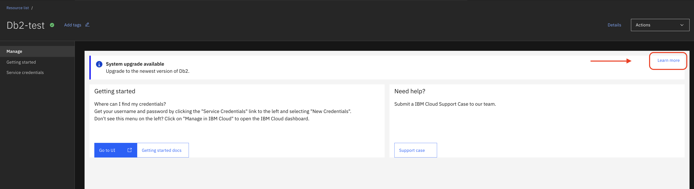{: caption="Example of the upgrade notification banner in the console." caption-side="bottom"}

1. You will be redirected to the **Upgrade Db2 Systems** page. In the upgrade interface, click **Create Instance**.
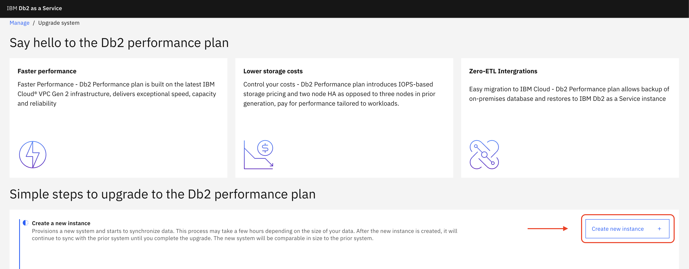{: caption="Example of the Upgrade Db2 Systems page where you create the new instance." caption-side="bottom"}

1. A popup will show the parent formation and the new formation's name. Select the location you'd like your instance to be provisioned in. Click **Create** to start provisioning your new environment.
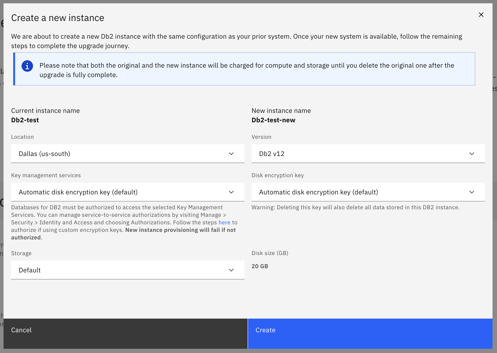{: caption="Confirm location and create new instance." caption-side="bottom"}

1. When the new instance has been created, there will be a link to go to the new system to complete the process. Click on **Go to new system to complete upgrade**.

1. On the new instance page, there will be a header titled **Action Required** to complete the upgrade. Click the **View Details** button to see the current status and progress.
    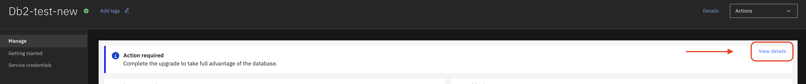{: caption="Click View Details button." caption-side="bottom"}
    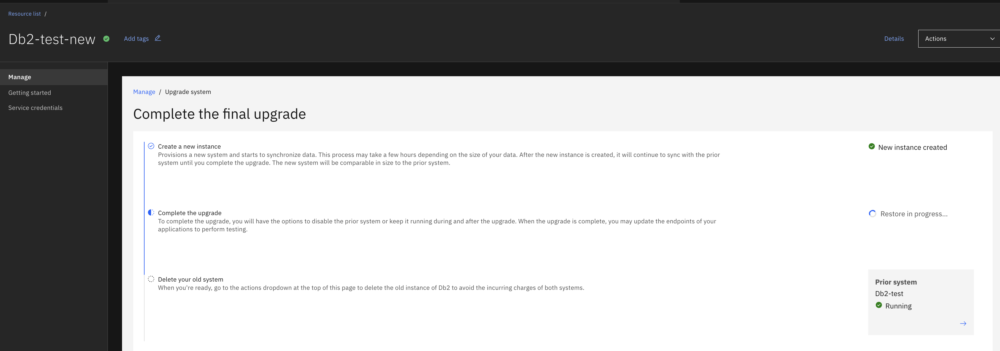{: caption="Track copy process." caption-side="bottom"}

    The UI is unavailable for the new instance until the process is completed.
    {: note}

1. When the process has completed, click the **Complete Upgrade** button.
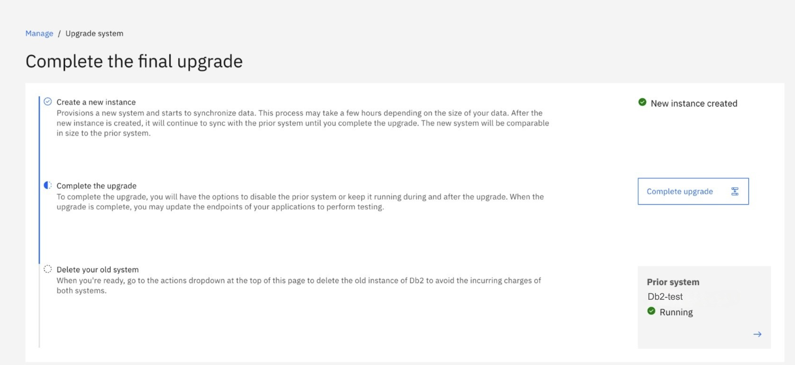{: caption="Click complete upgrade button." caption-side="bottom"}

1. There will be a popup to finalize the process. Select `Yes, create a clone for testing` to keep your Standard/Enterprise instance running and create a **copy** in the Performance plan. Both instances will be available for connections.
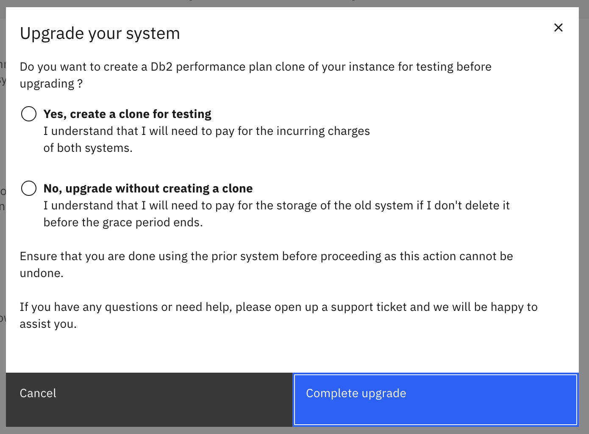{: caption="Select the clone for testing option and complete the process." caption-side="bottom"}

1. When the process is complete, your copy is now available in the **Performance** plan.

## Copying a Performance plan instance
{: #cp_performance}

### Prerequisites
{: #cp_perf_prereqs}

To copy your Performance plan database to a new instance, a backup of the current database must exist.

### Select a backup
{: #cp_perf_bkup}

To copy your instance to a new service instance:
1. Select **Backups** from the top navigation.
1. Under the **Snapshot backups** tab, select the checkbox next to the backup you want to copy.
1. Click **Clone**.

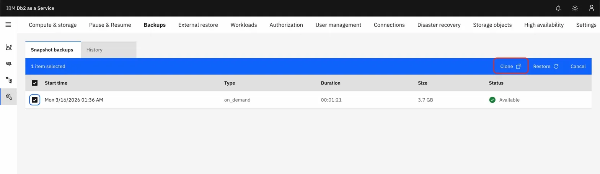{: caption="Select a backup and click Clone" caption-side="bottom"}

### Creating the copy instance
{: #cp_perf_create_inst}

On the **New clone** page, enter information for the new copy instance:
1. Select the data center location for the new copy instance under **Datacenter location**.
1. Enter a name under **Service name**.
1. Select the resource group of the new instance under **Resource group**.
1. If you'd like a highly available instance, select **Yes** for **High availability configuration**.
1. Optionally, add tags for the new instance under **Tags**.
1. Select a Key Management Services instance under **Key Management Services**. If not selected, automatic disk encryption key is used by default.
1. Select a disk encryption key under **Disk encryption key**. If not selected, automatic disk encryption key is used by default.
1. Select the backup location for the new copy instance under **Backup location**. Cross regional backup can be stored across multiple regions in a zone. Regional backups are stored only in one specific region.
1. Click **Clone**.
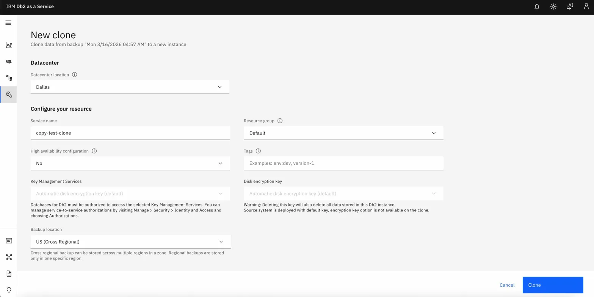{: caption="Enter information for the new clone instance" caption-side="bottom"}

1. The **Notifications** icon of the console shows the progress of the copy process.
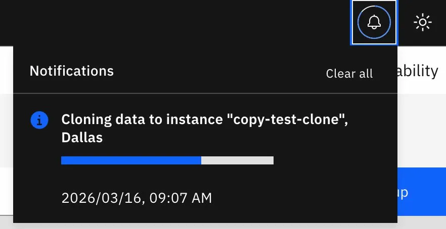{: caption="Clone progress" caption-side="bottom"}

1. After successful completion, the **Notifications** icon displays a success message. Your new copy instance is now available.
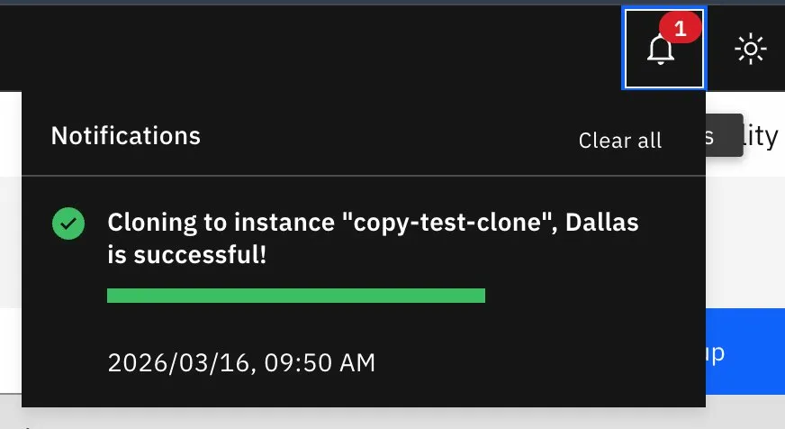{: caption="Clone successfully completed" caption-side="bottom"}
