---
copyright:
  years: 2026
lastupdated: "2026-01-12"

keywords: external restore, performance plan, backup restore, rollforward, IBM Cloud Object Storage, Amazon S3

subcollection: Db2onCloud
---

{{site.data.keyword.attribute-definition-list}}

# Restore from external backup (Performance Plan)
{: #restore-external-backup-performance}

You can restore your {{site.data.keyword.Db2_on_Cloud_long}} Performance plan database from an external backup stored in IBM Cloud Object Storage (COS) or Amazon S3. This feature allows you to recover your database from backups stored in your own storage bucket.
{: shortdesc}


## Prerequisites
{: #restore-external-prerequisites}
{: ui}

Before starting the restore process, ensure you have the following:

- Access to your Db2 on Cloud console page
- At least one successful internal (snapshot) backup taken on the target instance before initiating external restore
- An existing DB2 backup stored in an IBM Cloud Object Storage or Amazon S3 bucket
- Your endpoint URL along with HMAC credentials (Access Key and Secret Access Key) to access the bucket and backup image
- Sufficient database storage space to accommodate the restored database
- A backup image that meets the following requirements:
   - Must be a full database backup. Incremental backups are not supported.
   - Must be compatible with the current Db2 system: created on a Linux-x86-64 system, unencrypted, and created on a single partition system.
   - Offline backups: no more than two major versions behind the current Db2 on Cloud version. Online backups: must be on the same major version as the Db2 on Cloud system.
   - If the backup was taken in an Oracle-compatible system, ensure the Db2 on Cloud system is provisioned with Oracle compatibility enabled before restoring.

   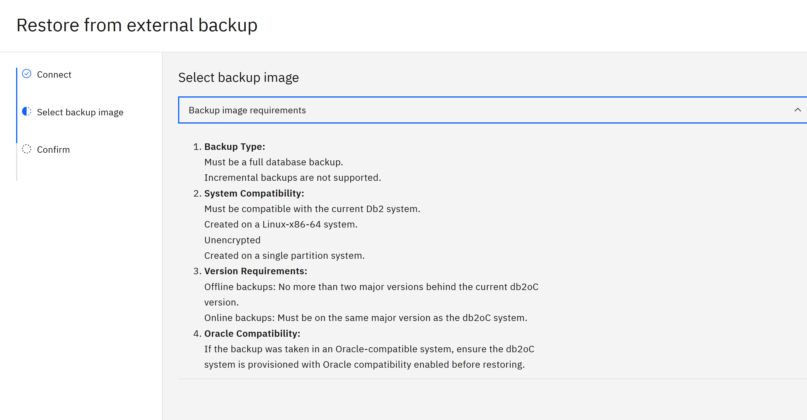{: caption="Backup image requirements" caption-side="bottom"}

The internal backup is required as a safety measure. If the external restore fails, you can recover the database by restoring from the internal backup.
{: note}

## Prerequisites
{: #restore-external-prerequisites-api}
{: api}

Before starting the restore process, ensure you have the following:

- An IAM API key with sufficient permissions
- At least one successful internal (snapshot) backup taken on the target instance before initiating external restore
- An existing DB2 backup stored in an IBM Cloud Object Storage or Amazon S3 bucket
- Your endpoint URL along with HMAC credentials (Access Key and Secret Access Key) to access the bucket and backup image
- Sufficient database storage space to accommodate the restored database
- A backup image that meets the following requirements:
   - Must be a full database backup. Incremental backups are not supported.
   - Must be compatible with the current Db2 system: created on a Linux-x86-64 system, unencrypted, and created on a single partition system.
   - Offline backups: no more than two major versions behind the current Db2 on Cloud version. Online backups: must be on the same major version as the Db2 on Cloud system.
   - If the backup was taken in an Oracle-compatible system, ensure the Db2 on Cloud system is provisioned with Oracle compatibility enabled before restoring.

The internal backup is required as a safety measure. If the external restore fails, you can recover the database by restoring from the internal backup.
{: note}

## Create internal backup (Prerequisite)
{: #restore-external-create-backup}
{: ui}

1. Navigate to the **External restore** tab. If no internal backup exists, you will see a message indicating that an internal backup file is required.

   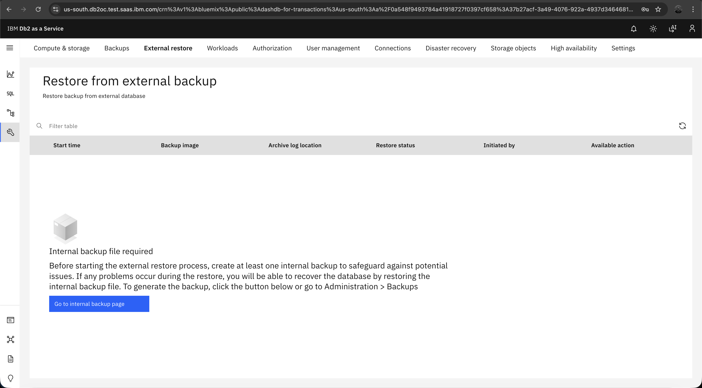{: caption="External restore page showing internal backup requirement" caption-side="bottom"}

2. Click **Go to internal backup page** or navigate to the **Backups** tab.

3. Click the **Run backup** button and confirm by clicking **Run** in the dialog.

   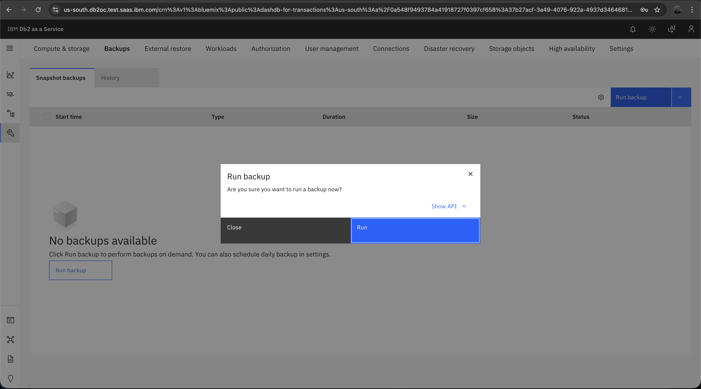{: caption="Run backup confirmation dialog" caption-side="bottom"}

4. Wait for the backup to complete. You can monitor the progress on the Backups page.

   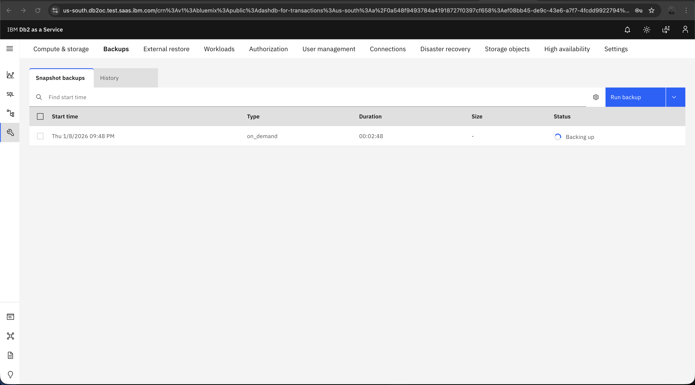{: caption="Snapshot backup in progress" caption-side="bottom"}

## Create internal backup (Prerequisite)
{: #restore-external-create-backup-api}
{: api}

Ensure at least one successful internal (snapshot) backup has been taken on the target instance before initiating an external restore. You can trigger an internal backup through the Db2 on Cloud console before proceeding with the API calls.

## Access external restore
{: #restore-external-access}
{: ui}

1. Once the internal backup is complete, navigate to the **External restore** tab.

2. Click the **External restore** button to begin the restore wizard.

   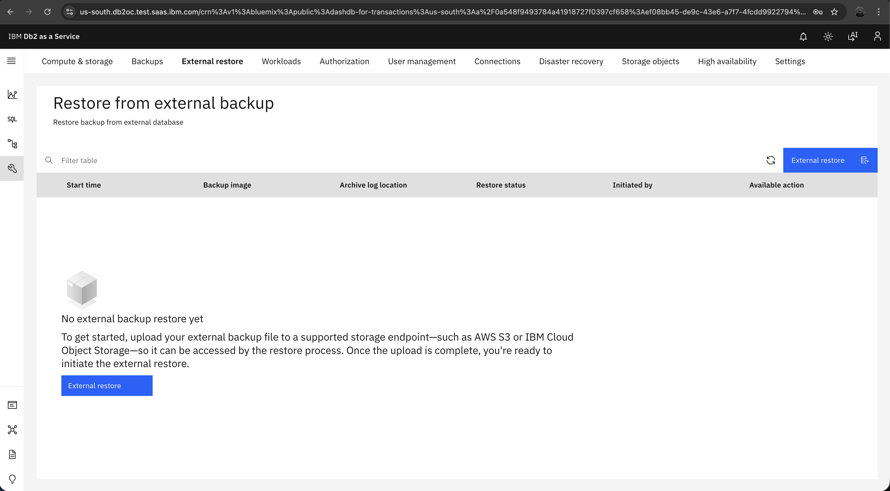{: caption="External restore page ready to initiate restore" caption-side="bottom"}

### Step 1: Connect external system
{: #restore-external-connect}

In the Connect step, provide the connection details for your external storage:

1. Select your endpoint type: **Amazon S3** or **IBM Cloud Object Storage**.

2. Select **Endpoint URL** from the dropdown.

3. Enter your **Access Key** (HMAC access key ID).

4. Enter your **Secret access key** (HMAC secret access key).

5. Click **Test connection** to verify the credentials are correct.

6. Click **Next** to proceed.

   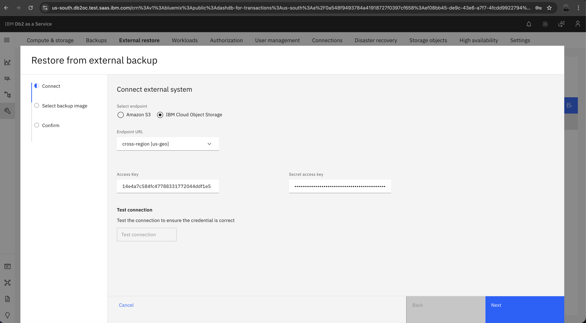{: caption="Connect external system by entering storage credentials" caption-side="bottom"}

### Step 2: Select backup image
{: #restore-external-select-backup}

In the Select backup image step, browse and select your backup file:

1. Select your bucket from the dropdown.

2. Navigate through the folder path to locate your backup image file.

3. Select the backup image file (e.g., EUDB.0.eunicec.DBPART000.20251018182026).

4. Click **Next** to proceed to the confirmation step.

   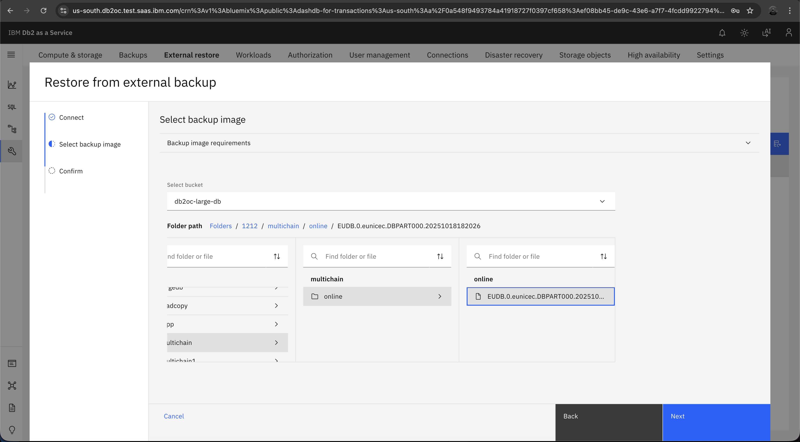{: caption="Select backup image" caption-side="bottom"}

### Step 3: Confirm
{: #restore-external-confirm}

In the Confirm step, review your selections and configure restore options:

1. Choose whether to perform backup size validation or skip it. Backup size validation checks if your instance has sufficient storage space for the backup before starting the restore. Skipping validation will start the restore immediately, but it may fail mid-process if storage is insufficient.

   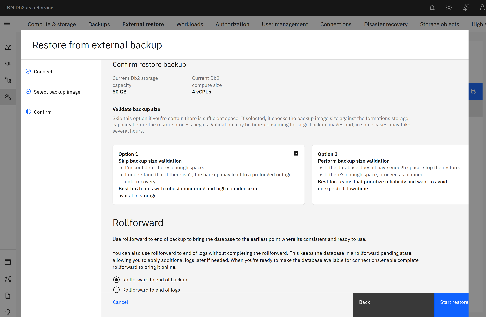{: caption="Confirm restore backup with validation and rollforward options" caption-side="bottom"}

2. Configure the rollforward option:
   - **Rollforward to end of backup**: Completes the restore and brings the database online.
   - **Rollforward to end of logs**: Keeps the database in a rollforward pending state, allowing you to apply additional logs later if needed. When you're ready to make the database available for connections, enable "Complete rollforward" to bring it online.

3. Click **Start restore backup** to start the external restore.

The database will be unavailable during the restore process. If you choose rollforward to end of logs without enabling "Complete rollforward", the database will remain offline until you manually complete the rollforward.
{: note}

## Access external restore
{: #restore-external-access-api}
{: api}

To initiate an external restore, use the [Restore database from external storage](https://cloud.ibm.com/apidocs/db2-on-cloud/db2-saas-perf-v4#postexternalbackuprestore){: external} endpoint. This single API call covers connecting to external storage, selecting the backup image, and confirming the restore.

```bash
curl -X POST \
  https://{HOSTNAME}/dbapi/v4/manage/backups/new_external_restore \
  -H 'accept: application/json' \
  -H 'authorization: Bearer {AUTH_TOKEN}' \
  -H 'content-type: application/json' \
  -d '{"input_image":"<backup_image_path>","input_container":"<bucket_name>","archivelog_location":"<archive_log_path>","access_key":"<access_key>","secret_key":"<secret_key>","check_db_size":"false","complete_rollforward":"true","region":""}'
```
{: pre}

Where:
- `input_image`: Path of the backup image in object storage, excluding the part number suffix. For example, if the full backup image path is `master/subdir/online/EUDB.0.db2inst1.DBPART000.20251018182026.001`, the value should be `master/subdir/online/EUDB.0.db2inst1.DBPART000.20251018182026`.
- `input_container`: Name of the bucket in your object storage.
- `archivelog_location`: Path to the archive log location in object storage if rolling forward to end of logs. For end of backup restores, the value should be `extrestore_endofbackup`.
- `access_key`: HMAC access key for object storage authentication.
- `secret_key`: HMAC secret key for object storage authentication.
- `check_db_size`: Set to `true` to validate database size before restore, or `false` to skip validation.
- `complete_rollforward`: Set to `true` to complete rollforward and bring the database online, or `false` to leave the database in rollforward pending state.
- `region`: Region of the external object storage (optional).

The database will be unavailable during the restore process. If you set `complete_rollforward` to `false`, the database will remain offline until you manually complete the rollforward.
{: note}

## Monitor restore progress
{: #restore-external-monitor}
{: ui}

Once the restore is initiated, you can monitor its progress on the External restore page. The view you see depends on your login type:

### For IAM Admins

IAM administrators will see the restore history page where they can monitor the restore status. Use the **Refresh** button to update the status.

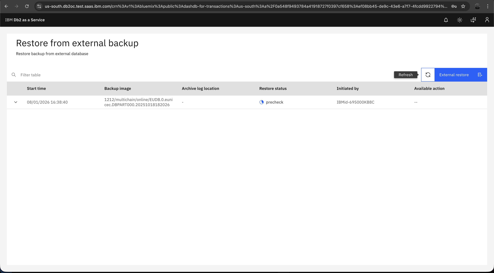{: caption="IAM Admin view of Restore history page" caption-side="bottom"}

### For User Logins

Regular users will see a full-screen progress page during the restore.

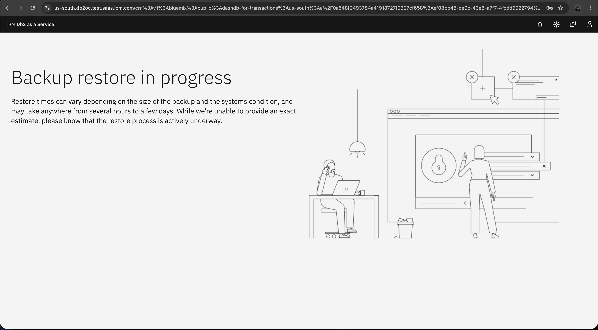{: caption="Backup restore in progress for User Logins" caption-side="bottom"}

During the restore process, console functionality is limited for all users. Regular users are directed to the full-screen progress page, while IAM admins can view the restore history page to monitor status. Restore times can vary depending on the size of the backup and system conditions, and may take anywhere from several hours to a few days.
{: note}

## Monitor restore progress
{: #restore-external-monitor-api}
{: api}

To monitor the progress of an external restore, use the [Get the list of new external restores](https://cloud.ibm.com/apidocs/db2-on-cloud/db2-saas-perf-v4#getnewexternalrestorestatuslist){: external} endpoint.

```bash
curl -X GET \
  https://{HOSTNAME}/dbapi/v4/manage/backups/new_external_restore/status/list \
  -H 'accept: application/json' \
  -H 'authorization: Bearer {AUTH_TOKEN}' \
  -H 'content-type: application/json'
```
{: pre}

The response includes the restore status and the `name` field, which is used as the `restore_crd` parameter when triggering a rollforward.

Restore times can vary depending on the size of the backup and system conditions, and may take anywhere from several hours to a few days.
{: note}

## Complete rollforward
{: #restore-external-rollforward}
{: ui}

If you selected "Rollforward to end of logs" without enabling "Complete rollforward", the restore will finish in a "rollforward_pending" state:

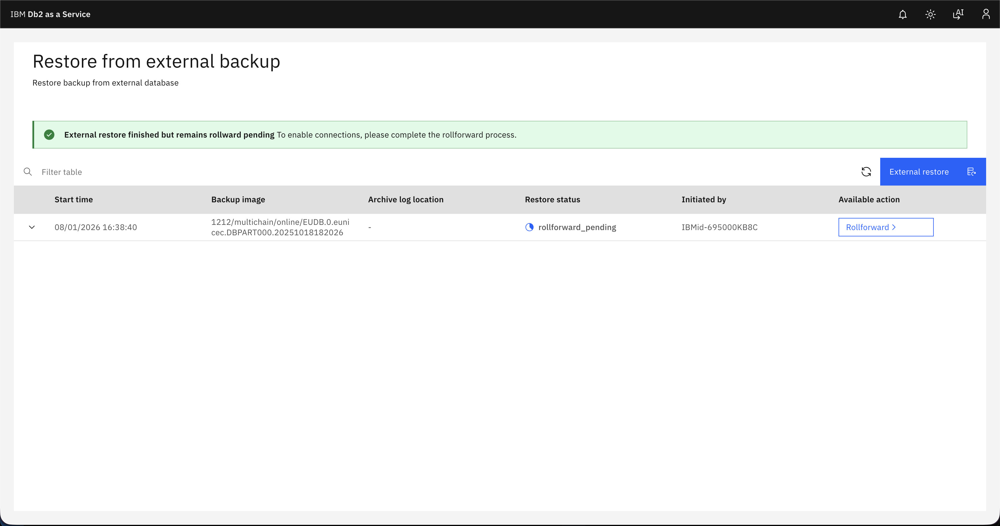{: caption="External restore finished with rollforward pending" caption-side="bottom"}

1. Click the **Rollforward** button in the Available action column.

2. In the Rollforward dialog:
   - Enable **Complete rollforward** toggle to bring the database online after this rollforward.
   - **Archive log location** will be prefilled based on the selection in the previous external restore step. You can change the path if the new logs are in a different location.

3. Click **Start rollforward** to proceed.

   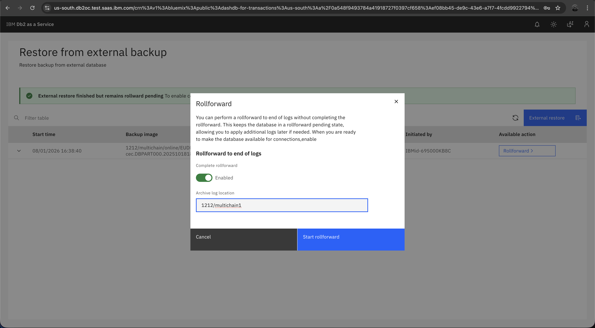{: caption="Rollforward dialog with Complete rollforward toggle and log location" caption-side="bottom"}

4. The status will change to "rollforward_in_progress" and then "finalizing".

   {: caption="Rollforward in progress" caption-side="bottom"}

   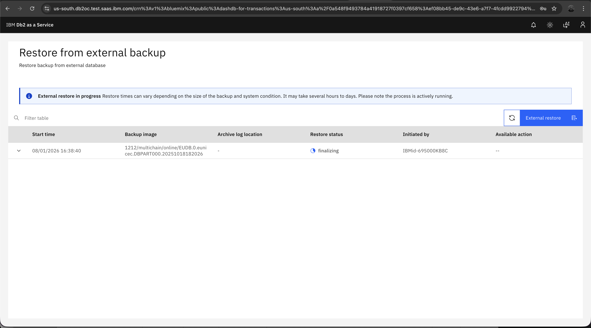{: caption="External restore finalizing" caption-side="bottom"}

## Complete rollforward
{: #restore-external-rollforward-api}
{: api}

To trigger a rollforward, use the [Trigger rollforward from an external restore backup](https://cloud.ibm.com/apidocs/db2-on-cloud/db2-saas-perf-v4#externalrestorerollforward){: external} endpoint.

```bash
curl -X POST \
  https://{HOSTNAME}/dbapi/v4/manage/backups/new_external_restore/rollforward \
  -H 'accept: application/json' \
  -H 'authorization: Bearer {AUTH_TOKEN}' \
  -H 'content-type: application/json' \
  -d '{"restore_crd":"<restore_crd_id>","complete_rollforward":"true","archivelog_location":"<archive_log_path>"}'
```
{: pre}

Where:
- `restore_crd`: Identifier of the restore operation. This value can be found in the `name` field from the response of the [Get the list of new external restores](https://cloud.ibm.com/apidocs/db2-on-cloud/db2-saas-perf-v4#getnewexternalrestorestatuslist){: external} endpoint.
- `complete_rollforward`: Set to `true` to bring the database online after rollforward, or `false` to keep it in rollforward pending state for additional log application.
- `archivelog_location`: Path to the archive log location in object storage. If not provided, uses the location from the original restore request.

## Verify completion
{: #restore-external-verify}
{: ui}

1. When the restore is complete, the status will show "Completed" with a green checkmark.

   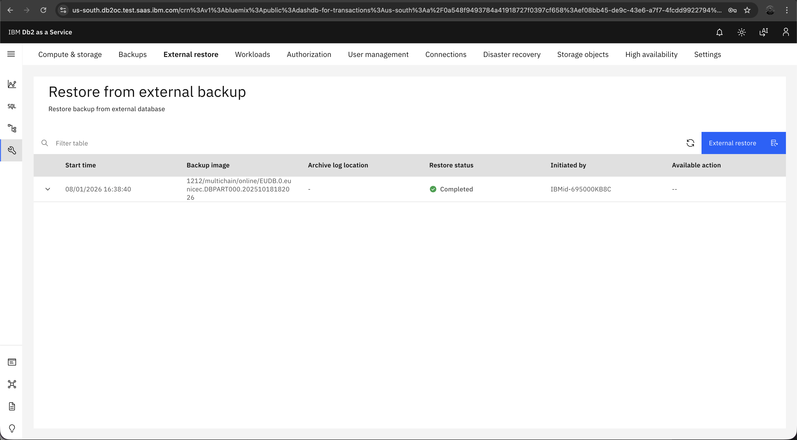{: caption="External restore completed successfully" caption-side="bottom"}

2. You can expand the restore entry to view the rollforward history, which shows details of each rollforward operation performed.

   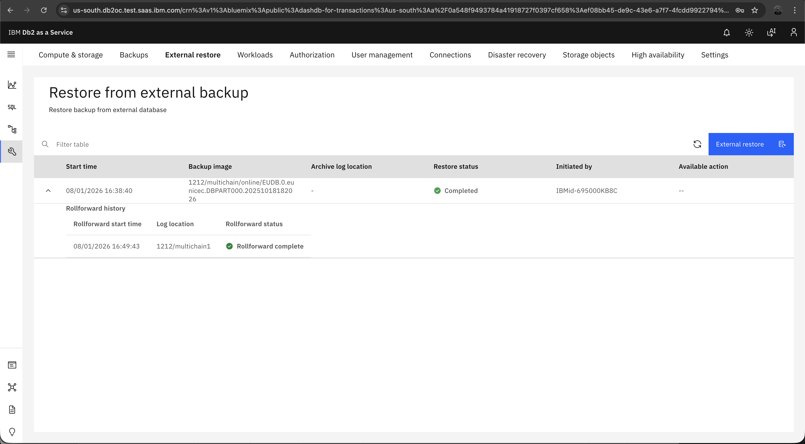{: caption="Completed restore with rollforward history expanded" caption-side="bottom"}

3. The database is now online and available for connections. The console will restore full functionality within a few minutes.

After the restore completes, it may take a few additional minutes for all console features to become fully available while the system completes post-restore setup tasks.
{: note}

## Verify completion
{: #restore-external-verify-api}
{: api}

Use the [Get the list of new external restores](https://cloud.ibm.com/apidocs/db2-on-cloud/db2-saas-perf-v4#getnewexternalrestorestatuslist){: external} endpoint to check the status of the restore operation. The restore is complete when the status shows "completed".

```bash
curl -X GET \
  https://{HOSTNAME}/dbapi/v4/manage/backups/new_external_restore/status/list \
  -H 'accept: application/json' \
  -H 'authorization: Bearer {AUTH_TOKEN}' \
  -H 'content-type: application/json'
```
{: pre}

After the restore completes, it may take a few additional minutes for all console features to become fully available while the system completes post-restore setup tasks.
{: note}

## External restore failure
{: #restore-external-failure}
{: ui}

In case of an external restore failure, there are a couple of options to recover the system:

1. **Initiate a different external restore**: Click the **External restore** button to start a new restore. For example, if you previously selected a backup image that is not compatible with the system, you can initiate a new external restore with the correct backup image.

2. **Reset from internal backup**: Click the **Reset from last internal backup** option to restore from the internal backup you created earlier. This will reset the system to its state before the external restore was attempted.

## External restore failure
{: #restore-external-failure-api}
{: api}

In case of an external restore failure, you can:

1. **Initiate a different external restore**: Call the [Restore database from external storage](https://cloud.ibm.com/apidocs/db2-on-cloud/db2-saas-perf-v4#postexternalbackuprestore){: external} endpoint again with the correct backup image.

2. **Reset from internal backup**: Use the console to click the **Reset from last internal backup** option to restore from the internal backup you created earlier. This will reset the system to its state before the external restore was attempted.
