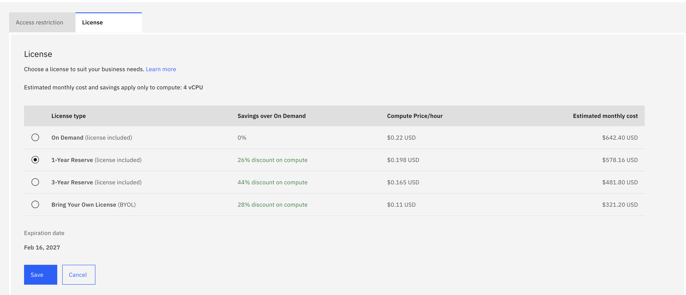
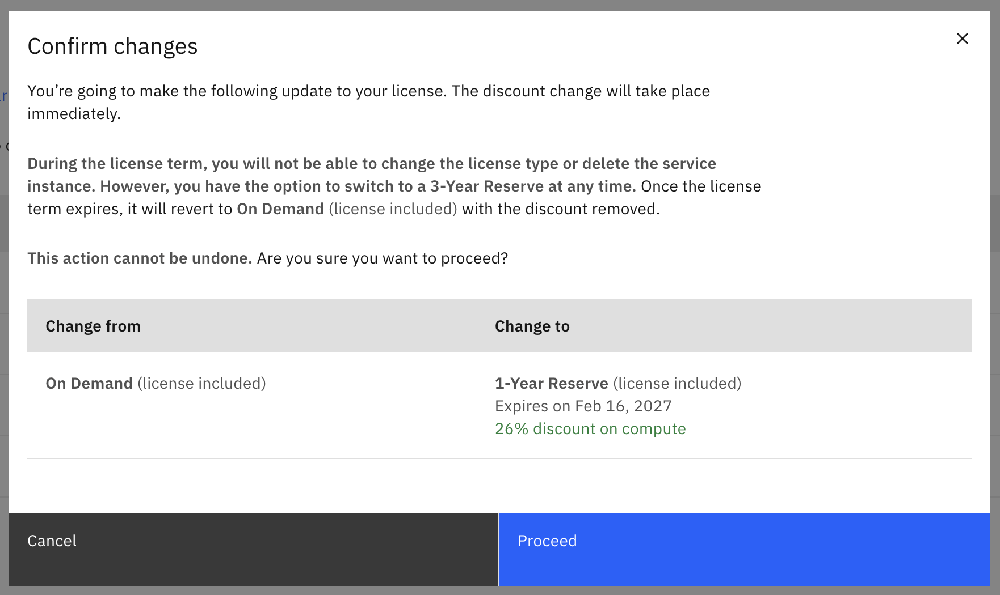

---
copyright:
  years: 2025, 2026
lastupdated: "2026-02-17"

keywords: reserved instance, reserved pricing, cost optimization, commitment

subcollection: Db2onCloud
---

{:external: target="_blank" .external}
{:shortdesc: .shortdesc}
{:codeblock: .codeblock}
{:screen: .screen}
{:tip: .tip}
{:important: .important}
{:note: .note}
{:deprecated: .deprecated}
{:pre: .pre}

# Reserved Instances
{: #reserved-instances}

Reserved Instances (RI) for Db2 on Cloud allow you to commit to a 1-year or 3-year term in exchange for a discounted compute price compared to the standard On Demand pricing model.
{: shortdesc}

## Prerequisites
{: #ri-prerequisites}

Before switching to a Reserved Instance license, ensure that you meet the following requirements:

- An active Db2 on Cloud instance on the **Performance** plan.

## Restrictions
{: #ri-restrictions}

Before committing to a Reserved Instance, be aware of the following restrictions:

- **Term commitment**: Once you select a 1-year or 3-year reservation, you cannot delete the instance until the term expires.
- **Plan changes**: You cannot change plans during the reservation term.
- **Scaling limitations**: You can scale up your instance during the reservation term, but you cannot scale down.

Review the restrictions carefully before committing. Reserved Instance terms are binding and cannot be cancelled early.
{: important}

## Selecting a Reserved Instance during provisioning
{: #ri-provisioning}

You can select a Reserved Instance license type when provisioning a new Db2 on Cloud instance.

During the provisioning process, locate the **Reserved Instance/BYOL** dropdown. By default, the license is set to **Default license**. Select **Reserved Instance (1 year)** or **Reserved Instance (3 year)** from the dropdown, then continue with the rest of the provisioning steps.

{: caption="Select Reserved Instance (1 year) or Reserved Instance (3 year) from the Reserved Instance/BYOL dropdown during provisioning" caption-side="bottom"}

## Configuring a Reserved Instance in the UI
{: #ri-configuration}

You can also change your license type to a Reserved Instance on an existing Db2 on Cloud instance through the console.

### Step 1: Navigate to the license settings
{: #ri-step1}

From your Db2 on Cloud instance dashboard:

1. Click the **Settings** icon in the left sidebar (wrench icon), or select **Settings** from the top navigation bar.
1. Select the **License** sub-tab.
1. Click the **Change** button on the right side to modify your license type.

{: caption="Navigate to Settings > License and click Change" caption-side="bottom"}

### Step 2: Select the Reserved Instance license type
{: #ri-step2}

On the License selection page, select either the **1-Year Reserve (license included)** or **3-Year Reserve (license included)** radio button, then click **Save**.

{: caption="Select a Reserved Instance option" caption-side="bottom"}

### Step 3: Confirm the license change
{: #ri-step3}

A confirmation dialog appears showing the details of your license change:

1. Verify the **Change from** and **Change to** columns reflect the correct transition.
1. Click **Proceed** to apply the change.

The discount takes effect immediately. An **Expiration date** is displayed on the License settings page indicating when the reservation term ends.

{: caption="Confirm the license change to a Reserved Instance" caption-side="bottom"}

### Step 4: Verify successful update
{: #ri-step4}

After clicking Proceed, you are returned to the License settings page. A green success banner confirms that the license has been successfully updated. The new Reserved Instance pricing is now active on your instance.

{: caption="License successfully updated confirmation" caption-side="bottom"}

## Important notes
{: #ri-notes}

- **Immediate effect**: The discount takes effect immediately upon confirmation. Your next billing cycle reflects the new Reserved Instance pricing.
- **Expiration date**: After committing, the License settings page displays an expiration date for your reservation term.
- **No service disruption**: Changing the license type does not affect your database instance availability. There is no downtime associated with this change.
- **Reversibility**: You can switch to a longer reservation term or to BYOL, but you cannot switch back to On Demand until the reservation term expires.
